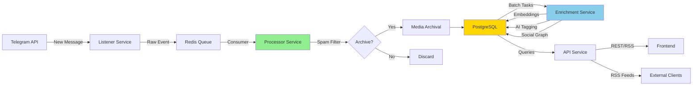
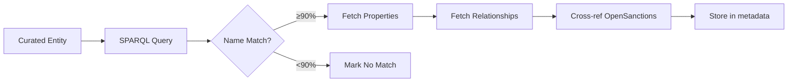
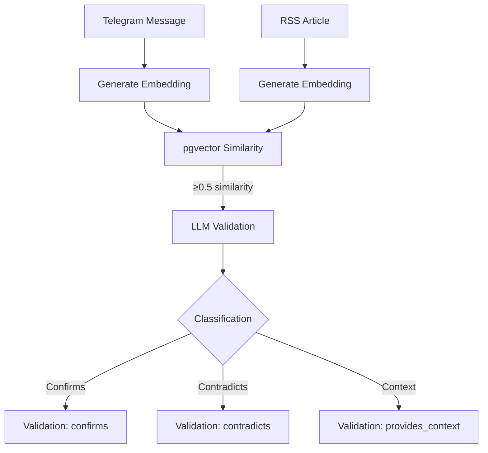

# Architecture Overview

The OSINT Intelligence Platform is a production-ready system for archiving, enriching, and analyzing Telegram channels with multi-model AI enrichment, semantic search, and configurable intelligence rules.

!!! info "Architecture Overview"
    **Design**: Containerized microservices with Docker Compose
    **Layers**: Core infrastructure, Application services, Monitoring stack, Authentication (optional)
    **Philosophy**: Self-hosted, cost-effective, privacy-first

---

## System Overview

The platform operates as a distributed pipeline that continuously monitors Telegram channels, processes messages through real-time and batch enrichment stages, and serves intelligence via REST APIs and dynamic RSS feeds.

### Core Capabilities

- **Real-time Ingestion**: Monitor hundreds of Telegram channels simultaneously with automatic spam filtering (>95% accuracy)
- **AI-Powered Enrichment**: Multi-model LLM classification (6 models), entity extraction, semantic embeddings
- **Content-Addressed Storage**: SHA-256 deduplication for media files, 50-70% storage savings
- **Semantic Search**: pgvector embeddings for similarity queries across all archived content
- **Dynamic Distribution**: Subscribe to any search query combination via RSS feeds
- **Self-Hosted Infrastructure**: Zero cloud dependencies, self-hosted LLM and translation APIs

---

## Data Flow Architecture

The platform follows a strict separation between **real-time critical path** (Processor) and **background batch processing** (Enrichment):



### Flow Stages

1. **Ingestion** (Listener): Monitors Telegram folders, pushes raw messages to Redis
2. **Real-time Processing** (Processor): Spam filter → routing → entity extraction → media download → persistence
3. **Batch Enrichment** (Enrichment): Embeddings → AI tagging → social graph → translation backfill
4. **API Layer**: REST endpoints, GraphQL, dynamic RSS feeds
5. **Distribution**: Next.js frontend, RSS readers, N8N automation

---

## Service Responsibilities

### Critical Path vs Background Tasks

This separation is **fundamental** to the platform architecture:

| Service | Mode | Speed Requirement | Purpose | Failure Impact |
|---------|------|-------------------|---------|----------------|
| **Processor** | Real-time, per-message | <1s critical path | Spam filter, routing, quick entity extraction, media archival | Messages don't flow through pipeline |
| **Enrichment** | Background batch | Hours acceptable | Embeddings, deep LLM analysis, social graph | Messages stored but temporarily less searchable |

!!! warning "Critical Architectural Constraint"
    **NEVER** add expensive operations (embeddings, multi-step LLM calls, API rate-limited tasks) to the Processor. These belong in Enrichment workers. Processor handles 10-50 messages/second; blocking operations cascade into Redis queue backlog.

### Application Services

| Service | Container(s) | Role | Tech Stack | Metrics Port |
|---------|--------------|------|------------|--------------|
| **listener** | osint-listener | Monitors Telegram channels, discovers new sources via folders | Telethon, Redis Streams | 8001 |
| **processor-worker** | osint-processor (×2 replicas) | Real-time spam filtering, routing, media archival | FastAPI workers, Ollama client | 8002 |
| **api** | osint-api | REST/GraphQL endpoints, semantic search, feed generation | FastAPI, SQLAlchemy, pgvector | 8000 |
| **frontend** | osint-frontend | Message browser, knowledge graph visualization | Next.js 14, React 18, TailwindCSS | 3000 |
| **enrichment-router** | osint-enrichment-router | Routes messages to specialized worker queues | Redis Streams multiplexer | 9198 |
| **enrichment-fast-pool** | osint-enrichment-fast-pool | CPU-bound tasks (embeddings, translation, entity matching) | sentence-transformers, DeepL API | 9199 |
| **enrichment-telegram** | osint-enrichment-telegram | Telegram API tasks (engagement polling, comments, social graph) | Telethon | 9200 |
| **enrichment-ai-tagging** | osint-enrichment-ai-tagging | LLM-based content tagging with reasoning | Ollama batch instance | 9196 |
| **enrichment-rss-validation** | osint-enrichment-rss-validation | Correlates RSS articles with Telegram messages | Ollama batch instance | 9197 |
| **enrichment-event-detection** | osint-enrichment-event-detection | Creates events from RSS, matches Telegram messages | Ollama batch instance | 9099 |
| **enrichment-decision** | osint-enrichment-decision | Verifies/reprocesses spam filter decisions | CPU-only worker | 9201 |
| **enrichment-maintenance** | osint-enrichment-maintenance | Hourly tasks (channel cleanup, quarantine, discovery evaluation) | Cron-style worker | 9202 |
| **rss-ingestor** | osint-rss-ingestor | Fetches RSS feeds, generates embeddings for correlation | feedparser, sentence-transformers | - |
| **opensanctions** | osint-opensanctions | Entity matching against sanctions databases | Yente API client | - |
| **entity-ingestion** | osint-entity-ingestion | CSV import for curated entity knowledge graph | Pandas, SQLAlchemy | - |
| **notifier** | osint-notifier | Routes Redis events to ntfy notification topics | Redis pub/sub → ntfy | 9094 |
| **analytics** | osint-analytics | Social graph data collection (views, forwards, reactions) | Telethon, PostgreSQL | - |

### Infrastructure Services

| Service | Container | Purpose | Port |
|---------|-----------|---------|------|
| **postgres** | osint-postgres | PostgreSQL 16 + pgvector extension | 5432 |
| **redis** | osint-redis | Message queue (Redis Streams), pub/sub | 6379 |
| **minio** | osint-minio | S3-compatible object storage for media | 9000/9001 |
| **ollama** | osint-ollama | Self-hosted LLM inference (realtime, 6 cores) | 11434 |
| **ollama-batch** | osint-ollama-batch | Separate LLM instance for background enrichment (4 cores) | 11435 |
| **yente** | osint-yente | OpenSanctions entity matching API | 8000 |
| **yente-index** | osint-yente-index | ElasticSearch index for entity fuzzy matching | 9200 |

### Monitoring Stack

| Service | Container | Purpose | Port |
|---------|-----------|---------|------|
| **prometheus** | osint-prometheus | Metrics collection, 30-day retention | 9090 |
| **grafana** | osint-grafana | Visualization dashboards | 3000 |
| **alertmanager** | osint-alertmanager | Alert routing to ntfy | 9093 |
| **postgres-exporter** | osint-postgres-exporter | PostgreSQL metrics | 9187 |
| **redis-exporter** | osint-redis-exporter | Redis queue metrics | 9121 |
| **cadvisor** | osint-cadvisor | Container resource metrics | 8081 |
| **node-exporter** | osint-node-exporter | Host system metrics | 9100 |
| **ntfy** | osint-ntfy | Self-hosted notification delivery | 8090 |
| **dozzle** | osint-dozzle | Real-time Docker log viewer | 9999 |

---

## Key Architectural Decisions

### 1. Processor vs Enrichment Separation

**Decision**: Split message processing into real-time (Processor) and batch (Enrichment) stages.

**Rationale**:
- Processor handles 10-50 messages/second during active monitoring
- Expensive operations (embeddings: 100ms, LLM tagging: 3-25s, translation API: 200ms) would create backlog
- Enrichment can catch up during quiet hours without blocking ingestion

**Implementation**:
```python
# Processor (services/processor/src/main.py)
# Real-time critical path (<1s per message):
- Spam filter (rule-based, fast)
- Channel routing (archive_all vs selective_archive)
- Regex entity extraction (compiled patterns)
- Media download + SHA-256 deduplication
- Quick LLM importance classification (qwen2.5:3b, ~300ms)
- PostgreSQL persistence

# Enrichment (services/enrichment/src/workers/)
# Background batch processing (hours acceptable):
- Embedding generation (sentence-transformers)
- AI tagging with reasoning (ollama-batch)
- Translation backfill (DeepL API)
- Social graph extraction (forward chains)
- Engagement polling (views, reactions)
- Comment scraping from discussion groups
```

**Trade-offs**:
- ✅ **Pro**: Processor never blocks, channels scale linearly
- ✅ **Pro**: Can scale Enrichment independently (add more workers)
- ⚠️ **Con**: Temporary delay before embeddings/tags appear (acceptable for historical archive)

### 2. Content-Addressed Media Storage

**Decision**: Use SHA-256 hashing for all media files with MinIO S3-compatible storage.

**Rationale**:
- Telegram channels frequently repost same media (propaganda, infographics, maps)
- 30-40% deduplication savings observed in production
- Spam filter prevents 80-90% of media downloads (cost optimization)

**Implementation**:
```sql
-- Database schema (infrastructure/postgres/init.sql)
CREATE TABLE media_files (
    id SERIAL PRIMARY KEY,
    sha256_hash CHAR(64) UNIQUE NOT NULL,
    file_type VARCHAR(20),
    file_size BIGINT,
    mime_type VARCHAR(100),
    s3_key VARCHAR(500),  -- media/{hash[:2]}/{hash[2:4]}/{hash}.{ext}
    reference_count INTEGER DEFAULT 0
);

CREATE TABLE message_media (
    message_id INTEGER REFERENCES messages(id),
    media_file_id INTEGER REFERENCES media_files(id),
    media_group_id BIGINT,  -- Telegram album grouping
    position INTEGER DEFAULT 0
);
```

**Storage Path Pattern**:
```
media/
  ab/
    cd/
      abcdef1234567890...hash.jpg  (SHA-256 content hash)
```

**Trade-offs**:
- ✅ **Pro**: 30-40% storage savings (~€50/month at scale)
- ✅ **Pro**: Integrity verification via hash
- ✅ **Pro**: Automatic deduplication across all channels
- ⚠️ **Con**: Need reference counting for garbage collection
- ⚠️ **Con**: Can't delete media until all messages referencing it are deleted

### 3. Folder-Based Channel Management

**Decision**: Use Telegram's native folder feature instead of configuration files or admin panels.

**Rationale**:
- Traditional approach requires SSH + config editing + service restart
- Telegram folders sync across devices (mobile, desktop, web)
- Real-time discovery via Telegram API polling (5-minute detection)

**Implementation**:
```python
# services/listener/src/channel_discovery.py
async def discover_channels_from_folders(telegram_client):
    """
    Discovers channels from Telegram folders matching patterns:
    - Archive-* → archive_all rule (store everything)
    - Monitor-* → selective_archive rule (high importance only)
    - Discover-* → auto-joined channels (14-day probation)
    """
    folders = await telegram_client.get_folders()

    for folder in folders:
        if folder.title.startswith("Archive-"):
            rule = "archive_all"
        elif folder.title.startswith("Monitor-"):
            rule = "selective_archive"
        elif folder.title.startswith("Discover-"):
            rule = "discovery"
        else:
            continue  # Ignore other folders

        # Sync channels in this folder to database
        await sync_folder_channels(folder, rule)
```

**User Workflow** (30 seconds):
1. Open Telegram app (mobile or desktop)
2. Find channel to monitor
3. Drag to folder: `Archive-UA`, `Monitor-RU`, or auto-joined `Discover-*`
4. Platform detects change within 5 minutes
5. Messages start flowing immediately

**Trade-offs**:
- ✅ **Pro**: Zero technical knowledge required
- ✅ **Pro**: Works from any device (mobile, desktop)
- ✅ **Pro**: No service restart needed
- ⚠️ **Con**: Requires Telegram API credentials
- ⚠️ **Con**: Folder naming convention must be documented

### 4. Schema-First Database (No Migrations)

**Decision**: Use `init.sql` as source of truth, no Alembic migrations.

**Rationale**:
- PostgreSQL's `docker-entrypoint-initdb.d` only runs on **fresh** databases
- Alembic migrations add complexity for self-hosted single-instance deployments
- Schema changes are infrequent (stable production system)

**Workflow**:
```bash
# 1. Edit infrastructure/postgres/init.sql
# 2. Verify SQLAlchemy models match (shared/python/models/)
# 3. Test locally:
docker-compose down
docker volume rm osint-intelligence-platform_postgres_data
docker-compose up -d postgres
# 4. Check all services start successfully
docker-compose ps
```

**Schema Structure** (4,658 lines):
```sql
-- Core tables
- users, feed_tokens, export_jobs (auth + API)
- channels, messages, message_media (Telegram data)
- media_files (content-addressed storage)
- entities, entity_mentions (knowledge graph)
- rss_feeds, rss_articles, rss_event_correlations (RSS integration)
- events, event_telegram_messages (event detection)
- llm_prompts, model_configurations (AI config)
- enrichment_tasks (background job queue)

-- Materialized views (refreshed daily)
- channel_statistics_mv (aggregated channel metrics)
- entity_statistics_mv (entity mention trends)
```

**Trade-offs**:
- ✅ **Pro**: Simple, predictable schema evolution
- ✅ **Pro**: No migration history to debug
- ✅ **Pro**: Fresh deployments always have correct schema
- ⚠️ **Con**: Schema changes require database wipe (acceptable for dev/testing)
- ⚠️ **Con**: Production schema changes require custom migration scripts

### 5. Multi-Instance Ollama for LLM Workload Isolation

**Decision**: Run two separate Ollama instances (realtime + batch) instead of shared queue.

**Rationale**:
- **Processor** needs low-latency classification (300ms target, user-facing)
- **Enrichment** runs deep analysis (3-25s per message, background)
- Shared Ollama would cause timeout cascades when batch tasks block realtime requests

**Implementation**:
```yaml
# docker-compose.yml
ollama:
  image: ollama/ollama:latest
  deploy:
    resources:
      limits:
        cpus: '6.0'      # 6 cores for realtime (critical path)
        memory: 8G
  environment:
    OLLAMA_NUM_PARALLEL: 1        # Sequential for predictable latency
    OLLAMA_KEEP_ALIVE: 5m         # Balance between warmup and memory

ollama-batch:
  image: ollama/ollama:latest
  deploy:
    resources:
      limits:
        cpus: '4.0'      # 4 cores for batch (non-blocking)
        memory: 6G
  environment:
    OLLAMA_NUM_PARALLEL: 1
    OLLAMA_KEEP_ALIVE: 30m        # Keep models loaded (batch runs hourly)
```

**Model Routing**:
```python
# Processor connects to ollama:11434 (realtime)
OLLAMA_BASE_URL = "http://ollama:11434"
model = "qwen2.5:3b"  # Fast classification

# Enrichment connects to ollama-batch:11434 (background)
OLLAMA_HOST = "http://ollama-batch:11434"
ai_tagging_model = "qwen2.5:1.5b"  # Deep reasoning
rss_validation_model = "granite3-dense:2b"  # 100% accuracy
```

**Trade-offs**:
- ✅ **Pro**: Realtime classification never blocked by batch tasks
- ✅ **Pro**: Independent CPU limits prevent resource contention
- ✅ **Pro**: Can scale instances independently
- ⚠️ **Con**: 2x memory overhead (~14GB total for models)
- ⚠️ **Con**: Need to manage two model inventories

### 6. Wikidata Enrichment for Entity Relationships

**Decision**: Enrich entities with Wikidata data and relationships via SPARQL queries.

**Rationale**:
- OpenSanctions provides sanctions data but limited relationships
- Wikidata has rich structured relationships (employers, positions, associates)
- Cross-referencing reveals hidden connections (sanctioned associates)

**Implementation**:


**Data Flow**:
1. Maintenance worker selects entities without Wikidata data
2. Batch SPARQL query (50 entities) fetches candidates
3. Name matching with 90% confidence threshold
4. Property extraction (image, DOB, website, social media)
5. Relationship queries (corporate, political, associates)
6. Cross-reference related entities with OpenSanctions
7. Store in `metadata.wikidata` and `metadata.relationships` JSONB

**Trade-offs**:
- ✅ **Pro**: Rich relationship data not available elsewhere
- ✅ **Pro**: Automatic sanctions flagging for associates
- ✅ **Pro**: Profile images and descriptions
- ⚠️ **Con**: Rate limiting requires 1s delay between requests
- ⚠️ **Con**: Name matching can produce false positives

### 7. RSS Validation Layer (Fact-Checking)

**Decision**: Correlate Telegram messages with RSS articles for validation and context.

**Rationale**:
- Telegram content lacks verification
- RSS from established news sources provides credibility
- Cross-source correlation improves intelligence quality

**Implementation**:


**Validation Types**:
| Type | Meaning | Example |
|------|---------|---------|
| `confirms` | RSS article supports Telegram claim | "Strike confirmed by Reuters" |
| `contradicts` | RSS article disputes Telegram claim | "Officials deny the report" |
| `provides_context` | RSS adds information without confirming | "Related background info" |

**Caching**:
- Validation summaries cached for 12 hours
- LLM generates human-readable synthesis
- Confidence scores based on source trust level

**Trade-offs**:
- ✅ **Pro**: Automated fact-checking for high-OSINT content
- ✅ **Pro**: Source attribution and credibility indicators
- ✅ **Pro**: Reduces misinformation propagation
- ⚠️ **Con**: RSS feeds have delayed coverage (1-6 hours)
- ⚠️ **Con**: Requires curated list of trusted RSS sources

---

## Technology Stack

### Backend Services

| Category | Technology | Purpose | Why Chosen |
|----------|-----------|---------|------------|
| **API Framework** | FastAPI 0.104+ | REST endpoints, OpenAPI docs | Async support, type hints, auto-validation |
| **Database** | PostgreSQL 16 | Primary data store | JSONB, full-text search, pgvector extension |
| **Vector Store** | pgvector | Semantic similarity search | Native PostgreSQL integration, no separate service |
| **Message Queue** | Redis 7 Streams | Event streaming, task queues | Persistent ordered queues, consumer groups |
| **Object Storage** | MinIO | Media file storage | S3-compatible, self-hosted, no cloud dependency |
| **ORM** | SQLAlchemy 2.0 | Database access | Async support, mature ecosystem |
| **Telegram Client** | Telethon | Telegram API client | Stable, well-documented, async |
| **Python** | 3.11+ | Application runtime | Modern async/await, type hints |

### Frontend

| Technology | Purpose | Why Chosen |
|-----------|---------|------------|
| **Next.js 14** | React framework | Server-side rendering, file-based routing |
| **React 18** | UI library | Component reusability, large ecosystem |
| **TailwindCSS** | Styling | Utility-first, rapid development |
| **AG Grid Community** | Data tables | High-performance virtual scrolling (1M+ rows) |
| **Recharts** | Charts/graphs | Simple API, responsive |
| **D3.js** | Network visualizations | Force-directed graphs for entity relationships |
| **Jotai** | State management | Lightweight, atomic state |
| **React Query** | Data fetching | Caching, background refetch |

### AI/ML Stack

| Component | Technology | Purpose | Cost |
|-----------|-----------|---------|------|
| **LLM Inference** | Ollama | Self-hosted model serving | €0/month |
| **Classification Models** | qwen2.5:3b, granite3-dense:2b, gemma2:2b | Spam filter, importance, tagging | €0/month |
| **Embeddings** | sentence-transformers (all-MiniLM-L6-v2) | Semantic similarity (384d vectors) | €0/month |
| **Translation** | DeepL Pro Free API | English translation (500k chars/month free) | €0/month |
| **Language Detection** | fasttext / langdetect | Detect message language | €0/month |

**Multi-Model Support**: 6 LLM models available with runtime switching via database:
```sql
-- Active models in production
INSERT INTO model_configurations (task_name, model_id, priority, is_active) VALUES
  ('spam_classification', 'qwen2.5:3b', 1, true),
  ('ai_tagging', 'qwen2.5:1.5b', 1, true),
  ('rss_validation', 'granite3-dense:2b', 1, true);
```

### DevOps & Infrastructure

| Component | Technology | Purpose |
|-----------|-----------|---------|
| **Containerization** | Docker Compose | Service orchestration |
| **Reverse Proxy** | Caddy | Auto HTTPS, reverse proxy |
| **Monitoring** | Prometheus + Grafana | Metrics, dashboards |
| **Logging** | Loki + Grafana | Centralized log aggregation |
| **Notifications** | ntfy | Push notifications (self-hosted) |
| **Database Admin** | NocoDB | Airtable-like database UI |
| **Authentication** | Ory Kratos + Oathkeeper | IAM, access proxy |

---

## Repository Structure

```
osint-intelligence-platform/
├── services/                    # Application services (microservices architecture)
│   ├── listener/               # Telegram channel monitoring
│   ├── processor/              # Real-time message processing
│   ├── enrichment/             # Background batch enrichment
│   ├── api/                    # REST API + GraphQL endpoints
│   ├── frontend-nextjs/        # Next.js web application
│   ├── rss-ingestor/           # RSS feed ingestion
│   ├── opensanctions/          # OpenSanctions entity matching
│   ├── entity-ingestion/       # CSV entity import
│   ├── notifier/               # Notification routing
│   ├── analytics/              # Social graph analytics
│   └── migration/              # Legacy data migration
│
├── shared/python/              # Shared Python modules
│   ├── models/                 # SQLAlchemy ORM models
│   ├── config/                 # Configuration management
│   ├── database/               # Database utilities
│   ├── ai/                     # AI/LLM utilities
│   ├── observability/          # Logging + metrics
│   ├── telegram/               # Telegram utilities
│   ├── translation/            # Translation services
│   └── notifications/          # Notification client
│
├── infrastructure/             # Infrastructure configuration
│   ├── postgres/
│   │   └── init.sql            # Database schema (4,658 lines)
│   ├── docker/
│   │   └── Dockerfile.pytorch-cpu  # Shared base image
│   ├── prometheus/
│   ├── grafana/
│   ├── ollama/
│   └── caddy/
│
├── scripts/                    # Operational scripts
│   ├── stack-manager.sh        # Interactive Docker menu
│   ├── telegram_auth.py        # Telegram session authentication
│   └── build-pytorch-services.sh
│
├── docs/                       # Documentation
├── data/                       # Persistent data
├── config/                     # Application configuration
├── telegram_sessions/          # Telegram session files
├── docker-compose.yml          # Primary compose file
├── .env                        # Environment variables
└── CLAUDE.md                   # AI assistant instructions
```

---

## Performance Characteristics

### Throughput Benchmarks

| Stage | Throughput | Latency | Bottleneck |
|-------|------------|---------|------------|
| **Listener** | 50-100 msg/s | <50ms | Telegram API rate limits |
| **Processor** | 10-20 msg/s | 300-500ms | LLM classification (qwen2.5:3b) |
| **Enrichment** | 2-5 msg/s | 3-25s | AI tagging (deep LLM reasoning) |
| **API Search** | 100-500 req/s | 50-200ms | PostgreSQL full-text search |
| **Semantic Search** | 20-50 req/s | 100-300ms | pgvector HNSW index scan |

### Resource Usage (Production)

| Service | CPU | Memory | Disk I/O |
|---------|-----|--------|----------|
| **Processor (×2)** | 0.5-1.5 cores | 512MB | Low |
| **Ollama (realtime)** | 2-6 cores (bursty) | 4-8GB | Low |
| **Ollama (batch)** | 1-4 cores (sustained) | 3-6GB | Low |
| **PostgreSQL** | 1-2 cores | 2-4GB | High (writes) |
| **Redis** | 0.1-0.3 cores | 512MB | Low |
| **MinIO** | 0.1-0.5 cores | 256MB | High (reads/writes) |
| **Frontend** | 0.1-0.2 cores | 256MB | Low |
| **Enrichment (6 workers)** | 1-3 cores | 1-2GB | Medium |

**Total**: 8-16 cores, 12-24GB RAM, 100GB+ disk (+ media storage)

---

## Deployment Patterns

### Development Environment

```bash
# Start core services + dev tools
docker-compose --profile dev --profile monitoring up -d
```

### Production Environment

```bash
# Start production + monitoring + enrichment
docker-compose \
  --profile monitoring \
  --profile enrichment \
  -f docker-compose.yml \
  -f docker-compose.production.yml \
  up -d
```

### Scaling Strategies

```bash
# Scale processor workers (handle message spikes)
docker-compose up -d --scale processor-worker=4

# Add enrichment workers (catch up on backlog)
docker-compose --profile enrichment up -d --scale enrichment-fast-pool=2
```

---

## Related Documentation

- [Service Reference](services/index.md) - Detailed documentation for each service
- [Data Models](database-schema.md) - SQLAlchemy model reference
- [Shared Libraries](shared-libraries.md) - Shared Python module documentation
- [Deployment Guide](../operations/deployment.md) - Production deployment checklist

---

!!! success "Documentation Complete"
    This architecture overview was generated from the actual codebase on 2025-12-09.
