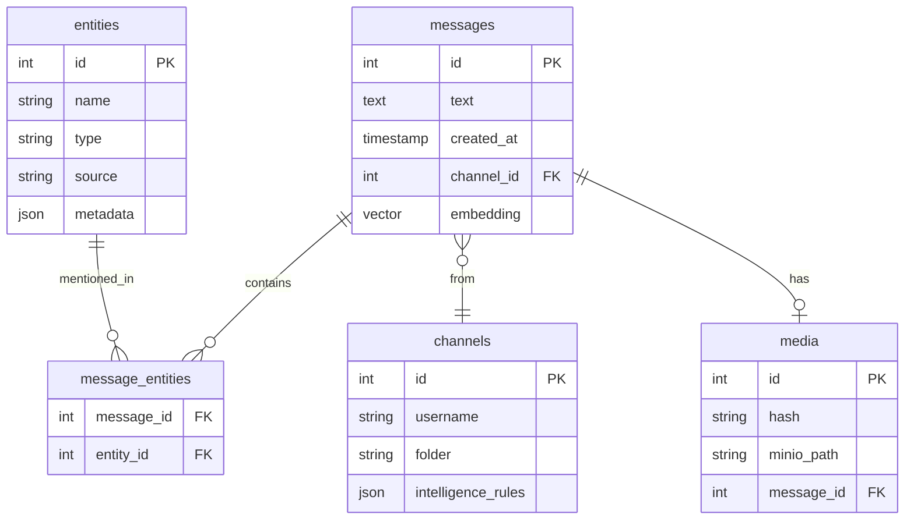

# Database Schema

Complete reference for the PostgreSQL database schema.

## Overview

**TODO: Content to be generated from codebase analysis**

The database schema is defined in `infrastructure/postgres/init.sql` which serves as the source of truth. The platform does not use Alembic migrations.

## Schema Management

**TODO: Document schema management approach:**

- `init.sql` as source of truth
- No Alembic migrations
- Schema changes require rebuild
- Testing schema changes

### Testing Schema Changes

```bash
# Clean rebuild to test schema changes
docker-compose down
docker volume rm osint-intelligence-platform_postgres_data
docker-compose up -d
```

## Core Tables

### messages

**TODO: Document messages table:**

- Primary message storage
- Columns and types
- Indexes
- Foreign keys
- Constraints

```sql
-- TODO: Add table definition from init.sql
```

### channels

**TODO: Document channels table:**

- Channel metadata
- Folder associations
- Intelligence rules

### entities

**TODO: Document entities table:**

- Entity types
- Entity sources
- Metadata storage

### message_entities

**TODO: Document message_entities join table:**

- Message-entity relationships
- Mention tracking

### media

**TODO: Document media table:**

- Media metadata
- SHA-256 hash deduplication
- MinIO path references

### llm_prompts

**TODO: Document llm_prompts table:**

- Prompt versioning
- Active/inactive status
- Model configuration

### enrichment_tasks

**TODO: Document enrichment_tasks table:**

- Task tracking
- Status management
- Error logging

### rss_feeds

**TODO: Document rss_feeds table:**

- Feed configuration
- Filter rules
- Authentication

## Vector Storage

### Embeddings

**TODO: Document pgvector usage:**

- Embedding columns
- Vector indexes
- Similarity search queries

```sql
-- TODO: Add vector column definitions and indexes
```

## Views

**TODO: Document database views if any exist**

## Functions and Triggers

**TODO: Document PostgreSQL functions and triggers:**

- Automatic timestamp updates
- Data validation triggers
- Computed columns

## Indexes

**TODO: Document critical indexes:**

- Performance-critical indexes
- Full-text search indexes
- Vector indexes
- Composite indexes

## Performance Optimization

**TODO: Document performance considerations:**

- Query optimization
- Index usage
- Partitioning strategies
- Vacuum and analyze

## Schema Diagram

**TODO: Add comprehensive ER diagram**



---

!!! warning "Schema Changes"
    Schema changes require a full database rebuild. Always test schema changes in development before applying to production.

!!! note "Documentation Status"
    This page is a placeholder. Content will be generated from infrastructure/postgres/init.sql.
