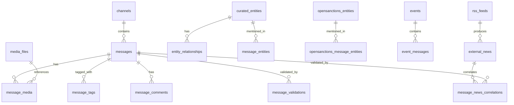

# Database Schema

Complete reference for the PostgreSQL database schema.

---

## Overview

The database schema is defined in `infrastructure/postgres/init.sql` (**4658 lines**) which serves as the single source of truth.

**Key Facts:**
- **45 tables** defined
- **PostgreSQL 16+** required
- **pgvector** extension for embeddings
- **No Alembic** migrations - schema rebuilds only

**Extensions Used:**
```sql
CREATE EXTENSION IF NOT EXISTS pg_trgm;           -- Similarity search
CREATE EXTENSION IF NOT EXISTS btree_gin;         -- Compound GIN indexes
CREATE EXTENSION IF NOT EXISTS vector;            -- pgvector for embeddings
CREATE EXTENSION IF NOT EXISTS pg_stat_statements; -- Query performance
```

---

## Schema Management

### Source of Truth

`infrastructure/postgres/init.sql` defines everything:
- All table definitions
- Indexes and constraints
- Functions and triggers
- Seed data (prompts, slang glossary)

### Schema Changes

See [Database Migrations](database-migrations.md) for the full workflow.

```bash
# Test schema changes with clean rebuild
docker-compose down
docker volume rm osint-intelligence-platform_postgres_data
docker-compose up -d postgres
```

---

## Core Tables

### messages

Primary message storage with AI enrichment (~100 columns):

```sql
CREATE TABLE IF NOT EXISTS messages (
    id BIGSERIAL PRIMARY KEY,
    message_id BIGINT NOT NULL,
    channel_id INTEGER NOT NULL REFERENCES channels(id) ON DELETE CASCADE,

    -- Content
    content TEXT,
    telegram_date TIMESTAMP WITH TIME ZONE,

    -- Social graph metadata
    author_user_id BIGINT,
    replied_to_message_id BIGINT,
    forward_from_channel_id BIGINT,
    forward_from_message_id BIGINT,
    forward_date TIMESTAMP WITH TIME ZONE,

    -- Comments/Discussion
    has_comments BOOLEAN DEFAULT FALSE,
    comments_count INTEGER DEFAULT 0,
    linked_chat_id BIGINT,

    -- Engagement
    views INTEGER,
    forwards INTEGER,

    -- Translation
    language_detected VARCHAR(10),
    content_translated TEXT,
    translation_provider VARCHAR(50),

    -- Media
    media_type VARCHAR(20),       -- photo, video, document
    grouped_id BIGINT,            -- Album grouping

    -- AI Enrichment: Spam
    is_spam BOOLEAN DEFAULT FALSE,
    spam_confidence NUMERIC(5, 2),
    spam_type VARCHAR(50),        -- financial, promotional, off_topic

    -- AI Enrichment: Classification
    osint_topic VARCHAR(50),      -- 13 topics
    importance_level VARCHAR(20), -- high, medium, low

    -- AI Enrichment: Embeddings
    content_embedding vector(384), -- all-MiniLM-L6-v2
    embedding_model VARCHAR(100),

    -- Full-text search
    search_vector TSVECTOR,

    -- Deduplication
    content_hash VARCHAR(64),     -- SHA-256

    -- Timestamps
    created_at TIMESTAMP WITH TIME ZONE DEFAULT NOW(),
    updated_at TIMESTAMP WITH TIME ZONE DEFAULT NOW(),

    CONSTRAINT uq_messages_channel_message UNIQUE (channel_id, message_id)
);
```

**Key Indexes:**
```sql
CREATE INDEX idx_messages_channel_date ON messages(channel_id, telegram_date DESC);
CREATE INDEX idx_messages_embedding ON messages USING hnsw (content_embedding vector_cosine_ops);
CREATE INDEX idx_messages_search_vector ON messages USING GIN (search_vector);
CREATE INDEX idx_messages_topic ON messages(osint_topic);
CREATE INDEX idx_messages_importance ON messages(importance_level);
CREATE INDEX idx_messages_spam ON messages(is_spam);
```

---

### channels

Telegram channel metadata with folder-based rules:

```sql
CREATE TABLE IF NOT EXISTS channels (
    id SERIAL PRIMARY KEY,
    telegram_id BIGINT UNIQUE NOT NULL,
    access_hash BIGINT,

    -- Identity
    username VARCHAR(255),
    name VARCHAR(255),
    description TEXT,
    type VARCHAR(20),             -- 'channel' or 'megagroup'

    -- Trust signals
    verified BOOLEAN DEFAULT FALSE,
    scam BOOLEAN DEFAULT FALSE,
    fake BOOLEAN DEFAULT FALSE,
    restricted BOOLEAN DEFAULT FALSE,

    -- Folder-based management
    folder VARCHAR(100),          -- Telegram folder name
    rule VARCHAR(50),             -- 'archive_all', 'selective_archive', 'discovery'

    -- Status
    active BOOLEAN DEFAULT TRUE,
    removed_at TIMESTAMP WITH TIME ZONE,

    -- Backfill tracking
    backfill_status VARCHAR(20),  -- pending, in_progress, completed, failed
    backfill_last_message_id BIGINT,
    backfill_started_at TIMESTAMP WITH TIME ZONE,
    backfill_completed_at TIMESTAMP WITH TIME ZONE,

    -- Timestamps
    created_at TIMESTAMP WITH TIME ZONE DEFAULT NOW(),
    updated_at TIMESTAMP WITH TIME ZONE DEFAULT NOW()
);
```

---

### curated_entities

Custom entity knowledge graph:

```sql
CREATE TABLE IF NOT EXISTS curated_entities (
    id SERIAL PRIMARY KEY,
    entity_id VARCHAR(100) UNIQUE NOT NULL, -- e.g., "brigade_47"
    name VARCHAR(255) NOT NULL,
    entity_type VARCHAR(50) NOT NULL,       -- person, organization, unit, location, equipment
    aliases TEXT[],                         -- Alternative names

    -- Metadata
    description TEXT,
    wikidata_id VARCHAR(20),
    country VARCHAR(100),
    affiliation VARCHAR(100),               -- 'ukraine', 'russia', 'neutral'

    -- Embedding for semantic matching
    name_embedding vector(384),

    -- External links
    wikipedia_url TEXT,
    official_url TEXT,
    social_media JSONB,

    -- Timestamps
    created_at TIMESTAMP WITH TIME ZONE DEFAULT NOW(),
    updated_at TIMESTAMP WITH TIME ZONE DEFAULT NOW()
);
```

---

### opensanctions_entities

Sanctions data from OpenSanctions/Yente:

```sql
CREATE TABLE IF NOT EXISTS opensanctions_entities (
    id VARCHAR(255) PRIMARY KEY,            -- OpenSanctions ID
    schema_name VARCHAR(100) NOT NULL,      -- 'Person', 'Company', 'LegalEntity'
    name VARCHAR(500) NOT NULL,
    aliases TEXT[],

    -- Sanctions data
    datasets TEXT[],                        -- ['us_ofac_sdn', 'eu_fsf']
    countries TEXT[],
    topics TEXT[],                          -- ['sanction', 'crime.fin']

    -- Properties (flexible FtM schema)
    properties JSONB NOT NULL,

    -- Embedding for semantic matching
    name_embedding vector(384),

    -- Sync tracking
    last_seen_at TIMESTAMP WITH TIME ZONE,
    first_seen_at TIMESTAMP WITH TIME ZONE,

    -- Timestamps
    created_at TIMESTAMP WITH TIME ZONE DEFAULT NOW(),
    updated_at TIMESTAMP WITH TIME ZONE DEFAULT NOW()
);
```

---

### llm_prompts

Versioned LLM prompts for classification:

```sql
CREATE TABLE IF NOT EXISTS llm_prompts (
    id SERIAL PRIMARY KEY,
    task VARCHAR(50) NOT NULL,              -- 'message_classification'
    name VARCHAR(100) NOT NULL,
    prompt_type VARCHAR(20) NOT NULL,       -- 'system' or 'user_template'
    content TEXT NOT NULL,

    -- Versioning
    version INTEGER NOT NULL DEFAULT 1,
    is_active BOOLEAN NOT NULL DEFAULT TRUE,

    -- Model selection
    model_name VARCHAR(100),                -- 'qwen2.5:3b'
    model_parameters JSONB DEFAULT '{}',    -- {"temperature": 0.3}
    task_category VARCHAR(50),              -- 'processor', 'enrichment'

    -- Metadata
    description TEXT,
    variables TEXT[],
    expected_output_format TEXT,

    -- Performance tracking
    usage_count INTEGER DEFAULT 0,
    avg_latency_ms INTEGER,
    error_count INTEGER DEFAULT 0,

    -- Timestamps
    created_at TIMESTAMP WITH TIME ZONE DEFAULT NOW(),
    updated_at TIMESTAMP WITH TIME ZONE,

    CONSTRAINT uq_prompt_task_version UNIQUE (task, version)
);
```

---

### events

Detected OSINT events:

```sql
CREATE TABLE IF NOT EXISTS events (
    id SERIAL PRIMARY KEY,
    event_id VARCHAR(100) UNIQUE NOT NULL,

    -- Event classification
    event_type VARCHAR(50) NOT NULL,        -- strike, battle, movement, etc.
    confidence NUMERIC(5, 2),
    status VARCHAR(20) DEFAULT 'active',    -- active, resolved, disputed

    -- Location
    location_name VARCHAR(255),
    location_coords POINT,
    location_precision VARCHAR(20),

    -- Time
    event_time TIMESTAMP WITH TIME ZONE,
    event_time_precision VARCHAR(20),       -- exact, day, week

    -- Content
    title VARCHAR(500),
    summary TEXT,
    source_count INTEGER DEFAULT 0,

    -- Timestamps
    created_at TIMESTAMP WITH TIME ZONE DEFAULT NOW(),
    updated_at TIMESTAMP WITH TIME ZONE DEFAULT NOW()
);
```

---

## Vector Storage

### Embedding Columns

The schema uses **pgvector** with 384-dimensional embeddings:

```sql
-- Messages (semantic search)
content_embedding vector(384)

-- Entities (semantic matching)
name_embedding vector(384)

-- External news (cross-validation)
title_embedding vector(384)
content_embedding vector(384)
```

### HNSW Indexes

High-performance approximate nearest neighbor search:

```sql
-- Message embeddings
CREATE INDEX idx_messages_embedding
ON messages USING hnsw (content_embedding vector_cosine_ops)
WITH (m = 16, ef_construction = 64);

-- Entity name embeddings
CREATE INDEX idx_curated_entities_embedding
ON curated_entities USING hnsw (name_embedding vector_cosine_ops);

-- News embeddings
CREATE INDEX idx_external_news_embedding
ON external_news USING hnsw (title_embedding vector_cosine_ops);
```

### Similarity Search

```sql
-- Find similar messages
SELECT id, content,
       1 - (content_embedding <=> query_embedding) as similarity
FROM messages
WHERE content_embedding IS NOT NULL
ORDER BY content_embedding <=> query_embedding
LIMIT 10;
```

---

## Full-Text Search

### TSVECTOR Column

```sql
-- Auto-populated by trigger
search_vector TSVECTOR

-- GIN index for fast search
CREATE INDEX idx_messages_search_vector
ON messages USING GIN (search_vector);
```

### Search Trigger

```sql
CREATE OR REPLACE FUNCTION messages_search_vector_update()
RETURNS TRIGGER AS $$
BEGIN
    NEW.search_vector :=
        setweight(to_tsvector('simple', COALESCE(NEW.content, '')), 'A') ||
        setweight(to_tsvector('simple', COALESCE(NEW.content_translated, '')), 'B');
    RETURN NEW;
END;
$$ LANGUAGE plpgsql;

CREATE TRIGGER messages_search_vector_trigger
BEFORE INSERT OR UPDATE ON messages
FOR EACH ROW EXECUTE FUNCTION messages_search_vector_update();
```

---

## Key Relationships



---

## Table Summary (45 tables)

| Category | Tables |
|----------|--------|
| **Core** | users, channels, messages, message_quarantine |
| **Media** | media_files, message_media |
| **Auth** | feed_tokens, export_jobs |
| **AI/LLM** | llm_prompts, model_configuration, message_tags, tag_stats |
| **Entities** | curated_entities, opensanctions_entities, message_entities, opensanctions_message_entities, entity_relationships |
| **Events** | events, event_messages, event_sources, event_config |
| **RSS** | rss_feeds, news_sources, external_news, message_validations, message_news_correlations |
| **Translation** | translation_config, translation_usage |
| **Config** | platform_config, folder_rules, military_slang |
| **Audit** | decision_logs |
| **Comments** | message_comments, telegram_users |

---

## Performance Considerations

### Index Strategy

1. **B-tree** for equality/range queries (channel_id, telegram_date)
2. **GIN** for full-text search (search_vector)
3. **HNSW** for vector similarity (embeddings)
4. **Partial indexes** for filtered queries (WHERE is_spam = false)

### Common Query Patterns

```sql
-- Recent messages by channel (uses idx_messages_channel_date)
SELECT * FROM messages
WHERE channel_id = $1
ORDER BY telegram_date DESC
LIMIT 50;

-- Semantic search (uses HNSW index)
SELECT id, 1 - (content_embedding <=> $1) as score
FROM messages
WHERE is_spam = false
ORDER BY content_embedding <=> $1
LIMIT 20;

-- Full-text search (uses GIN index)
SELECT * FROM messages
WHERE search_vector @@ plainto_tsquery('simple', $1)
ORDER BY telegram_date DESC;
```

---

## Related Documentation

- [Database Migrations](database-migrations.md) - Schema change workflow
- [Shared Libraries](shared-libraries.md) - SQLAlchemy models
- [Environment Variables](../reference/environment-vars.md) - PostgreSQL config
