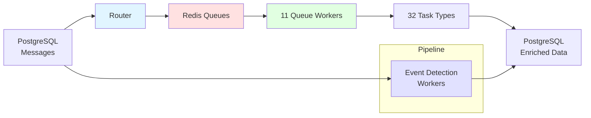
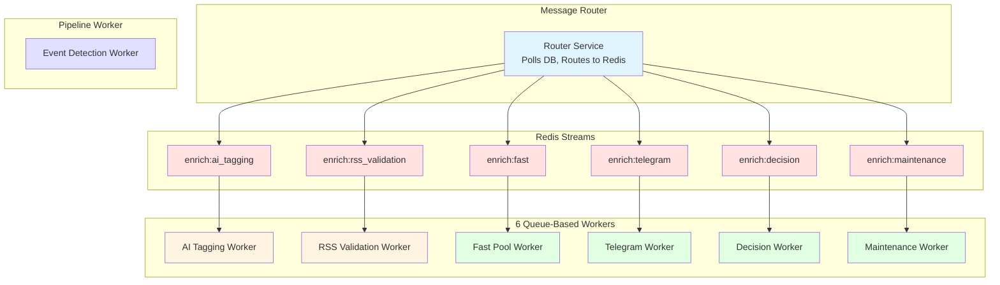
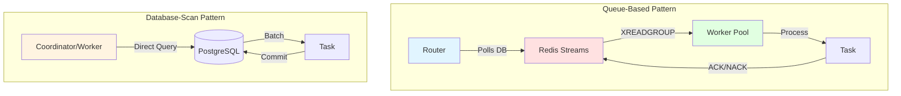
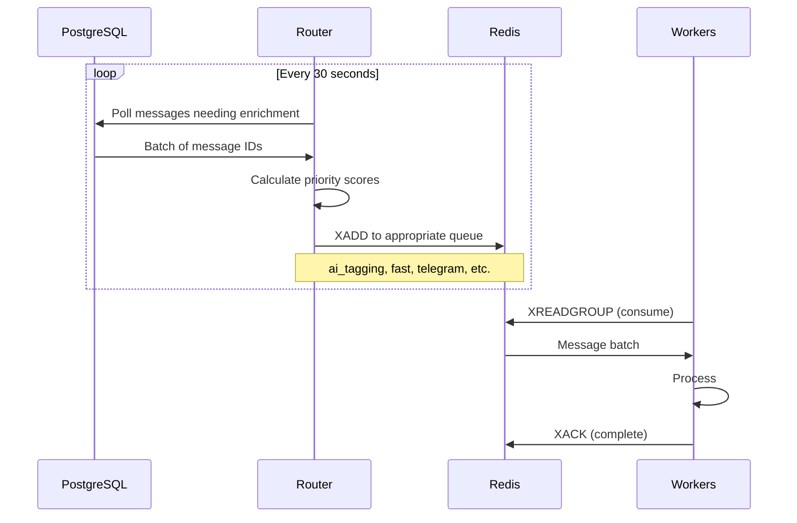
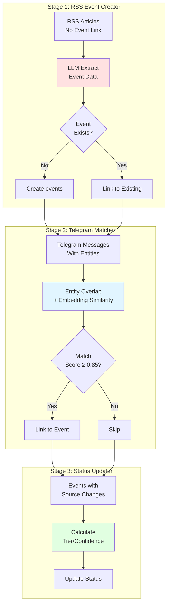
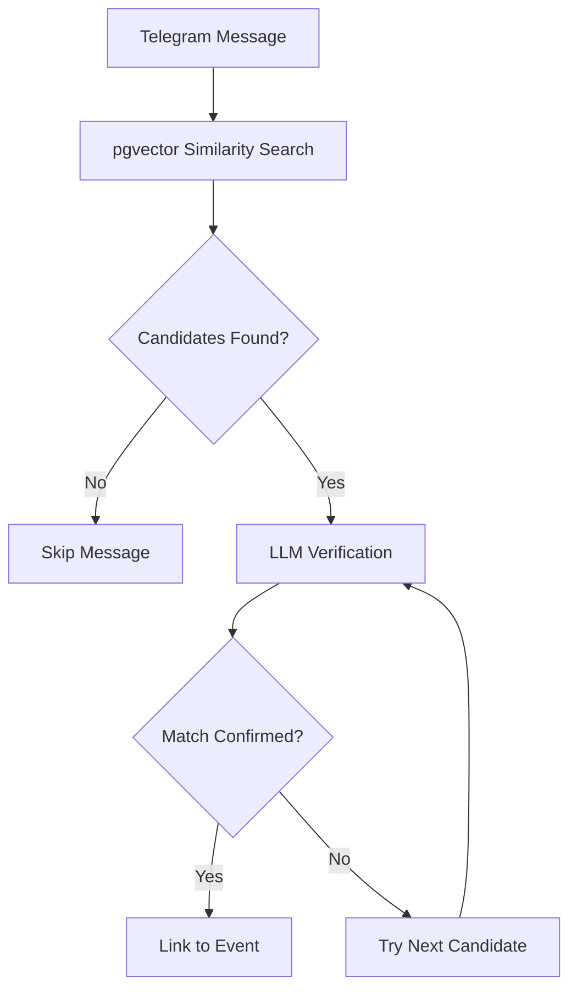
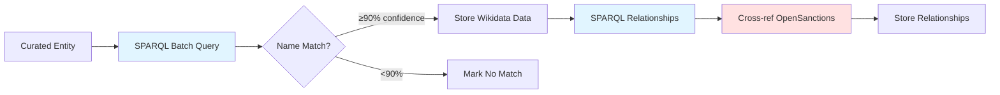
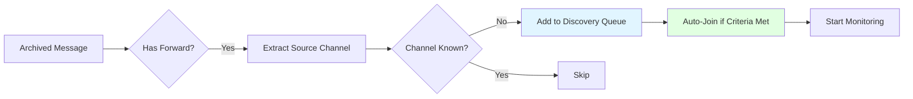
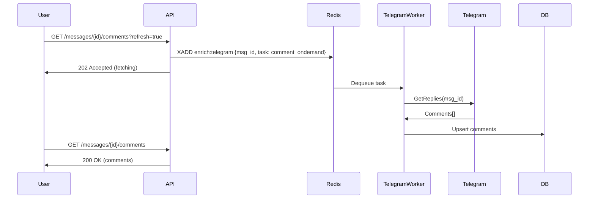
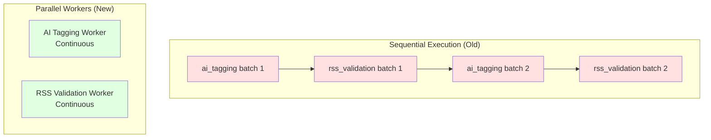

# Enrichment Service

**Background batch processing service for deep message analysis and metadata enrichment**

## Overview

The Enrichment Service handles asynchronous, batch-oriented processing of messages for expensive operations that don't need to block the real-time processing pipeline. It operates independently from the Processor service, with **distinct performance requirements and failure characteristics**.



### Key Characteristics

| Aspect | Enrichment Service | Processor Service |
|--------|-------------------|-------------------|
| **Processing Mode** | Background batch processing | Real-time per-message |
| **Speed** | Can be slow (minutes to hours) | Must be fast (<1 second) |
| **Priority** | Asynchronous | Critical path |
| **Failure Impact** | Metadata temporarily missing | Message delivery blocked |
| **Resource Usage** | CPU/memory intensive | Bounded and predictable |

!!! success "Production Stats"
    - **32 Task Types** across 11 workers (6 queue-based + 5 pipeline/dedicated)
    - **Background Processing**: Enriches ~50,000 messages/day
    - **LLM Tasks**: Dedicated workers prevent Ollama contention (50% faster)
    - **Cost**: €0/month (self-hosted Ollama CPU inference)

## Architecture

### Component Overview



### Three-Phase Architecture

#### Phase 1: Message Router

Routes work from PostgreSQL to Redis Streams queues with priority scoring.

**File**: `/services/enrichment/src/router.py`

```python
# Router polls DB and routes messages to appropriate Redis queue
messages = await poll_messages_for_task(session, "ai_tagging", limit=100)

for msg in messages:
    priority = calculate_priority(msg)  # importance + channel + age boost
    await queue.enqueue(message_id=msg.id, task="ai_tagging", priority=priority)
```

**Priority Calculation**:
- Base: `importance_level` (critical=100, high=75, medium=50, low=25)
- Bonus: `channel_priority` (critical=50, high=30, normal=10, low=0)
- Age boost: +2 per hour waiting (max +20)

**Backpressure**:
- Pause routing if queue depth > 1000
- Resume when depth < 500

#### Phase 2: Worker Pools

11 worker types (6 queue-based + 5 pipeline/dedicated):

| Worker | Queue | Tasks Handled | LLM? | Rate Limited? |
|--------|-------|---------------|------|---------------|
| **AI Tagging** | `enrich:ai_tagging` | AI tag generation | ✅ | ❌ |
| **RSS Validation** | `enrich:rss_validation` | Article validation | ✅ | ❌ |
| **Fast Pool** | `enrich:fast` | Embedding, translation, entity matching, geolocation, RSS correlation | ❌ | ❌ |
| **Telegram** | `enrich:telegram` | Engagement polling, social graph, comments, forward discovery | ❌ | ✅ (20 req/s) |
| **Decision** | `enrich:decision` | Decision verification, reprocessing | ❌ | ❌ |
| **Maintenance** | `enrich:maintenance` | Channel cleanup, quarantine, discovery eval, Wikidata | ❌ | ❌ |
| **Event Detection** | *Pipeline (DB-scan)* | RSS event creator, Telegram matcher, status updater | ✅ | ❌ |
| **Geolocation LLM** | `enrich:geolocation_llm` | LLM-based location extraction | ✅ | ❌ |
| **Cluster Detection** | `enrich:cluster_detection` | Cluster detection, archiver, tier updater | ❌ | ❌ |
| **Cluster Validation** | `enrich:cluster_validation` | LLM-based cluster validation | ✅ | ❌ |

#### Phase 3: Task Execution

32 task types (most inherit from `BaseEnrichmentTask`):

### Task Execution Patterns

The Enrichment Service uses two distinct execution patterns based on task characteristics:



#### Queue-Based Pattern (Router → Redis → Workers)

**Used by**: AI Tagging, RSS Validation, Fast Pool tasks, Telegram tasks, Decision tasks

**How It Works**:

1. **Router** polls PostgreSQL for messages needing enrichment
2. **Router** enqueues message IDs to Redis Streams with priority
3. **Workers** consume from Redis using `XREADGROUP` (consumer groups)
4. **Workers** fetch full message from DB and process
5. **Workers** ACK on success, NACK on failure (retry or DLQ)

**Advantages**:

- ✅ Horizontal scaling (add more workers)
- ✅ Work distribution across instances
- ✅ Backpressure control (pause routing when queue full)
- ✅ Retry/DLQ for fault tolerance
- ✅ Priority-based processing

**Code Pattern**:

```python
# Router (enqueue)
async def route_messages(self):
    messages = await poll_messages_for_task(session, "ai_tagging", limit=100)
    for msg in messages:
        await self.queue.enqueue(message_id=msg.id, task="ai_tagging", priority=score)

# Worker (dequeue)
async def process_cycle(self):
    batch = await self.queue.dequeue(count=self.batch_size, block_ms=2000)
    for item in batch:
        try:
            await self.task.process(item.data["message_id"], session)
            await self.queue.ack(item)
        except Exception as e:
            await self.queue.nack(item, str(e))
```

#### Database-Scan Pattern (Direct DB Query)

**Used by**: Forward Discovery, Comment Backfill, some Maintenance tasks, Event Detection Pipeline

**How It Works**:

1. **Worker** directly queries PostgreSQL for work (no Redis intermediary)
2. **Worker** processes batch within single transaction
3. **Worker** commits and sleeps until next cycle

**Advantages**:

- ✅ Simpler architecture (no Redis dependency for work discovery)
- ✅ Transaction guarantees (ACID)
- ✅ Good for sequential/dependent operations
- ✅ LLM task isolation (no contention)

**Disadvantages**:

- ❌ Single-instance only (no horizontal scaling)
- ❌ No work distribution
- ❌ No built-in retry/DLQ

**Code Pattern**:

```python
# Database-scan pattern (used by maintenance tasks, event detection)
async def run_cycle(self):
    async with get_session() as session:
        messages = await session.execute(text("""
            SELECT id FROM messages
            WHERE needs_processing = true
            ORDER BY priority DESC
            LIMIT :batch_size
        """), {"batch_size": self.batch_size})

        for msg in messages:
            await self.task.process(msg.id, session)

        await session.commit()
```

#### Pattern Selection Guide

| Criteria | Queue-Based | Database-Scan |
|----------|-------------|---------------|
| **Need horizontal scaling?** | ✅ Yes | ❌ No |
| **LLM task isolation?** | ⚠️ Possible | ✅ Preferred |
| **Transaction guarantees?** | ❌ Eventual | ✅ ACID |
| **Rate limiting needed?** | ✅ Built-in | ⚠️ Manual |
| **Retry/DLQ needed?** | ✅ Built-in | ⚠️ Manual |
| **Simple implementation?** | ❌ More complex | ✅ Simpler |

**Task Pattern Assignments**:

| Task | Pattern | Reason |
|------|---------|--------|
| `ai_tagging` | Queue-based | Needs scaling, LLM isolation via dedicated queue |
| `rss_validation` | Queue-based | Needs scaling, LLM isolation via dedicated queue |
| `embedding` | Queue-based | CPU-bound, benefits from parallel workers |
| `translation` | Queue-based | API rate limits handled by worker |
| `engagement_polling` | Queue-based | Telegram rate limits, needs distribution |
| `comment_ondemand` | Queue-based | User-triggered, needs priority handling |
| `forward_discovery` | Database-scan | Background, no scaling need, maintenance task |
| `rss_event_creator` | Pipeline | Sequential dependency, LLM isolation |
| `telegram_event_matcher` | Pipeline | Sequential dependency, LLM isolation |
| `event_status_updater` | Pipeline | Sequential dependency, no LLM |

---

```python
class BaseEnrichmentTask(ABC):
    def requires_llm(self) -> bool:
        """Return True if task uses Ollama."""
        return False

    def get_priority(self) -> int:
        """Return 0-100 (higher = more urgent)."""
        return 50

    @abstractmethod
    async def process_batch(self, messages: List[Any], session: AsyncSession) -> int:
        """Process a batch of messages."""
        pass
```

## Workers Reference

### Router Service

**Purpose**: Central work distributor - polls PostgreSQL and routes work to Redis queues

**Queue**: N/A (produces to all queues)
**File**: `/services/enrichment/src/router.py`
**Container**: `enrichment-router`

**Configuration**:

```bash
ROUTER_POLL_INTERVAL=30        # Seconds between DB polls
ROUTER_BATCH_SIZE=100          # Messages per poll cycle
BACKPRESSURE_HIGH=1000         # Pause routing when queue exceeds
BACKPRESSURE_LOW=500           # Resume routing when queue drops below
METRICS_PORT=9198
```

**How It Works**:



**Priority Calculation**:

```python
def calculate_priority(msg) -> int:
    """Calculate message priority (0-200)."""
    # Base: importance_level
    base = {
        "critical": 100,
        "high": 75,
        "medium": 50,
        "low": 25
    }.get(msg.importance_level, 50)

    # Bonus: channel_priority
    channel_bonus = {
        "critical": 50,
        "high": 30,
        "normal": 10,
        "low": 0
    }.get(msg.channel_priority, 10)

    # Age boost: +2 per hour waiting (max +20)
    hours_waiting = (now() - msg.created_at).total_seconds() / 3600
    age_boost = min(int(hours_waiting * 2), 20)

    return base + channel_bonus + age_boost
```

**Backpressure Control**:

When a queue exceeds `BACKPRESSURE_HIGH` (default 1000), the router:

1. Pauses routing to that queue
2. Logs warning with queue depth
3. Emits `enrichment_backpressure_active{queue="..."} 1` metric
4. Resumes when queue drops below `BACKPRESSURE_LOW` (default 500)

This prevents unbounded queue growth if workers can't keep up.

**Task Discovery Queries**:

The router uses task-specific queries to find work:

```sql
-- AI Tagging: Messages without AI tags
SELECT m.id FROM messages m
WHERE m.is_spam = false
  AND m.content IS NOT NULL
  AND NOT EXISTS (
    SELECT 1 FROM message_tags mt
    WHERE mt.message_id = m.id AND mt.generated_by = 'ai_tagging'
  )
LIMIT :batch_size;

-- Embedding: Messages without embeddings
SELECT m.id FROM messages m
WHERE m.content_embedding IS NULL
  AND m.content IS NOT NULL
  AND m.is_spam = false
LIMIT :batch_size;

-- Translation: Non-English messages without translation
SELECT m.id FROM messages m
WHERE m.content_translated IS NULL
  AND m.content IS NOT NULL
  AND m.is_spam = false
LIMIT :batch_size;
```

**Metrics**:

```prometheus
# Router cycle metrics
enrichment_router_cycle_duration_seconds 2.5
enrichment_router_messages_routed_total{queue="ai_tagging"} 1500

# Backpressure metrics
enrichment_backpressure_active{queue="ai_tagging"} 0
enrichment_queue_depth{queue="ai_tagging"} 150
```

---

### 1. AI Tagging Worker

**Purpose**: Generate AI-powered tags using Ollama LLM

**Queue**: `enrich:ai_tagging`
**File**: `/services/enrichment/src/workers/ai_tagging_worker.py`
**Tasks**: `ai_tagging`

**Configuration**:

```bash
OLLAMA_HOST=http://ollama-batch:11434
AI_TAGGING_MODEL=qwen2.5:3b
TIME_BUDGET_SECONDS=120  # Max processing time per cycle
BATCH_SIZE=10
CYCLE_INTERVAL_SECONDS=30
METRICS_PORT=9096
```

**How It Works**:

1. Dequeues message IDs from Redis
2. Fetches full message content from DB
3. Calls Ollama LLM for deep analysis
4. Generates tags: keywords, topics, entities, emotions, urgency
5. ACKs messages in Redis

**Circuit Breaker**:
- Opens after 5 consecutive failures
- Opens after slow responses (>30s per message)
- Recovers after 5 minutes

**Metrics**:
- `enrichment_llm_requests_total{task="ai_tagging", model="qwen2.5:3b"}`
- `enrichment_llm_duration_seconds{task="ai_tagging"}`
- `enrichment_queue_depth{queue="redis:ai_tagging"}`

### 2. RSS Validation Worker

**Purpose**: Validate Telegram messages against correlated RSS articles

**Queue**: `enrich:rss_validation`
**File**: `/services/enrichment/src/workers/rss_validation_worker.py`
**Tasks**: `rss_validation`

**Configuration**:

```bash
OLLAMA_HOST=http://ollama-batch:11434
RSS_VALIDATION_MODEL=qwen2.5:3b
TIME_BUDGET_SECONDS=60
BATCH_SIZE=5  # Smaller batches (processes multiple articles per message)
CYCLE_INTERVAL_SECONDS=30
MIN_SIMILARITY=0.5
METRICS_PORT=9097
```

**Validation Flow**:

1. Fetch message + correlated RSS articles (similarity ≥ 0.5)
2. Call LLM to classify relationship: `confirms`, `contradicts`, `provides_context`
3. Store validation result with confidence score
4. Update correlation quality metrics

**Why Separate from AI Tagging?**
- Different batch sizes (5 vs 10)
- Different time budgets (60s vs 120s)
- Independent scaling
- Prevents blocking each other for Ollama access

### 3. Fast Pool Worker

**Purpose**: Handle CPU-bound non-LLM tasks

**Queue**: `enrich:fast`
**File**: `/services/enrichment/src/workers/fast_worker.py`
**Tasks**: `embedding`, `translation`, `entity_matching`, `rss_correlation`

**Configuration**:

```bash
TIME_BUDGET_SECONDS=60
BATCH_SIZE=50
CYCLE_INTERVAL_SECONDS=30
EMBEDDING_MODEL=all-MiniLM-L6-v2
DEEPL_API_KEY=your-key-here
ENTITY_MATCHING_THRESHOLD=0.75
METRICS_PORT=9199
```

**Task Routing**:

```python
# Router pushes to single queue, worker routes internally
TASK_CLASSES = {
    "embedding": EmbeddingTask,          # Vector generation
    "translation": TranslationTask,       # DeepL/Google Translate
    "entity_matching": EntityMatchingTask, # Knowledge graph matching
    "rss_correlation": RSSCorrelationTask, # Vector similarity search
}
```

**Performance**:

| Task | Throughput | Bottleneck |
|------|------------|------------|
| Embedding | 20-30 msg/s | CPU (model inference) |
| Translation | 10-20 msg/s | API rate limits |
| Entity Matching | 50-100 msg/s | Database queries |
| RSS Correlation | 30-50 msg/s | pgvector search |

### 4. Telegram Worker

**Purpose**: Handle rate-limited Telegram API calls

**Queue**: `enrich:telegram`
**File**: `/services/enrichment/src/workers/telegram_worker.py`
**Tasks**: `engagement_polling`, `social_graph_extraction`, `comment_fetcher`, `comment_realtime`, `comment_backfill`, `comment_ondemand`, `forward_discovery`

**Configuration**:

```bash
TIME_BUDGET_SECONDS=120
BATCH_SIZE=20
CYCLE_INTERVAL_SECONDS=30
RATE_LIMIT_PER_SECOND=20  # Prevent FloodWait
TELEGRAM_API_ID=your-api-id
TELEGRAM_API_HASH=your-api-hash
TELEGRAM_SESSION_PATH=/app/sessions/enrichment_telegram
COMMENT_AUTO_TRANSLATE=false  # On-demand translation via API
METRICS_PORT=9200
```

**Two Work Modes**:

1. **Queue-based**: Consumes from Redis (`engagement_polling`, `comment_fetcher`, etc.)
2. **Database-scan**: Polls DB directly (`forward_discovery`, `comment_backfill`, `comment_realtime`)

**Rate Limiting**:

```python
async def _rate_limit(self):
    """Enforce 20 req/s limit."""
    elapsed = time.time() - self._last_request_time
    if elapsed < self._min_request_interval:
        await asyncio.sleep(self._min_request_interval - elapsed)
    self._last_request_time = time.time()
```

**Comment Fetching Strategy**:

- **comment_fetcher**: Initial fetch for new messages
- **comment_realtime**: Tiered refresh (0-24h = 4h, 1-7d = 24h, 7-30d = weekly)
- **comment_backfill**: Historical catchup for missed messages
- **Viral posts**: Refresh every 4 hours (tracked in `viral_posts` table)

### 5. Decision Worker

**Purpose**: Verify LLM decision quality

**Queue**: `enrich:decision`
**File**: `/services/enrichment/src/workers/decision_worker.py`
**Tasks**: `decision_verifier`, `decision_reprocessor`

**Configuration**:

```bash
TIME_BUDGET_SECONDS=60
BATCH_SIZE=50
CYCLE_INTERVAL_SECONDS=30
METRICS_PORT=9201
```

**Use Cases**:

- **decision_verifier**: Flag low-confidence classifications
- **decision_reprocessor**: Re-run LLM on flagged messages

### 6. Maintenance Worker

**Purpose**: Periodic cleanup and housekeeping

**Queue**: `enrich:maintenance`
**File**: `/services/enrichment/src/workers/maintenance_worker.py`
**Tasks**: `channel_cleanup`, `quarantine_processor`, `discovery_evaluator`, `wikidata_enrichment`

**Configuration**:

```bash
TIME_BUDGET_SECONDS=120
BATCH_SIZE=100
CYCLE_INTERVAL_SECONDS=300  # 5 minutes
WIKIDATA_BATCH_SIZE=50
WIKIDATA_MIN_CONFIDENCE=0.90
METRICS_PORT=9202
```

**Task Functions**:

- **channel_cleanup**: Remove stale/inactive channels
- **quarantine_processor**: Review quarantined messages
- **discovery_evaluator**: Score channel quality for recommendations
- **wikidata_enrichment**: Enrich entities with Wikidata metadata

### 7. Event Detection Worker (V2)

**Purpose**: RSS-centric event detection pipeline - creates events from news articles, then links Telegram messages

**Queue**: None (pipeline worker, database-scan pattern)
**File**: `/services/enrichment/src/workers/event_detection_worker.py`
**Container**: `enrichment-event-detection`
**Tasks**: `rss_event_creator`, `telegram_event_matcher`, `event_status_updater`

**Configuration**:

```bash
OLLAMA_HOST=http://ollama-batch:11434
EVENT_DETECTION_MODEL=qwen2.5:3b
TIME_BUDGET_SECONDS=300  # 5 minutes total
BATCH_SIZE=10
CYCLE_INTERVAL_SECONDS=60
METRICS_PORT=9098

# Event matching thresholds
EVENT_ENTITY_OVERLAP_THRESHOLD=1      # Min shared entities for matching
EVENT_EMBEDDING_SIMILARITY_THRESHOLD=0.85  # Semantic similarity cutoff
EVENT_TIME_WINDOW_HOURS=72            # Max hours between article and message
```

**Architecture Overview**:



**Pipeline Stages**:

#### Stage 1: RSS Event Creator

**File**: `/services/enrichment/src/tasks/rss_event_creator.py`
**LLM Required**: ✅ Yes

Extracts structured event data from RSS articles using LLM analysis.

**Process**:

1. Query RSS articles without event links
2. Call LLM to extract: event type, title, description, date, location, entities
3. Check if similar event already exists (by embedding similarity)
4. Create new `events` record or link to existing
5. Mark article as processed

**LLM Prompt** (simplified):

```
Extract event information from this news article:

Title: {article.title}
Content: {article.content}

Return JSON with:
- event_type: military_action | political | humanitarian | infrastructure | other
- title: Short event title
- description: 2-3 sentence summary
- date: Event date (if mentioned)
- location: Geographic location
- entities: List of people/organizations/equipment mentioned
```

**Output Schema** (events):

```sql
INSERT INTO events (
    title, description, event_type, event_date,
    location, status, tier, confidence,
    created_from_source, created_from_source_id,
    embedding
)
VALUES (
    :title, :description, :event_type, :date,
    :location, 'detected', 1, :confidence,
    'rss_article', :article_id,
    :embedding  -- Generated from title + description
);
```

**Time Budget**: 50% (150s of 300s total)

#### Stage 2: Telegram Event Matcher

**File**: `/services/enrichment/src/tasks/telegram_event_matcher.py`
**LLM Required**: ✅ Yes (uses embedding similarity for candidates, LLM to verify match)

Links Telegram messages to existing events using a two-phase approach: embedding similarity for candidate selection, then LLM verification.

**Matching Process**:



1. **Candidate Selection** (embedding similarity ≥ 0.75):
   - Uses pgvector cosine distance against `events.content_embedding`
   - Returns top 3 most similar events
   - Only considers non-archived events

2. **LLM Verification** (uses `event_match` prompt):
   - Verifies if message actually discusses the candidate event
   - Returns confidence score, match reason, location match, entity overlap
   - Requires confidence ≥ 0.7 to confirm match

**Configuration**:

```python
similarity_threshold: float = 0.75,        # Min embedding similarity for candidates
match_confidence_threshold: float = 0.7,   # Min LLM confidence to confirm match
max_candidates: int = 3,                   # Max events to consider per message
```

**Candidate Query**:

```sql
SELECT
    e.id, e.title, e.event_type, e.location_name,
    e.event_date, e.summary,
    1 - (e.content_embedding <=> CAST(:embedding AS vector)) as similarity
FROM events e
WHERE e.content_embedding IS NOT NULL
  AND e.archived_at IS NULL
  AND 1 - (e.content_embedding <=> :embedding) >= :threshold
ORDER BY similarity DESC
LIMIT :max_candidates
```

**LLM Verification Prompt** (`event_match` task):

```
TELEGRAM MESSAGE:
{content}
Channel: {channel_name}
Date: {telegram_date}

CANDIDATE EVENT:
Title: {event_title}
Type: {event_type}
Location: {location}
Date: {event_date}
Summary: {summary}

→ Returns JSON: {is_match, confidence, match_reason, location_match, entity_overlap}
```

**Output** (event_messages):

```sql
INSERT INTO event_messages (
    event_id, message_id, channel_id,
    match_confidence, match_method
)
VALUES (
    :event_id, :message_id, :channel_id,
    :confidence, 'llm_verified'
)
ON CONFLICT (event_id, message_id) DO NOTHING
```

**Time Budget**: 40% (120s of 300s total)

#### Stage 3: Event Status Updater

**File**: `/services/enrichment/src/tasks/event_status_updater.py`
**LLM Required**: ❌ No

Updates event tier, confidence, and status based on linked sources.

**Tier Progression**:

| Tier | Criteria | Status |
|------|----------|--------|
| 1 | Single source | `detected` |
| 2 | 2+ sources from different types | `confirmed` |
| 3 | 5+ sources including official | `verified` |
| 4 | Cross-referenced with sanctions/entities | `validated` |

**Confidence Calculation**:

```python
def calculate_confidence(event) -> float:
    """Calculate event confidence (0.0 - 1.0)."""
    sources = get_event_sources(event.id)

    base_confidence = 0.3  # Single source baseline

    # Source diversity bonus
    source_types = set(s.source_type for s in sources)
    diversity_bonus = len(source_types) * 0.1  # +0.1 per unique type

    # Source count bonus
    count_bonus = min(len(sources) * 0.05, 0.2)  # Max +0.2

    # Entity verification bonus
    if event.has_verified_entities:
        entity_bonus = 0.1
    else:
        entity_bonus = 0.0

    return min(base_confidence + diversity_bonus + count_bonus + entity_bonus, 1.0)
```

**Update Query**:

```sql
UPDATE events
SET tier = :new_tier,
    confidence = :new_confidence,
    status = :new_status,
    source_count = :source_count,
    last_updated = NOW()
WHERE id = :event_id
  AND (tier != :new_tier OR confidence != :new_confidence)
```

**Time Budget**: 10% (30s of 300s total)

**Why Pipeline Pattern?**

The Event Detection Worker uses the database-scan pattern (not queue-based) for several reasons:

1. **Sequential dependencies**: Events must exist before matching, matching must complete before status update
2. **LLM isolation**: Dedicated 300s time budget prevents Ollama contention with AI tagging
3. **Batch efficiency**: Processing related articles/messages together improves LLM context
4. **Transaction guarantees**: ACID ensures event + links created atomically

**Database Schema** (events):

```sql
-- Main events table
CREATE TABLE events (
    id SERIAL PRIMARY KEY,
    title TEXT NOT NULL,
    summary TEXT,
    event_type VARCHAR(50) NOT NULL,
    event_date DATE,
    location_name TEXT,
    tier_status VARCHAR(20) DEFAULT 'breaking',  -- breaking, developing, confirmed, archived
    rss_source_count INTEGER DEFAULT 1,
    content_embedding VECTOR(384),               -- For similarity matching
    created_at TIMESTAMP WITH TIME ZONE DEFAULT NOW(),
    updated_at TIMESTAMP WITH TIME ZONE DEFAULT NOW(),
    last_activity_at TIMESTAMP WITH TIME ZONE DEFAULT NOW(),
    archived_at TIMESTAMP WITH TIME ZONE         -- NULL = active
);

-- Links RSS articles (authoritative sources) to events
CREATE TABLE event_sources (
    id SERIAL PRIMARY KEY,
    event_id INTEGER REFERENCES events(id) ON DELETE CASCADE,
    article_id INTEGER REFERENCES external_news(id) ON DELETE CASCADE,
    is_primary_source BOOLEAN DEFAULT false,
    created_at TIMESTAMP WITH TIME ZONE DEFAULT NOW(),
    UNIQUE(event_id, article_id)
);

-- Links Telegram messages to events
CREATE TABLE event_messages (
    id SERIAL PRIMARY KEY,
    event_id INTEGER REFERENCES events(id) ON DELETE CASCADE,
    message_id INTEGER REFERENCES messages(id) ON DELETE CASCADE,
    channel_id INTEGER REFERENCES channels(id),   -- Denormalized for query efficiency
    match_confidence FLOAT NOT NULL,              -- LLM confidence (0.0-1.0)
    match_method VARCHAR(20) DEFAULT 'llm_verified',
    created_at TIMESTAMP WITH TIME ZONE DEFAULT NOW(),
    UNIQUE(event_id, message_id)
);

-- Helper function for finding similar events
CREATE OR REPLACE FUNCTION find_similar_events(
    query_embedding VECTOR,
    similarity_threshold FLOAT DEFAULT 0.78,
    max_results INT DEFAULT 1,
    max_hours_old INT DEFAULT 48
)
RETURNS TABLE(event_id INT, title TEXT, similarity FLOAT) AS $$
BEGIN
    RETURN QUERY
    SELECT
        e.id,
        e.title,
        1 - (e.content_embedding <=> query_embedding) as sim
    FROM events e
    WHERE e.content_embedding IS NOT NULL
      AND e.archived_at IS NULL
      AND e.created_at > NOW() - (max_hours_old || ' hours')::INTERVAL
      AND 1 - (e.content_embedding <=> query_embedding) >= similarity_threshold
    ORDER BY sim DESC
    LIMIT max_results;
END;
$$ LANGUAGE plpgsql;
```

!!! warning "Known Schema Issue"
    The `event_messages` table includes `channel_id` as a denormalized column for query efficiency.
    The channel is technically available via `messages.channel_id`, but storing it directly avoids
    a join when querying events by channel coverage.

**Metrics**:

```prometheus
# Stage metrics
enrichment_event_stage_duration_seconds{stage="rss_event_creator"} 45.2
enrichment_event_stage_duration_seconds{stage="telegram_matcher"} 38.1
enrichment_event_stage_duration_seconds{stage="status_updater"} 5.3

# Event metrics
enrichment_events_created_total 150
enrichment_events_matched_messages_total 1250
enrichment_events_tier_transitions_total{from="1", to="2"} 45
```

### Geolocation Task

**File**: `/services/enrichment/src/tasks/geolocation.py`
**Worker**: Fast Pool (`enrich:fast` queue)

Extracts geographic coordinates from location mentions in messages using a 4-stage pipeline.

#### 4-Stage Pipeline

```
Stage 1: Gazetteer Match (offline, 0.95 confidence)
    ↓ miss
Stage 2: LLM Relative Location ("10km north of X", 0.75 confidence)
    ↓ miss
Stage 3: Nominatim API (OSM, 0.85 confidence)
    ↓ miss
Stage 4: Mark Unresolved (manual review queue)
```

**Stage 1 - Gazetteer**: Instant lookup against local GeoNames database (~30,000 UA/RU locations). Returns 0.95 confidence.

**Stage 2 - LLM Relative**: Handles "10km north of Bakhmut" patterns. Uses qwen2.5:3b via Ollama. Returns 0.75 confidence.

**Stage 3 - Nominatim**: OpenStreetMap API fallback. Rate-limited to 1 req/sec. Returns 0.85 confidence.

**Stage 4 - Unresolved**: Failed all stages. Creates entry with `extraction_method='unresolved'` for manual review.

#### Configuration

```bash
NOMINATIM_URL=https://nominatim.openstreetmap.org
GEOLOCATION_MODEL=qwen2.5:3b
```

#### Real-Time Updates

Publishes to Redis `map:new_location` for WebSocket live map updates.

---

### Cluster Detection Worker (V3)

**File**: `/services/enrichment/src/workers/cluster_detection_worker.py`
**Tasks**: `cluster_detection`, `cluster_archiver`, `cluster_tier_updater`
**Queue**: `enrich:cluster_detection`
**Container**: `enrichment-cluster-detection`

Dedicated worker for Telegram-centric event detection (Event Detection V3). Detects event clusters from message velocity spikes using embedding similarity, then runs auxiliary maintenance tasks.

#### Architecture

The cluster_detection_worker runs three tasks in sequence each cycle:

1. **cluster_detection**: Main detection task - finds velocity spikes and groups similar messages
2. **cluster_archiver**: Archives stale rumors (>24h) and propaganda clusters
3. **cluster_tier_updater**: Recalculates tiers for all validated clusters

#### Detection Algorithm

1. Monitor message velocity per location (messages/hour)
2. Trigger when velocity > `CLUSTER_VELOCITY_THRESHOLD` in time window
3. Check embedding similarity > `CLUSTER_SIMILARITY_THRESHOLD` (0.80)
4. Create cluster if >= `MIN_MESSAGES_FOR_CLUSTER` similar messages

#### Tier Progression

Tiers auto-upgrade via database triggers:

| Tier | Channels | Cross-Affiliation |
|------|----------|-------------------|
| `rumor` | 1 | No |
| `unconfirmed` | 2-3 | No |
| `confirmed` | 3+ | Yes |
| `verified` | Any | Human verified |

#### Configuration

```bash
CLUSTER_VELOCITY_THRESHOLD=2.0      # messages/hour
CLUSTER_TIME_WINDOW_HOURS=2
CLUSTER_SIMILARITY_THRESHOLD=0.80   # embedding cosine
MIN_MESSAGES_FOR_CLUSTER=3
```

#### Key Tables

- `telegram_event_clusters`: Detected clusters with tier/status
- `cluster_messages`: Junction table with similarity scores
- `message_locations`: Geocoded coordinates from geolocation task

---

### Geolocation LLM Task

**File**: `/services/enrichment/src/tasks/geolocation_llm.py`
**Worker**: Fast Pool (`enrich:fast` queue)
**Priority**: 60
**LLM Required**: Yes (qwen2.5:3b via Ollama)

Handles messages that the fast geolocation task couldn't process by using LLM to extract location names, then geocoding them.

#### Pipeline

```
1. LLM extracts location names from text (handles RU/UA/EN)
2. Gazetteer lookup for extracted names (offline, 0.95 confidence)
3. Nominatim API for names not in gazetteer (online, 0.85 confidence)
4. Store coordinates in message_locations table
```

**Use Case**: Messages containing location mentions that aren't direct matches (e.g., "near the city center", "eastern part of Bakhmut").

#### Work Query

Selects messages that:
- Have content > 50 chars
- Are not spam
- Are older than 1 hour (gives fast pool time first)
- Don't already have `message_locations` entries

#### Configuration

```bash
OLLAMA_HOST=http://ollama:11434
GEOLOCATION_MODEL=qwen2.5:3b
NOMINATIM_URL=https://nominatim.openstreetmap.org
```

#### Key Methods

- `_extract_locations_with_llm()` - LLM prompt returns location names, one per line
- `_geocode_location()` - Gazetteer first, then Nominatim fallback
- `_save_location()` - Stores with `extraction_method='llm_gazetteer'` or `'llm_nominatim'`

---

### Discovery Metrics Collector Task

**File**: `/services/enrichment/src/tasks/discovery_metrics_collector.py`
**Worker**: Maintenance Worker (`enrich:maintenance` queue)
**Priority**: 50
**Dependencies**: Telegram client (passed from main.py)

Polls discovery channels via Telegram API to collect quality metrics WITHOUT archiving messages.

#### Role in Discovery Pipeline

```
1. ForwardDiscoveryTask → Joins channels (adds to channels table)
2. THIS TASK → Polls and analyzes messages (updates quality_metrics)
3. DiscoveryEvaluatorTask → Promotes/rejects based on metrics
```

**Why This Matters**: Enables evaluation of channels BEFORE committing to archive them. Channels in probation period (14 days) are monitored but not archived until quality is proven.

#### How It Works

1. Fetches last 30 messages from each discovery channel
2. Runs through spam filter + relevance classifier
3. Updates `channels.quality_metrics` with counts
4. Does NOT store message content in database

#### Quality Analysis

**Spam Indicators** (2+ required to flag): casino, crypto, bitcoin, buy now, giveaway, etc.

**Relevance Keywords (UA)**: зсу, всу, drone, артилер, tank, фронт, military, etc.

**Relevance Keywords (RU)**: сво, спецоперац, вагнер, dnr, lnr, донецк, etc.

**Off-Topic Keywords**: recipe, fashion, celebrity, sport, weather, horoscope, etc.

#### Output Metrics

```json
{
  "total_messages_received": 156,
  "spam_messages": 12,
  "off_topic_messages": 8,
  "high_quality_messages": 98,
  "spam_rate": 0.0769,
  "off_topic_rate": 0.0513,
  "last_poll_at": "2025-12-18T15:30:00Z"
}
```

#### Configuration

- Poll interval: 6 hours between polls for same channel
- Messages per poll: 30
- Rate limiting: 2 second delay between channel polls

---

### RSS Correlation Task

**File**: `/services/enrichment/src/tasks/rss_correlation.py`
**Worker**: Fast Pool (`enrich:fast` queue)
**Priority**: 60 (after embeddings, before validation)
**Dependencies**: pgvector extension

Matches Telegram messages with RSS news articles using semantic similarity.

#### Purpose

Creates correlation records between Telegram messages and RSS articles for:
- Unified intelligence display (show related sources)
- Downstream validation by `RSSValidationTask` (LLM classification)
- Perspective difference detection (RU vs UA sources)

#### Algorithm

```
1. For each message with embedding:
   - Search for RSS articles within time window (±24 hours)
   - Calculate cosine similarity using pgvector <=> operator
   - Create correlation records for matches above threshold
```

#### Correlation Types

| Similarity | Type | Description |
|------------|------|-------------|
| ≥ 0.85 | `same_event` | Very high match - likely same event |
| ≥ 0.75 | `related_topic` | High match - related coverage |
| ≥ 0.40 | `possibly_related` | Lower match - may be related |

#### Configuration

```bash
# Defaults (can be overridden in platform_config table)
RSS_CORRELATION_SIMILARITY_THRESHOLD=0.40  # Lower for cross-lingual
RSS_CORRELATION_TIME_WINDOW_HOURS=24       # News often lags Telegram
MAX_ARTICLES_PER_MESSAGE=10
```

#### Perspective Detection

Automatically flags when sources represent opposing perspectives:
- `channel_folder` contains "RU" + `article.source_category` contains "UA" → `perspective_difference=true`

---

### Cluster Tier Updater Task

**File**: `/services/enrichment/src/tasks/cluster_tier_updater.py`
**Worker**: Maintenance Worker (`enrich:maintenance` queue)
**Priority**: 40
**LLM Required**: No (rule-based)

Periodically recalculates cluster tiers to catch edge cases missed by database triggers.

#### Purpose

Complements automatic triggers but ensures no edge cases are missed (e.g., RSS articles added after initial cluster validation).

#### How It Works

Calls PostgreSQL function `recalculate_cluster_tiers()` which:
1. Checks all validated clusters
2. Recalculates tier based on current evidence
3. Returns list of upgrades

#### Tier Recalculation Logic (in PostgreSQL function)

```sql
-- Tier hierarchy:
-- verified: RSS corroboration + 3+ channels
-- confirmed: RSS corroboration OR (cross-affiliation + 5+ channels)
-- unconfirmed: Cross-affiliation + 3+ channels
-- rumor: Everything else
```

#### Stats Output

```json
{
  "clusters_checked": 150,
  "tiers_upgraded": 3,
  "recent_upgrades": [
    [456, "unconfirmed", "confirmed"],
    [789, "rumor", "unconfirmed"]
  ]
}
```

---

### Cluster Validation Worker (V3)

**File**: `/services/enrichment/src/workers/cluster_validation_worker.py`
**Task**: `cluster_validation`
**Queue**: `enrich:cluster_validation`
**Container**: `enrichment-cluster-validation`
**LLM Required**: Yes (qwen2.5:3b via Ollama)

Dedicated LLM worker for validating detected clusters using claim analysis. Completes the Event Detection V3 pipeline:

```
cluster_detection → cluster_validation → cluster_tier_updater → cluster_archiver
                    ^^^^^^^^^^^^^^^^
                    (this worker)
```

Validates detected clusters using LLM claim analysis.

#### Validation Stages

1. **LLM Claim Analysis**: Classifies as `factual_report`, `rumor`, `propaganda`, or `opinion`
2. **Cross-Affiliation Check**: RU + UA sources = higher confidence
3. **RSS Corroboration**: Check if RSS articles support the cluster
4. **Tier Assignment**: Based on evidence
5. **Auto-Archive**: Propaganda clusters archived immediately

#### Claim Types

| Type | Characteristics |
|------|-----------------|
| `factual_report` | Specific details, named sources, verifiable claims |
| `rumor` | Unverified claims, "reportedly", "allegedly" |
| `propaganda` | Emotional language, extreme claims, clear bias |
| `opinion` | Commentary, analysis, personal views |

#### Tier Assignment Logic

```python
if has_rss and channel_count >= 3:
    tier = 'verified'
elif has_rss:
    tier = 'confirmed'
elif cross_affiliation_met and channel_count >= 5:
    tier = 'confirmed'
elif cross_affiliation_met and channel_count >= 3:
    tier = 'unconfirmed'
else:
    tier = 'rumor'
```

#### Promotion to Event

Clusters with tier `confirmed` or `verified` are promoted to events:
1. Creates entry in `events` table
2. Links cluster via `promoted_to_event_id`
3. Copies messages to `event_messages` table

#### Configuration

```bash
CLUSTER_RUMOR_TTL_HOURS=24  # Auto-archive rumors after this
OLLAMA_HOST=http://ollama:11434
AI_TAGGING_MODEL=qwen2.5:3b
```

---

### Cluster Archiver Task

**File**: `/services/enrichment/src/tasks/cluster_archiver.py`
**Worker**: Maintenance Worker (`enrich:maintenance` queue)
**Priority**: 20 (lowest - maintenance task)
**LLM Required**: No (rule-based)

Auto-archives stale rumors and propaganda clusters to keep the event timeline clean.

#### Archive Conditions

1. **Stale Rumors**: Clusters with `tier='rumor'` older than TTL (default 24 hours)
   - Archive reason: `no_confirmation`

2. **Propaganda**: Clusters with `claim_type='propaganda'` (from validation)
   - Archive reason: `rejected_propaganda`

#### Archive Process

```sql
UPDATE telegram_event_clusters
SET status = 'archived',
    archived_at = NOW(),
    archive_reason = :reason
WHERE ...
```

#### Configuration

```bash
CLUSTER_RUMOR_TTL_HOURS=24  # Hours before auto-archiving unconfirmed rumors
```

#### Stats Output

```json
{
  "total_archived": 15,
  "rumors_archived": 12,
  "propaganda_archived": 3,
  "rumor_ttl_hours": 24
}
```

---

### Wikidata Enrichment

The Wikidata Enrichment task enriches curated and OpenSanctions entities with data from Wikidata, providing:

- **Profile data**: Images, descriptions, birth/founding dates, country, website
- **Social media**: Twitter, Telegram handles
- **Relationships**: Corporate, political, and associate connections via SPARQL queries
- **Cross-references**: Links relationships to local OpenSanctions database

**File**: `/services/enrichment/src/tasks/wikidata_enrichment.py`
**Worker**: Maintenance Worker (`enrich:maintenance` queue)

#### How It Works



1. **Entity Selection**: Fetches entities without `metadata.wikidata.enriched_at`
2. **Batch SPARQL Query**: Queries Wikidata for names (50 entities per batch)
3. **Name Matching**: Uses `SequenceMatcher` with 90% minimum confidence
4. **Disambiguation**: Prefers entities with descriptions, images, recent birth dates
5. **Property Extraction**: Extracts P18 (image), P569 (birth), P856 (website), etc.
6. **Relationship Fetching**: Queries SPARQL for corporate/political/associate relationships
7. **OpenSanctions Cross-Reference**: Enriches relationships with local sanctions data
8. **Storage**: Updates entity metadata JSONB with Wikidata and relationships

#### Configuration

```bash
# Maintenance Worker settings
WIKIDATA_BATCH_SIZE=50        # Entities per SPARQL query
WIKIDATA_MIN_CONFIDENCE=0.90  # Name match threshold (0.0-1.0)
```

#### Wikidata Properties Used

| Property | ID | Purpose |
|----------|-----|---------|
| Image | P18 | Profile picture |
| Birth Date | P569 | Person's birth date |
| Founding Date | P571 | Organization founding |
| Country | P17 | Country of citizenship/origin |
| Website | P856 | Official website |
| Twitter | P2002 | Twitter handle |
| Telegram | P3789 | Telegram handle |
| Employer | P108 | Corporate relationship |
| Owner Of | P1830 | Ownership relationship |
| Owned By | P127 | Ownership relationship |
| Position Held | P39 | Political position |
| Political Party | P102 | Party membership |
| Member Of | P463 | Organization membership |
| Partner | P451 | Personal associate |
| Business Partner | P1327 | Business associate |

#### Relationship Categories

Relationships are categorized into three groups:

| Category | Properties | Example |
|----------|------------|---------|
| **Corporate** | P108, P1830, P127 | "employer", "owns", "owned_by" |
| **Political** | P39, P102, P463 | "position", "party", "member_of" |
| **Associates** | P451, P1327 | "partner", "associate" |

#### Data Storage

**Entity Metadata** (stored in `curated_entities.metadata` or `opensanctions_entities.properties`):

```json
{
  "wikidata": {
    "qid": "Q7747",
    "match_confidence": 0.95,
    "label": "Vladimir Putin",
    "description": "President of Russia",
    "image_url": "https://commons.wikimedia.org/...",
    "birth_date": "1952-10-07",
    "country": "Russia",
    "website": null,
    "social_media": {
      "twitter": null,
      "telegram": null
    },
    "enriched_at": "2025-12-09T10:30:00Z",
    "wikidata_url": "https://www.wikidata.org/wiki/Q7747"
  },
  "relationships": {
    "fetched_at": "2025-12-09T10:30:05Z",
    "expires_at": "2025-12-16T10:30:05Z",
    "corporate": [],
    "political": [
      {
        "type": "position",
        "entity_id": "Q4964182",
        "name": "President of Russia",
        "start": "2012",
        "opensanctions_id": null,
        "is_sanctioned": false
      }
    ],
    "associates": [],
    "sources": ["wikidata", "opensanctions"]
  }
}
```

#### Relationship Caching

- **Cache Duration**: 7 days (configurable via `RELATIONSHIP_CACHE_DAYS`)
- **Refresh**: Triggered when `relationships.expires_at` is past
- **Force Refresh**: API supports `?refresh=true` parameter on entity endpoints

#### Rate Limiting

- **Request Delay**: 1 second between SPARQL requests (respects Wikidata guidelines)
- **Batch Size**: 50 entities per query (balances efficiency vs. timeout risk)
- **User-Agent**: Identifies as "OSINT-Intelligence-Platform/1.0"

#### Triggering Enrichment

Wikidata enrichment runs automatically via the Maintenance Worker, but can also be triggered:

1. **Automatic**: Router queues entities without Wikidata data
2. **Manual**: Add entity IDs to `enrich:maintenance` Redis queue
3. **API Refresh**: Call entity API with `?refresh=true`

#### Related Tables

- [`curated_entities`](../../reference/database-tables.md#curated_entities) - Stores Wikidata data in `metadata` JSONB
- [`opensanctions_entities`](../../reference/database-tables.md#opensanctions_entities) - Stores Wikidata data in `properties` JSONB
- [`entity_relationships`](../../reference/database-tables.md#entity_relationships) - Dedicated relationship storage (alternative to JSONB)

---

## Key Tasks

### LLM Tasks

#### AI Tagging

**File**: `/services/enrichment/src/tasks/ai_tagging.py`

Generates deep LLM analysis for message classification.

**Output Schema**:

```json
{
  "keywords": ["military", "equipment", "tank"],
  "topics": ["defense", "technology"],
  "entities": ["T-72B3", "Russian Armed Forces"],
  "emotions": ["concern", "alertness"],
  "urgency": "high"
}
```

**Query**:

```sql
SELECT m.id, m.content, m.content_translated
FROM messages m
WHERE m.is_spam = false
  AND m.content IS NOT NULL
  AND NOT EXISTS (
    SELECT 1 FROM message_tags mt
    WHERE mt.message_id = m.id AND mt.generated_by = 'ai_tagging'
  )
ORDER BY m.id ASC
LIMIT :batch_size
```

**Priority**: 100 (critical for search/display)

#### RSS Validation

**File**: `/services/enrichment/src/tasks/rss_validation.py`

Validates Telegram messages against correlated news articles.

**Input**: Messages with RSS correlations (similarity ≥ 0.5)

**LLM Prompt**:

```
Analyze relationship between Telegram message and news article:

Message: "{telegram_content}"
Article: "{rss_title}" - {rss_content}

Classify relationship:
- confirms: Article confirms message claims
- contradicts: Article contradicts message
- provides_context: Article adds context
```

**Output**:

```sql
INSERT INTO message_validations (
  message_id, source_type, source_id,
  validation_type, confidence_score, notes
)
VALUES (:message_id, 'rss_article', :article_id, :type, :confidence, :notes)
```

**Priority**: 50 (nice-to-have enrichment)

### CPU Tasks

#### Embedding

**File**: `/services/enrichment/src/tasks/embedding.py`

Generates 384-dimensional sentence embeddings for semantic search.

**Model**: `all-MiniLM-L6-v2` (default, configurable)

```python
from sentence_transformers import SentenceTransformer

model = SentenceTransformer('all-MiniLM-L6-v2')
embeddings = model.encode(texts, batch_size=batch_size)
```

**Query**:

```sql
SELECT m.id, m.content, m.content_translated
FROM messages m
WHERE m.content_embedding IS NULL
  AND m.content IS NOT NULL
  AND m.is_spam = false
ORDER BY m.id ASC
LIMIT :batch_size
```

**Update**:

```sql
UPDATE messages
SET content_embedding = :embedding
WHERE id = :message_id
```

**Performance**: ~20-30 messages/second on CPU

#### Translation

**File**: `/services/enrichment/src/tasks/translation.py`

Translates non-English messages to English.

**Translation Services**:

1. **DeepL Pro** (primary): Superior RU/UK quality, 500k chars/month free
2. **Google Translate** (fallback): Unlimited free tier

```python
# DeepL
translator = deepl.Translator(auth_key)
result = translator.translate_text(text, target_lang="EN-US")

# Google Translate (fallback)
translator = GoogleTranslator(source='auto', target='en')
result = translator.translate(text)
```

**Query**:

```sql
SELECT m.id, m.content
FROM messages m
WHERE m.content_translated IS NULL
  AND m.content IS NOT NULL
  AND m.is_spam = false
ORDER BY m.id ASC
LIMIT :batch_size
```

#### Entity Matching

**File**: `/services/enrichment/src/tasks/entity_matching.py`

Matches message content against 1,425 curated entities.

**Sources**:
- **ArmyGuide**: Military equipment (T-72B3, Su-35, etc.)
- **Root.NK**: Individuals and organizations
- **ODIN**: Sanctioned entities

**Match Types**:

```python
# 1. Exact name match
SELECT ce.id FROM curated_entities ce
WHERE LOWER(m.content) LIKE '%' || LOWER(ce.name) || '%'

# 2. Alias match
SELECT ce.id FROM curated_entities ce
WHERE LOWER(m.content) LIKE '%' || LOWER(ce.alias) || '%'

# 3. Hashtag match
SELECT ce.id FROM curated_entities ce
WHERE m.content LIKE '%#' || ce.name || '%'

# 4. Semantic match (pgvector)
SELECT ce.id FROM curated_entities ce
WHERE ce.embedding <=> m.content_embedding < 0.25  -- similarity > 0.75
```

**Output**:

```sql
INSERT INTO message_entities (message_id, entity_id, match_type, confidence)
VALUES (:message_id, :entity_id, :match_type, :confidence)
ON CONFLICT (message_id, entity_id) DO NOTHING
```

### Telegram API Tasks

#### Engagement Polling

**File**: `/services/enrichment/src/tasks/engagement_polling.py`

Polls Telegram for updated view/reaction counts.

**Polling Strategy**:

- **Hot** (0-24h): Poll every 4 hours
- **Warm** (1-7d): Poll every 24 hours
- **Cool** (7-30d): Poll weekly
- **Cold** (>30d): Archive, stop polling

```python
# Fetch from Telegram API
message = await client.get_messages(channel_id, ids=[msg_id])

# Update database
await session.execute(text("""
    UPDATE messages
    SET view_count = :views,
        reaction_count = :reactions,
        last_engagement_poll = NOW()
    WHERE id = :message_id
"""), {
    "views": message.views,
    "reactions": sum(r.count for r in message.reactions),
    "message_id": msg_id
})
```

**Timeline Tracking**:

```sql
INSERT INTO message_engagement_timeline (
  message_id, polled_at, view_count, reaction_count
)
VALUES (:message_id, NOW(), :views, :reactions)
```

#### Social Graph Extraction

**File**: `/services/enrichment/src/tasks/social_graph_extraction.py`

Extracts channel relationships from forwards/replies.

**Extraction Logic**:

```python
# Parse forward metadata
if message.forward:
    await session.execute(text("""
        INSERT INTO message_forwards (
          message_id, from_channel_id, from_message_id, forward_date
        )
        VALUES (:msg_id, :from_channel, :from_msg, :date)
    """))

# Parse reply metadata
if message.reply_to:
    await session.execute(text("""
        INSERT INTO message_replies (
          message_id, reply_to_message_id, reply_to_channel_id
        )
        VALUES (:msg_id, :reply_to_msg, :reply_to_channel)
    """))
```

**Channel Discovery**:

```python
# If forward is from unknown channel, add to discovery queue
if forward_channel_id not in known_channels:
    await session.execute(text("""
        INSERT INTO channel_discovery_queue (
          telegram_id, discovered_via, status
        )
        VALUES (:channel_id, 'forward', 'pending')
        ON CONFLICT (telegram_id) DO NOTHING
    """))
```

#### Comment Fetching

**File**: `/services/enrichment/src/tasks/comment_fetcher.py`

Fetches discussion group comments for messages.

**Three Task Modes**:

1. **comment_fetcher**: Initial fetch (triggered by processor)
2. **comment_realtime**: Tiered refresh polling
3. **comment_backfill**: Historical catchup

**Fetch Logic**:

```python
async def fetch_comments(channel_id: int, msg_id: int, discussion_group_id: int):
    # Get discussion group entity
    discussion_group = await client.get_entity(discussion_group_id)

    # Fetch comments
    comments = await client.get_messages(
        discussion_group,
        reply_to=msg_id,
        limit=100
    )

    # Store in database
    for comment in comments:
        await session.execute(text("""
            INSERT INTO message_comments (
              message_id, comment_telegram_id, author_id,
              content, posted_at, reactions
            )
            VALUES (:msg_id, :comment_id, :author, :content, :posted, :reactions)
            ON CONFLICT (comment_telegram_id) DO UPDATE
            SET reactions = EXCLUDED.reactions
        """))
```

**Translation**:

- Default: **Off** (translations cached, fetched on-demand via API)
- Optional: Enable auto-translate with `COMMENT_AUTO_TRANSLATE=true`

#### Forward Discovery

**File**: `/services/enrichment/src/tasks/forward_discovery.py`

Automatically discovers new channels from message forwards - a "snowball" discovery mechanism.

**How It Works**:



1. **Message Scan**: Queries messages with `forward_from_chat` metadata
2. **Channel Extraction**: Extracts source channel ID from forward header
3. **Deduplication**: Checks if channel already in `channels` or `channel_discovery_queue`
4. **Quality Scoring**: Scores channel based on forward frequency and source reputation
5. **Auto-Join Decision**: Channels with score ≥70 auto-joined to probation folder

**Query**:

```sql
SELECT m.id, m.metadata->>'forward_from_chat' as forward_channel_id
FROM messages m
WHERE m.metadata ? 'forward_from_chat'
  AND NOT EXISTS (
    SELECT 1 FROM channel_discovery_queue cdq
    WHERE cdq.telegram_id = (m.metadata->>'forward_from_chat')::bigint
  )
  AND NOT EXISTS (
    SELECT 1 FROM channels c
    WHERE c.telegram_id = (m.metadata->>'forward_from_chat')::bigint
  )
ORDER BY m.telegram_date DESC
LIMIT :batch_size
```

**Output**:

```sql
INSERT INTO channel_discovery_queue (
    telegram_id, discovered_via, discovered_from_channel_id,
    discovery_count, first_seen, status
)
VALUES (:channel_id, 'forward', :source_channel_id, 1, NOW(), 'pending')
ON CONFLICT (telegram_id) DO UPDATE
SET discovery_count = channel_discovery_queue.discovery_count + 1,
    last_seen = NOW()
```

**Priority**: 50 (background maintenance)
**Worker**: Maintenance Worker (database-scan pattern)

#### Comment On-Demand

**File**: `/services/enrichment/src/tasks/comment_ondemand.py`

API-triggered comment fetching for specific messages. Unlike scheduled comment tasks, this responds to user requests.

**Trigger Flow**:



**Use Cases**:

1. **User requests comments**: Frontend refresh button triggers fetch
2. **Viral post detection**: High-engagement posts trigger immediate fetch
3. **Investigation mode**: Analyst needs current comments on specific message

**Query** (checks if fetch needed):

```sql
SELECT m.id, m.channel_id, m.telegram_message_id,
       c.discussion_group_id,
       m.last_comment_fetch
FROM messages m
JOIN channels c ON m.channel_id = c.id
WHERE m.id = :message_id
  AND c.discussion_group_id IS NOT NULL
  AND (
    m.last_comment_fetch IS NULL
    OR m.last_comment_fetch < NOW() - INTERVAL '5 minutes'
  )
```

**Priority**: 75 (high - user-triggered)
**Worker**: Telegram Worker (queue-based pattern)

## Configuration

### Environment Variables

#### Global Settings

```bash
# Database
POSTGRES_HOST=postgres
POSTGRES_PORT=5432
POSTGRES_DB=osint_platform
POSTGRES_USER=osint_user
POSTGRES_PASSWORD=your-password

# Redis (for queues and reprocessing)
REDIS_URL=redis://redis:6379

# Metrics
METRICS_PORT=9095
```

#### Task Configuration

```bash
# Translation
DEEPL_API_KEY=your-key-here
TRANSLATION_BATCH_SIZE=50

# Embedding
EMBEDDING_MODEL=all-MiniLM-L6-v2
EMBEDDING_BATCH_SIZE=100

# AI Tagging (LLM)
OLLAMA_HOST=http://ollama-batch:11434
AI_TAGGING_MODEL=qwen2.5:3b
AI_TAGGING_BATCH_SIZE=10
AI_TAGGING_TIMEOUT=300.0

# Entity Matching
ENTITY_MATCHING_THRESHOLD=0.75
ENTITY_MATCHING_BATCH_SIZE=100

# Event Detection
EVENT_ENTITY_OVERLAP_THRESHOLD=1
EVENT_EMBEDDING_SIMILARITY_THRESHOLD=0.85
EVENT_TIME_WINDOW_HOURS=72

# Wikidata Enrichment
WIKIDATA_BATCH_SIZE=50
WIKIDATA_MIN_CONFIDENCE=0.90

# Telegram API (for social graph, comments, engagement)
TELEGRAM_API_ID=your-api-id
TELEGRAM_API_HASH=your-api-hash
TELEGRAM_SESSION_PATH=/app/sessions/enrichment_telegram
TELEGRAM_PHONE=+1234567890
```

#### Worker-Specific Settings

```bash
# AI Tagging Worker
TIME_BUDGET_SECONDS=120
BATCH_SIZE=10
CYCLE_INTERVAL_SECONDS=30
METRICS_PORT=9096

# RSS Validation Worker
TIME_BUDGET_SECONDS=60
BATCH_SIZE=5
CYCLE_INTERVAL_SECONDS=30
MIN_SIMILARITY=0.5
METRICS_PORT=9097

# Fast Pool Worker
TIME_BUDGET_SECONDS=60
BATCH_SIZE=50
CYCLE_INTERVAL_SECONDS=30
METRICS_PORT=9199

# Telegram Worker
TIME_BUDGET_SECONDS=120
BATCH_SIZE=20
CYCLE_INTERVAL_SECONDS=30
RATE_LIMIT_PER_SECOND=20
COMMENT_AUTO_TRANSLATE=false
METRICS_PORT=9200

# Decision Worker
TIME_BUDGET_SECONDS=60
BATCH_SIZE=50
CYCLE_INTERVAL_SECONDS=30
METRICS_PORT=9201

# Maintenance Worker
TIME_BUDGET_SECONDS=120
BATCH_SIZE=100
CYCLE_INTERVAL_SECONDS=300
METRICS_PORT=9202

# Event Detection Worker
TIME_BUDGET_SECONDS=300
BATCH_SIZE=10
CYCLE_INTERVAL_SECONDS=60
METRICS_PORT=9098

# Router
ROUTER_POLL_INTERVAL=30
ROUTER_BATCH_SIZE=100
METRICS_PORT=9198
```

## Redis Queues

### Queue Configuration

```python
# /services/enrichment/src/redis_queue.py

QUEUE_CONFIGS = {
    "ai_tagging": QueueConfig(
        stream_key="enrich:ai_tagging",
        consumer_group="ai_tagging_workers",
        batch_size=10,
        max_batch_size=50,
        time_budget_seconds=120,
        priority_weight=100,
    ),
    "rss_validation": QueueConfig(
        stream_key="enrich:rss_validation",
        consumer_group="rss_validation_workers",
        batch_size=5,
        max_batch_size=10,
        time_budget_seconds=60,
        priority_weight=50,
    ),
    "fast": QueueConfig(
        stream_key="enrich:fast",
        consumer_group="fast_workers",
        batch_size=50,
        max_batch_size=200,
        time_budget_seconds=60,
        priority_weight=75,
    ),
    "telegram": QueueConfig(
        stream_key="enrich:telegram",
        consumer_group="telegram_workers",
        batch_size=20,
        max_batch_size=50,
        time_budget_seconds=120,
        rate_limit_per_second=20,
    ),
    "decision": QueueConfig(
        stream_key="enrich:decision",
        consumer_group="decision_workers",
        batch_size=50,
        max_batch_size=100,
        time_budget_seconds=60,
        priority_weight=25,
    ),
    "maintenance": QueueConfig(
        stream_key="enrich:maintenance",
        consumer_group="maintenance_workers",
        batch_size=100,
        max_batch_size=200,
        time_budget_seconds=120,
        priority_weight=10,
    ),
}
```

### Task to Queue Mapping

```python
TASK_TO_QUEUE = {
    # LLM tasks (dedicated queues)
    "ai_tagging": "ai_tagging",
    "rss_validation": "rss_validation",
    "geolocation_llm": "geolocation_llm",
    "cluster_validation": "cluster_validation",

    # CPU tasks (shared fast queue)
    "embedding": "fast",
    "translation": "fast",
    "entity_matching": "fast",
    "geolocation": "fast",
    "rss_correlation": "fast",

    # Telegram API tasks (rate-limited queue)
    "engagement_polling": "telegram",
    "social_graph_extraction": "telegram",
    "comment_fetcher": "telegram",
    "comment_realtime": "telegram",
    "comment_backfill": "telegram",
    "comment_ondemand": "telegram",
    "forward_discovery": "telegram",

    # Decision tasks
    "decision_verifier": "decision",
    "decision_reprocessor": "decision",

    # Maintenance tasks
    "channel_cleanup": "maintenance",
    "quarantine_processor": "maintenance",
    "discovery_evaluator": "maintenance",
    "wikidata_enrichment": "maintenance",

    # Cluster detection (with auxiliary tasks)
    "cluster_detection": "cluster_detection",
    # Note: cluster_archiver and cluster_tier_updater run as
    # post-cycle auxiliary tasks in cluster_detection_worker
}
```

### Queue Operations

#### Enqueue (Router)

```python
await queue.enqueue(
    message_id=msg.message_id,
    task="ai_tagging",
    priority=priority_score,
    data={
        "importance_level": msg.importance_level,
        "channel_priority": msg.channel_priority,
    }
)
```

#### Dequeue (Worker)

```python
# Dequeue with 2s block timeout
queue_msgs = await queue.dequeue(count=batch_size, block_ms=2000)

for qm in queue_msgs:
    message_id = qm.data["message_id"]
    # Process message...

    # ACK on success
    await queue.ack(qm)

    # NACK on failure (retry or DLQ)
    await queue.nack(qm, error_message)
```

#### Dead Letter Queue (DLQ)

Messages move to DLQ after `max_retries` (default: 3):

```bash
# View DLQ
redis-cli XRANGE enrich:ai_tagging:dlq - +

# Reprocess from DLQ
redis-cli XRANGE enrich:ai_tagging:dlq - + | while read line; do
    redis-cli XADD enrich:ai_tagging "*" $line
done
```

## Metrics

### Prometheus Endpoints

Each worker exposes metrics on a unique port:

| Worker | Metrics Port | Container Name |
|--------|--------------|----------------|
| **Router** | 9198 | `osint-enrichment-router` |
| **AI Tagging** | 9196 | `osint-enrichment-ai-tagging` |
| **RSS Validation** | 9097 | `osint-enrichment-rss-validation` |
| **Event Detection** | 9098 | `osint-enrichment-event-detection` |
| **Geolocation LLM** | 9099 | `osint-enrichment-geolocation-llm` |
| **Fast Pool** | 9199 | `osint-enrichment-fast-pool` |
| **Telegram** | 9200 | `osint-enrichment-telegram` |
| **Decision** | 9201 | `osint-enrichment-decision` |
| **Maintenance** | 9202 | `osint-enrichment-maintenance` |
| **Cluster Detection** | 9211 | `osint-enrichment-cluster-detection` |
| **Cluster Validation** | 9212 | `osint-enrichment-cluster-validation` |

**Quick check all endpoints**:

```bash
for port in 9198 9096 9097 9098 9199 9200 9201 9202; do
  echo "Port $port: $(curl -s http://localhost:$port/metrics | head -1)"
done
```

### Key Metrics

#### Queue Metrics

```prometheus
# Queue depth (pending messages)
enrichment_queue_depth{queue="redis:ai_tagging"} 150

# Queue lag (age of oldest message in seconds)
enrichment_queue_lag_seconds{queue="redis:ai_tagging"} 3600

# Backpressure ratio (pending / batch_size)
enrichment_backpressure_ratio{task="ai_tagging"} 15.0
```

#### LLM Metrics

```prometheus
# LLM request count
enrichment_llm_requests_total{task="ai_tagging", model="qwen2.5:3b", status="success"} 1500

# LLM request duration
enrichment_llm_duration_seconds{task="ai_tagging", model="qwen2.5:3b"} 2.5

# LLM batch size
enrichment_llm_batch_size{task="ai_tagging"} 10
```

#### Worker Metrics

```prometheus
# Cycle duration
enrichment_cycle_duration_seconds{worker="ai_tagging_worker"} 120.5

# Messages processed
enrichment_messages_processed_total{task="ai_tagging"} 1500

# Task errors
enrichment_task_errors_total{task="ai_tagging"} 3
```

#### Circuit Breaker Metrics

```prometheus
# Circuit state (0=closed, 1=open)
enrichment_circuit_breaker_state{worker="ai_tagging_worker"} 0

# Consecutive failures
enrichment_circuit_breaker_failures{worker="ai_tagging_worker"} 0
```

## Scaling Patterns

### Horizontal Scaling

Scale workers independently based on queue depth:

```yaml
# docker-compose.yml
services:
  enrichment-ai-tagging:
    image: osint-platform-enrichment:latest
    command: python -m src.workers.ai_tagging_worker
    deploy:
      replicas: 2  # Run 2 instances
    environment:
      TIME_BUDGET_SECONDS: 120
      BATCH_SIZE: 10
```

**Scaling Guidelines**:

| Queue Depth | Recommended Workers |
|-------------|-------------------|
| 0-100 | 1 worker |
| 100-500 | 2 workers |
| 500-1000 | 3-4 workers |
| >1000 | Investigate bottleneck |

### Vertical Scaling

Adjust batch sizes and time budgets:

```bash
# Increase throughput (more CPU usage)
BATCH_SIZE=20
TIME_BUDGET_SECONDS=180

# Decrease throughput (less CPU usage)
BATCH_SIZE=5
TIME_BUDGET_SECONDS=60
```

### LLM Task Isolation

**Problem**: LLM tasks compete for Ollama (CPU inference is single-threaded)

**Solution**: Dedicated workers prevent contention



**Performance Improvement**:
- Old: 2x slower (context switching overhead)
- New: 50% faster (dedicated execution)

## Troubleshooting

### Queue Backlog Growing

**Symptom**: Queue depth increasing, lag rising

```bash
# Check queue metrics
curl http://localhost:9198/metrics | grep queue_depth

# View queue contents
redis-cli XLEN enrich:ai_tagging
redis-cli XRANGE enrich:ai_tagging - + COUNT 10
```

**Solutions**:

1. **Scale workers**: Increase replicas
2. **Increase batch size**: Process more per cycle
3. **Increase time budget**: Allow longer processing
4. **Check bottleneck**: LLM slow? Database slow?

### Worker Not Processing

**Symptom**: Worker running but queue not decreasing

```bash
# Check worker logs
docker-compose logs -f enrichment-ai-tagging

# Check Redis connection
redis-cli XINFO STREAM enrich:ai_tagging
redis-cli XINFO GROUPS enrich:ai_tagging
```

**Common Issues**:

- **No consumer group**: Worker can't consume
  ```bash
  redis-cli XGROUP CREATE enrich:ai_tagging ai_tagging_workers 0 MKSTREAM
  ```

- **Pending messages stuck**: Claim pending messages
  ```bash
  redis-cli XPENDING enrich:ai_tagging ai_tagging_workers
  redis-cli XCLAIM enrich:ai_tagging ai_tagging_workers consumer-1 300000 <msg-id>
  ```

- **DLQ overflow**: Messages failing repeatedly
  ```bash
  redis-cli XLEN enrich:ai_tagging:dlq
  # Investigate failures in DLQ
  ```

### Circuit Breaker Open

**Symptom**: Worker skipping cycles, "Circuit breaker OPEN" in logs

```bash
# Check circuit breaker state
curl http://localhost:9096/metrics | grep circuit_breaker

# enrichment_circuit_breaker_state{worker="ai_tagging_worker"} 1
# enrichment_circuit_breaker_failures{worker="ai_tagging_worker"} 5
```

**Causes**:

- **LLM timeout**: Ollama not responding (>30s per message)
- **LLM errors**: Model failures, OOM
- **Database errors**: Connection failures

**Recovery**:

- Wait 5 minutes (automatic recovery)
- Fix root cause (check Ollama, database)
- Restart worker to reset circuit breaker

### Telegram FloodWait

**Symptom**: Telegram worker throwing FloodWait errors

```bash
# Check rate limiting
docker-compose logs enrichment-telegram | grep FloodWait
```

**Solution**:

```bash
# Reduce rate limit
RATE_LIMIT_PER_SECOND=10  # Down from 20

# Increase batch interval
CYCLE_INTERVAL_SECONDS=60  # Up from 30
```

### Translation API Quota Exceeded

**Symptom**: Translation task failing with quota errors

```bash
# Check DeepL usage
curl https://api-free.deepl.com/v2/usage \
  -H "Authorization: DeepL-Auth-Key YOUR_KEY"
```

**Fallback**:

- DeepL fails → Google Translate (unlimited free)
- Both fail → Skip translation, log error

### Database Connection Pool Exhausted

**Symptom**: "Connection pool exhausted" errors

```bash
# Check pool config
POOL_SIZE=5
MAX_OVERFLOW=10
```

**Solutions**:

1. **Increase pool size**: `POOL_SIZE=10`
2. **Reduce workers**: Scale down to reduce connections
3. **Check query performance**: Slow queries block pool

## Related Files

### Core Service Files

| File | Purpose |
|------|---------|
| `/services/enrichment/src/main.py` | Service entry point |
| `/services/enrichment/src/router.py` | Message router (DB → Redis queues) |
| `/services/enrichment/src/config.py` | Configuration management |
| `/services/enrichment/src/redis_queue.py` | Redis Streams queue implementation |
| `/services/enrichment/src/metrics.py` | Prometheus metrics |
| `/services/enrichment/src/progress_tracker.py` | Task progress tracking |

### Worker Files

| File | Purpose |
|------|---------|
| `/services/enrichment/src/workers/base_worker.py` | Base worker class (25KB) |
| `/services/enrichment/src/workers/ai_tagging_worker.py` | AI tagging worker |
| `/services/enrichment/src/workers/rss_validation_worker.py` | RSS validation worker |
| `/services/enrichment/src/workers/fast_worker.py` | Fast pool worker |
| `/services/enrichment/src/workers/telegram_worker.py` | Telegram API worker |
| `/services/enrichment/src/workers/decision_worker.py` | Decision verification worker |
| `/services/enrichment/src/workers/maintenance_worker.py` | Maintenance worker |
| `/services/enrichment/src/workers/event_detection_worker.py` | Event detection pipeline (V2) |
| `/services/enrichment/src/workers/geolocation_llm_worker.py` | LLM geolocation worker |
| `/services/enrichment/src/workers/cluster_detection_worker.py` | Cluster detection + archiver + tier updater (V3) |
| `/services/enrichment/src/workers/cluster_validation_worker.py` | LLM cluster validation (V3) |

### Task Files (32 total)

| Task | File | Type |
|------|------|------|
| AI Tagging | `/services/enrichment/src/tasks/ai_tagging.py` | LLM |
| RSS Validation | `/services/enrichment/src/tasks/rss_validation.py` | LLM |
| Geolocation LLM | `/services/enrichment/src/tasks/geolocation_llm.py` | LLM |
| Cluster Validation | `/services/enrichment/src/tasks/cluster_validation.py` | LLM |
| RSS Event Creator | `/services/enrichment/src/tasks/rss_event_creator.py` | LLM |
| Telegram Event Matcher | `/services/enrichment/src/tasks/telegram_event_matcher.py` | LLM |
| Embedding | `/services/enrichment/src/tasks/embedding.py` | CPU |
| Translation | `/services/enrichment/src/tasks/translation.py` | CPU |
| Entity Matching | `/services/enrichment/src/tasks/entity_matching.py` | CPU |
| Geolocation | `/services/enrichment/src/tasks/geolocation.py` | CPU |
| RSS Correlation | `/services/enrichment/src/tasks/rss_correlation.py` | CPU |
| Cluster Detection | `/services/enrichment/src/tasks/cluster_detection.py` | CPU |
| Cluster Archiver | `/services/enrichment/src/tasks/cluster_archiver.py` | CPU |
| Cluster Tier Updater | `/services/enrichment/src/tasks/cluster_tier_updater.py` | CPU |
| Engagement Polling | `/services/enrichment/src/tasks/engagement_polling.py` | Telegram |
| Social Graph | `/services/enrichment/src/tasks/social_graph_extraction.py` | Telegram |
| Comment Fetcher | `/services/enrichment/src/tasks/comment_fetcher.py` | Telegram |
| Comment Realtime | `/services/enrichment/src/tasks/comment_realtime.py` | Telegram |
| Comment Backfill | `/services/enrichment/src/tasks/comment_backfill.py` | Telegram |
| Comment On-Demand | `/services/enrichment/src/tasks/comment_ondemand.py` | Telegram |
| Forward Discovery | `/services/enrichment/src/tasks/forward_discovery.py` | Telegram |
| Discovery Metrics Collector | `/services/enrichment/src/tasks/discovery_metrics_collector.py` | Telegram |
| Discovery Evaluator | `/services/enrichment/src/tasks/discovery_evaluator.py` | Telegram |
| Event Status Updater | `/services/enrichment/src/tasks/event_status_updater.py` | CPU |
| Decision Verifier | `/services/enrichment/src/tasks/decision_verifier.py` | CPU |
| Decision Reprocessor | `/services/enrichment/src/tasks/decision_reprocessor.py` | CPU |
| Channel Cleanup | `/services/enrichment/src/tasks/channel_cleanup.py` | CPU |
| Quarantine Processor | `/services/enrichment/src/tasks/quarantine_processor.py` | CPU |
| Wikidata Enrichment | `/services/enrichment/src/tasks/wikidata_enrichment.py` | CPU |
| Wikidata OpenSanctions | `/services/enrichment/src/tasks/wikidata_opensanctions.py` | CPU |

## Known Issues

!!! warning "Event Detection V2 - Known Limitations"

    The following are known issues and limitations in the current Event Detection V2 implementation:

### 1. Schema Considerations

**`event_messages.channel_id` Denormalization**

The `channel_id` column is stored directly in `event_messages` even though it could be derived via `messages.channel_id`. This is intentional for query performance (avoids join when aggregating events by channel coverage), but creates potential for data inconsistency if message channel changes.

**Mitigation**: Messages don't change channels, so this is acceptable. Consider a trigger if this assumption changes.

### 2. Prompt Versioning

**Single Active Prompt per Task**

Only the latest active prompt is used for `event_extract` and `event_match` tasks. There's no:
- A/B testing between prompt versions
- Rollback UI in admin interface
- Automatic fallback if prompt parse fails

**Impact**: Prompt changes require careful testing. Bad prompt could affect all event detection until reverted.

**Workaround**: Test new prompts manually before activating. Use `is_active=false` for draft prompts.

### 3. Embedding Storage Redundancy

**Dual Embedding Storage**

Both `events.content_embedding` and `external_news.embedding` store 384-dimension vectors. When an event is created from an RSS article, the article's embedding is copied to the event.

**Impact**: ~3KB per event of storage redundancy.

**Justification**: Enables independent lifecycle - events can be updated/re-embedded without affecting source articles.

### 4. Cascade Delete Behavior

**Hard Delete Propagation**

Deleting an RSS article (`external_news`) will cascade delete its event source links (`event_sources`). If this was the only source, the event becomes orphaned but remains.

**Impact**: No soft delete means no audit trail for removed content.

**Recommendation**: Consider adding `deleted_at` columns for soft delete if audit trail becomes important.

### 5. Time Window Constraints

**48-Hour Matching Window**

The Telegram Event Matcher only considers messages from the last 48 hours. Older messages won't be matched to events even if semantically relevant.

**Impact**: Late-breaking Telegram coverage of older events won't be linked.

**Workaround**: Increase `INTERVAL '48 hours'` in matcher query if longer windows needed. Trade-off is query performance.

### 6. LLM Contention

**Dedicated Worker Isolation**

Event Detection uses a separate Ollama instance (`ollama-batch`) and dedicated 300s time budget. However, if AI Tagging also runs against `ollama-batch`, they will contend.

**Mitigation**: Current architecture routes AI Tagging to separate Ollama instance. Ensure `OLLAMA_HOST` is correctly configured per worker.

---

## See Also

- [Processor Service](processor.md) - Real-time message processing
- [API Service](api.md) - REST API endpoints
- [Database Schema](../../reference/database-tables.md) - Database table reference
- [LLM Integration](../llm-integration.md) - LLM prompt design and usage
- [Database Tables Reference](../../reference/database-tables.md) - Entity and message table schemas
