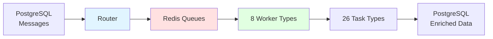
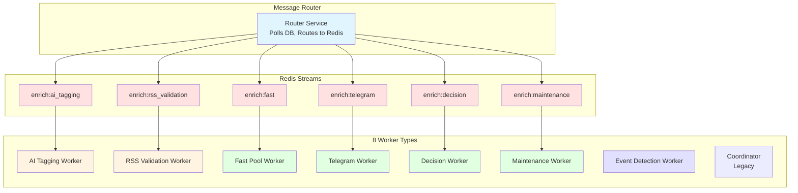
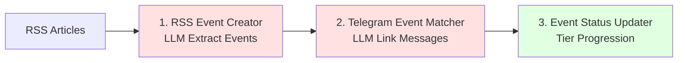
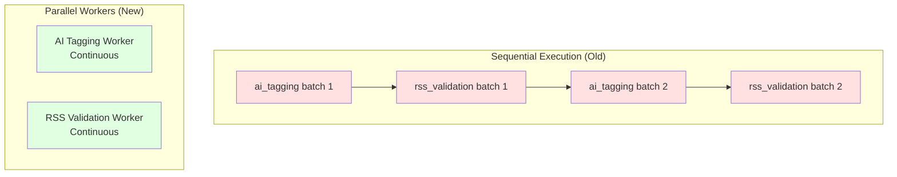

# Enrichment Service

**Background batch processing service for deep message analysis and metadata enrichment**

## Overview

The Enrichment Service handles asynchronous, batch-oriented processing of messages for expensive operations that don't need to block the real-time processing pipeline. It operates independently from the Processor service, with **distinct performance requirements and failure characteristics**.



### Key Characteristics

| Aspect | Enrichment Service | Processor Service |
|--------|-------------------|-------------------|
| **Processing Mode** | Background batch processing | Real-time per-message |
| **Speed** | Can be slow (minutes to hours) | Must be fast (<1 second) |
| **Priority** | Asynchronous | Critical path |
| **Failure Impact** | Metadata temporarily missing | Message delivery blocked |
| **Resource Usage** | CPU/memory intensive | Bounded and predictable |

!!! success "Production Stats"
    - **26 Task Types** across 8 worker pools
    - **Background Processing**: Enriches ~50,000 messages/day
    - **LLM Tasks**: Sequential execution prevents Ollama contention (50% faster)
    - **Cost**: €0/month (self-hosted Ollama CPU inference)

## Architecture

### Component Overview



### Three-Phase Architecture

#### Phase 1: Message Router

Routes work from PostgreSQL to Redis Streams queues with priority scoring.

**File**: `/services/enrichment/src/router.py`

```python
# Router polls DB and routes messages to appropriate Redis queue
messages = await poll_messages_for_task(session, "ai_tagging", limit=100)

for msg in messages:
    priority = calculate_priority(msg)  # importance + channel + age boost
    await queue.enqueue(message_id=msg.id, task="ai_tagging", priority=priority)
```

**Priority Calculation**:
- Base: `importance_level` (critical=100, high=75, medium=50, low=25)
- Bonus: `channel_priority` (critical=50, high=30, normal=10, low=0)
- Age boost: +2 per hour waiting (max +20)

**Backpressure**:
- Pause routing if queue depth > 1000
- Resume when depth < 500

#### Phase 2: Worker Pools

8 specialized worker types consume from Redis queues:

| Worker | Queue | Tasks Handled | LLM? | Rate Limited? |
|--------|-------|---------------|------|---------------|
| **AI Tagging** | `enrich:ai_tagging` | AI tag generation | ✅ | ❌ |
| **RSS Validation** | `enrich:rss_validation` | Article validation | ✅ | ❌ |
| **Fast Pool** | `enrich:fast` | Embedding, translation, entity matching, RSS correlation | ❌ | ❌ |
| **Telegram** | `enrich:telegram` | Engagement polling, social graph, comments, forward discovery | ❌ | ✅ (20 req/s) |
| **Decision** | `enrich:decision` | Decision verification, reprocessing | ❌ | ❌ |
| **Maintenance** | `enrich:maintenance` | Channel cleanup, quarantine, discovery eval, Wikidata | ❌ | ❌ |
| **Event Detection** | Pipeline (no queue) | RSS event creator, Telegram matcher, status updater | ✅ | ❌ |
| **Coordinator** | N/A (legacy) | Polls DB directly (deprecated) | Varies | ❌ |

#### Phase 3: Task Execution

26 task types inherit from `BaseEnrichmentTask`:

```python
class BaseEnrichmentTask(ABC):
    def requires_llm(self) -> bool:
        """Return True if task uses Ollama."""
        return False

    def get_priority(self) -> int:
        """Return 0-100 (higher = more urgent)."""
        return 50

    @abstractmethod
    async def process_batch(self, messages: List[Any], session: AsyncSession) -> int:
        """Process a batch of messages."""
        pass
```

## Workers Reference

### 1. AI Tagging Worker

**Purpose**: Generate AI-powered tags using Ollama LLM

**Queue**: `enrich:ai_tagging`
**File**: `/services/enrichment/src/workers/ai_tagging_worker.py`
**Tasks**: `ai_tagging`

**Configuration**:

```bash
OLLAMA_HOST=http://ollama-batch:11434
AI_TAGGING_MODEL=qwen2.5:3b
TIME_BUDGET_SECONDS=120  # Max processing time per cycle
BATCH_SIZE=10
CYCLE_INTERVAL_SECONDS=30
METRICS_PORT=9096
```

**How It Works**:

1. Dequeues message IDs from Redis
2. Fetches full message content from DB
3. Calls Ollama LLM for deep analysis
4. Generates tags: keywords, topics, entities, emotions, urgency
5. ACKs messages in Redis

**Circuit Breaker**:
- Opens after 5 consecutive failures
- Opens after slow responses (>30s per message)
- Recovers after 5 minutes

**Metrics**:
- `enrichment_llm_requests_total{task="ai_tagging", model="qwen2.5:3b"}`
- `enrichment_llm_duration_seconds{task="ai_tagging"}`
- `enrichment_queue_depth{queue="redis:ai_tagging"}`

### 2. RSS Validation Worker

**Purpose**: Validate Telegram messages against correlated RSS articles

**Queue**: `enrich:rss_validation`
**File**: `/services/enrichment/src/workers/rss_validation_worker.py`
**Tasks**: `rss_validation`

**Configuration**:

```bash
OLLAMA_HOST=http://ollama-batch:11434
RSS_VALIDATION_MODEL=qwen2.5:3b
TIME_BUDGET_SECONDS=60
BATCH_SIZE=5  # Smaller batches (processes multiple articles per message)
CYCLE_INTERVAL_SECONDS=30
MIN_SIMILARITY=0.5
METRICS_PORT=9097
```

**Validation Flow**:

1. Fetch message + correlated RSS articles (similarity ≥ 0.5)
2. Call LLM to classify relationship: `confirms`, `contradicts`, `provides_context`
3. Store validation result with confidence score
4. Update correlation quality metrics

**Why Separate from AI Tagging?**
- Different batch sizes (5 vs 10)
- Different time budgets (60s vs 120s)
- Independent scaling
- Prevents blocking each other for Ollama access

### 3. Fast Pool Worker

**Purpose**: Handle CPU-bound non-LLM tasks

**Queue**: `enrich:fast`
**File**: `/services/enrichment/src/workers/fast_worker.py`
**Tasks**: `embedding`, `translation`, `entity_matching`, `rss_correlation`

**Configuration**:

```bash
TIME_BUDGET_SECONDS=60
BATCH_SIZE=50
CYCLE_INTERVAL_SECONDS=30
EMBEDDING_MODEL=all-MiniLM-L6-v2
DEEPL_API_KEY=your-key-here
ENTITY_MATCHING_THRESHOLD=0.75
METRICS_PORT=9199
```

**Task Routing**:

```python
# Router pushes to single queue, worker routes internally
TASK_CLASSES = {
    "embedding": EmbeddingTask,          # Vector generation
    "translation": TranslationTask,       # DeepL/Google Translate
    "entity_matching": EntityMatchingTask, # Knowledge graph matching
    "rss_correlation": RSSCorrelationTask, # Vector similarity search
}
```

**Performance**:

| Task | Throughput | Bottleneck |
|------|------------|------------|
| Embedding | 20-30 msg/s | CPU (model inference) |
| Translation | 10-20 msg/s | API rate limits |
| Entity Matching | 50-100 msg/s | Database queries |
| RSS Correlation | 30-50 msg/s | pgvector search |

### 4. Telegram Worker

**Purpose**: Handle rate-limited Telegram API calls

**Queue**: `enrich:telegram`
**File**: `/services/enrichment/src/workers/telegram_worker.py`
**Tasks**: `engagement_polling`, `social_graph_extraction`, `comment_fetcher`, `comment_realtime`, `comment_backfill`, `forward_discovery`

**Configuration**:

```bash
TIME_BUDGET_SECONDS=120
BATCH_SIZE=20
CYCLE_INTERVAL_SECONDS=30
RATE_LIMIT_PER_SECOND=20  # Prevent FloodWait
TELEGRAM_API_ID=your-api-id
TELEGRAM_API_HASH=your-api-hash
TELEGRAM_SESSION_PATH=/app/sessions/enrichment_telegram
COMMENT_AUTO_TRANSLATE=false  # On-demand translation via API
METRICS_PORT=9200
```

**Two Work Modes**:

1. **Queue-based**: Consumes from Redis (`engagement_polling`, `comment_fetcher`, etc.)
2. **Database-scan**: Polls DB directly (`forward_discovery`, `comment_backfill`, `comment_realtime`)

**Rate Limiting**:

```python
async def _rate_limit(self):
    """Enforce 20 req/s limit."""
    elapsed = time.time() - self._last_request_time
    if elapsed < self._min_request_interval:
        await asyncio.sleep(self._min_request_interval - elapsed)
    self._last_request_time = time.time()
```

**Comment Fetching Strategy**:

- **comment_fetcher**: Initial fetch for new messages
- **comment_realtime**: Tiered refresh (0-24h = 4h, 1-7d = 24h, 7-30d = weekly)
- **comment_backfill**: Historical catchup for missed messages
- **Viral posts**: Refresh every 4 hours (tracked in `viral_posts` table)

### 5. Decision Worker

**Purpose**: Verify LLM decision quality

**Queue**: `enrich:decision`
**File**: `/services/enrichment/src/workers/decision_worker.py`
**Tasks**: `decision_verifier`, `decision_reprocessor`

**Configuration**:

```bash
TIME_BUDGET_SECONDS=60
BATCH_SIZE=50
CYCLE_INTERVAL_SECONDS=30
METRICS_PORT=9201
```

**Use Cases**:

- **decision_verifier**: Flag low-confidence classifications
- **decision_reprocessor**: Re-run LLM on flagged messages

### 6. Maintenance Worker

**Purpose**: Periodic cleanup and housekeeping

**Queue**: `enrich:maintenance`
**File**: `/services/enrichment/src/workers/maintenance_worker.py`
**Tasks**: `channel_cleanup`, `quarantine_processor`, `discovery_evaluator`, `wikidata_enrichment`

**Configuration**:

```bash
TIME_BUDGET_SECONDS=120
BATCH_SIZE=100
CYCLE_INTERVAL_SECONDS=300  # 5 minutes
WIKIDATA_BATCH_SIZE=50
WIKIDATA_MIN_CONFIDENCE=0.90
METRICS_PORT=9202
```

**Task Functions**:

- **channel_cleanup**: Remove stale/inactive channels
- **quarantine_processor**: Review quarantined messages
- **discovery_evaluator**: Score channel quality for recommendations
- **wikidata_enrichment**: Enrich entities with Wikidata metadata

### 7. Event Detection Worker

**Purpose**: Multi-stage event detection pipeline

**Queue**: None (pipeline worker)
**File**: `/services/enrichment/src/workers/event_detection_worker.py`
**Tasks**: `rss_event_creator`, `telegram_event_matcher`, `event_status_updater`

**Configuration**:

```bash
OLLAMA_HOST=http://ollama-batch:11434
EVENT_DETECTION_MODEL=qwen2.5:3b
TIME_BUDGET_SECONDS=300  # 5 minutes
BATCH_SIZE=10
CYCLE_INTERVAL_SECONDS=60
METRICS_PORT=9098
```

**Pipeline Stages**:



**Time Budget Allocation**:
- Stage 1 (RSS Event Creator): 50% (150s)
- Stage 2 (Telegram Matcher): 40% (120s)
- Stage 3 (Status Updater): 10% (30s)

**Why Pipeline?**
- Ensures events exist before matching
- Status updates run after all new data linked
- Dedicated LLM time budget (doesn't compete with AI tagging)

### 8. Coordinator (Legacy)

**Purpose**: Original batch processor (being phased out)

**Queue**: None (polls DB directly)
**File**: `/services/enrichment/src/coordinator.py`
**Tasks**: Any task not assigned to dedicated worker

**Why Deprecated?**

- LLM tasks run sequentially (prevents Ollama contention)
- Non-LLM tasks run in parallel (slower than dedicated workers)
- No Redis queue (less efficient work distribution)
- All tasks share same time budget

**Migration Path**:
New tasks should use dedicated workers. Coordinator remains for backward compatibility.

## Key Tasks

### LLM Tasks

#### AI Tagging

**File**: `/services/enrichment/src/tasks/ai_tagging.py`

Generates deep LLM analysis for message classification.

**Output Schema**:

```json
{
  "keywords": ["military", "equipment", "tank"],
  "topics": ["defense", "technology"],
  "entities": ["T-72B3", "Russian Armed Forces"],
  "emotions": ["concern", "alertness"],
  "urgency": "high"
}
```

**Query**:

```sql
SELECT m.id, m.content, m.content_translated
FROM messages m
WHERE m.is_spam = false
  AND m.content IS NOT NULL
  AND NOT EXISTS (
    SELECT 1 FROM message_tags mt
    WHERE mt.message_id = m.id AND mt.generated_by = 'ai_tagging'
  )
ORDER BY m.id ASC
LIMIT :batch_size
```

**Priority**: 100 (critical for search/display)

#### RSS Validation

**File**: `/services/enrichment/src/tasks/rss_validation.py`

Validates Telegram messages against correlated news articles.

**Input**: Messages with RSS correlations (similarity ≥ 0.5)

**LLM Prompt**:

```
Analyze relationship between Telegram message and news article:

Message: "{telegram_content}"
Article: "{rss_title}" - {rss_content}

Classify relationship:
- confirms: Article confirms message claims
- contradicts: Article contradicts message
- provides_context: Article adds context
```

**Output**:

```sql
INSERT INTO message_validations (
  message_id, source_type, source_id,
  validation_type, confidence_score, notes
)
VALUES (:message_id, 'rss_article', :article_id, :type, :confidence, :notes)
```

**Priority**: 50 (nice-to-have enrichment)

### CPU Tasks

#### Embedding

**File**: `/services/enrichment/src/tasks/embedding.py`

Generates 384-dimensional sentence embeddings for semantic search.

**Model**: `all-MiniLM-L6-v2` (default, configurable)

```python
from sentence_transformers import SentenceTransformer

model = SentenceTransformer('all-MiniLM-L6-v2')
embeddings = model.encode(texts, batch_size=batch_size)
```

**Query**:

```sql
SELECT m.id, m.content, m.content_translated
FROM messages m
WHERE m.content_embedding IS NULL
  AND m.content IS NOT NULL
  AND m.is_spam = false
ORDER BY m.id ASC
LIMIT :batch_size
```

**Update**:

```sql
UPDATE messages
SET content_embedding = :embedding
WHERE id = :message_id
```

**Performance**: ~20-30 messages/second on CPU

#### Translation

**File**: `/services/enrichment/src/tasks/translation.py`

Translates non-English messages to English.

**Translation Services**:

1. **DeepL Pro** (primary): Superior RU/UK quality, 500k chars/month free
2. **Google Translate** (fallback): Unlimited free tier

```python
# DeepL
translator = deepl.Translator(auth_key)
result = translator.translate_text(text, target_lang="EN-US")

# Google Translate (fallback)
translator = GoogleTranslator(source='auto', target='en')
result = translator.translate(text)
```

**Query**:

```sql
SELECT m.id, m.content
FROM messages m
WHERE m.content_translated IS NULL
  AND m.content IS NOT NULL
  AND m.is_spam = false
ORDER BY m.id ASC
LIMIT :batch_size
```

#### Entity Matching

**File**: `/services/enrichment/src/tasks/entity_matching.py`

Matches message content against 1,425 curated entities.

**Sources**:
- **ArmyGuide**: Military equipment (T-72B3, Su-35, etc.)
- **Root.NK**: Individuals and organizations
- **ODIN**: Sanctioned entities

**Match Types**:

```python
# 1. Exact name match
SELECT ce.id FROM curated_entities ce
WHERE LOWER(m.content) LIKE '%' || LOWER(ce.name) || '%'

# 2. Alias match
SELECT ce.id FROM curated_entities ce
WHERE LOWER(m.content) LIKE '%' || LOWER(ce.alias) || '%'

# 3. Hashtag match
SELECT ce.id FROM curated_entities ce
WHERE m.content LIKE '%#' || ce.name || '%'

# 4. Semantic match (pgvector)
SELECT ce.id FROM curated_entities ce
WHERE ce.embedding <=> m.content_embedding < 0.25  -- similarity > 0.75
```

**Output**:

```sql
INSERT INTO message_entities (message_id, entity_id, match_type, confidence)
VALUES (:message_id, :entity_id, :match_type, :confidence)
ON CONFLICT (message_id, entity_id) DO NOTHING
```

### Telegram API Tasks

#### Engagement Polling

**File**: `/services/enrichment/src/tasks/engagement_polling.py`

Polls Telegram for updated view/reaction counts.

**Polling Strategy**:

- **Hot** (0-24h): Poll every 4 hours
- **Warm** (1-7d): Poll every 24 hours
- **Cool** (7-30d): Poll weekly
- **Cold** (>30d): Archive, stop polling

```python
# Fetch from Telegram API
message = await client.get_messages(channel_id, ids=[msg_id])

# Update database
await session.execute(text("""
    UPDATE messages
    SET view_count = :views,
        reaction_count = :reactions,
        last_engagement_poll = NOW()
    WHERE id = :message_id
"""), {
    "views": message.views,
    "reactions": sum(r.count for r in message.reactions),
    "message_id": msg_id
})
```

**Timeline Tracking**:

```sql
INSERT INTO message_engagement_timeline (
  message_id, polled_at, view_count, reaction_count
)
VALUES (:message_id, NOW(), :views, :reactions)
```

#### Social Graph Extraction

**File**: `/services/enrichment/src/tasks/social_graph_extraction.py`

Extracts channel relationships from forwards/replies.

**Extraction Logic**:

```python
# Parse forward metadata
if message.forward:
    await session.execute(text("""
        INSERT INTO message_forwards (
          message_id, from_channel_id, from_message_id, forward_date
        )
        VALUES (:msg_id, :from_channel, :from_msg, :date)
    """))

# Parse reply metadata
if message.reply_to:
    await session.execute(text("""
        INSERT INTO message_replies (
          message_id, reply_to_message_id, reply_to_channel_id
        )
        VALUES (:msg_id, :reply_to_msg, :reply_to_channel)
    """))
```

**Channel Discovery**:

```python
# If forward is from unknown channel, add to discovery queue
if forward_channel_id not in known_channels:
    await session.execute(text("""
        INSERT INTO channel_discovery_queue (
          telegram_id, discovered_via, status
        )
        VALUES (:channel_id, 'forward', 'pending')
        ON CONFLICT (telegram_id) DO NOTHING
    """))
```

#### Comment Fetching

**File**: `/services/enrichment/src/tasks/comment_fetcher.py`

Fetches discussion group comments for messages.

**Three Task Modes**:

1. **comment_fetcher**: Initial fetch (triggered by processor)
2. **comment_realtime**: Tiered refresh polling
3. **comment_backfill**: Historical catchup

**Fetch Logic**:

```python
async def fetch_comments(channel_id: int, msg_id: int, discussion_group_id: int):
    # Get discussion group entity
    discussion_group = await client.get_entity(discussion_group_id)

    # Fetch comments
    comments = await client.get_messages(
        discussion_group,
        reply_to=msg_id,
        limit=100
    )

    # Store in database
    for comment in comments:
        await session.execute(text("""
            INSERT INTO message_comments (
              message_id, comment_telegram_id, author_id,
              content, posted_at, reactions
            )
            VALUES (:msg_id, :comment_id, :author, :content, :posted, :reactions)
            ON CONFLICT (comment_telegram_id) DO UPDATE
            SET reactions = EXCLUDED.reactions
        """))
```

**Translation**:

- Default: **Off** (translations cached, fetched on-demand via API)
- Optional: Enable auto-translate with `COMMENT_AUTO_TRANSLATE=true`

## Configuration

### Environment Variables

#### Global Settings

```bash
# Database
POSTGRES_HOST=postgres
POSTGRES_PORT=5432
POSTGRES_DB=osint_platform
POSTGRES_USER=osint_user
POSTGRES_PASSWORD=your-password

# Redis (for queues and reprocessing)
REDIS_URL=redis://redis:6379

# Metrics
METRICS_PORT=9095
```

#### Task Configuration

```bash
# Translation
DEEPL_API_KEY=your-key-here
TRANSLATION_BATCH_SIZE=50

# Embedding
EMBEDDING_MODEL=all-MiniLM-L6-v2
EMBEDDING_BATCH_SIZE=100

# AI Tagging (LLM)
OLLAMA_HOST=http://ollama-batch:11434
AI_TAGGING_MODEL=qwen2.5:3b
AI_TAGGING_BATCH_SIZE=10
AI_TAGGING_TIMEOUT=300.0

# Entity Matching
ENTITY_MATCHING_THRESHOLD=0.75
ENTITY_MATCHING_BATCH_SIZE=100

# Event Detection
EVENT_ENTITY_OVERLAP_THRESHOLD=1
EVENT_EMBEDDING_SIMILARITY_THRESHOLD=0.85
EVENT_TIME_WINDOW_HOURS=72

# Wikidata Enrichment
WIKIDATA_BATCH_SIZE=50
WIKIDATA_MIN_CONFIDENCE=0.90

# Telegram API (for social graph, comments, engagement)
TELEGRAM_API_ID=your-api-id
TELEGRAM_API_HASH=your-api-hash
TELEGRAM_SESSION_PATH=/app/sessions/enrichment_telegram
TELEGRAM_PHONE=+1234567890
```

#### Worker-Specific Settings

```bash
# AI Tagging Worker
TIME_BUDGET_SECONDS=120
BATCH_SIZE=10
CYCLE_INTERVAL_SECONDS=30
METRICS_PORT=9096

# RSS Validation Worker
TIME_BUDGET_SECONDS=60
BATCH_SIZE=5
CYCLE_INTERVAL_SECONDS=30
MIN_SIMILARITY=0.5
METRICS_PORT=9097

# Fast Pool Worker
TIME_BUDGET_SECONDS=60
BATCH_SIZE=50
CYCLE_INTERVAL_SECONDS=30
METRICS_PORT=9199

# Telegram Worker
TIME_BUDGET_SECONDS=120
BATCH_SIZE=20
CYCLE_INTERVAL_SECONDS=30
RATE_LIMIT_PER_SECOND=20
COMMENT_AUTO_TRANSLATE=false
METRICS_PORT=9200

# Decision Worker
TIME_BUDGET_SECONDS=60
BATCH_SIZE=50
CYCLE_INTERVAL_SECONDS=30
METRICS_PORT=9201

# Maintenance Worker
TIME_BUDGET_SECONDS=120
BATCH_SIZE=100
CYCLE_INTERVAL_SECONDS=300
METRICS_PORT=9202

# Event Detection Worker
TIME_BUDGET_SECONDS=300
BATCH_SIZE=10
CYCLE_INTERVAL_SECONDS=60
METRICS_PORT=9098

# Router
ROUTER_POLL_INTERVAL=30
ROUTER_BATCH_SIZE=100
METRICS_PORT=9198
```

## Redis Queues

### Queue Configuration

```python
# /services/enrichment/src/redis_queue.py

QUEUE_CONFIGS = {
    "ai_tagging": QueueConfig(
        stream_key="enrich:ai_tagging",
        consumer_group="ai_tagging_workers",
        batch_size=10,
        max_batch_size=50,
        time_budget_seconds=120,
        priority_weight=100,
    ),
    "rss_validation": QueueConfig(
        stream_key="enrich:rss_validation",
        consumer_group="rss_validation_workers",
        batch_size=5,
        max_batch_size=10,
        time_budget_seconds=60,
        priority_weight=50,
    ),
    "fast": QueueConfig(
        stream_key="enrich:fast",
        consumer_group="fast_workers",
        batch_size=50,
        max_batch_size=200,
        time_budget_seconds=60,
        priority_weight=75,
    ),
    "telegram": QueueConfig(
        stream_key="enrich:telegram",
        consumer_group="telegram_workers",
        batch_size=20,
        max_batch_size=50,
        time_budget_seconds=120,
        rate_limit_per_second=20,
    ),
    "decision": QueueConfig(
        stream_key="enrich:decision",
        consumer_group="decision_workers",
        batch_size=50,
        max_batch_size=100,
        time_budget_seconds=60,
        priority_weight=25,
    ),
    "maintenance": QueueConfig(
        stream_key="enrich:maintenance",
        consumer_group="maintenance_workers",
        batch_size=100,
        max_batch_size=200,
        time_budget_seconds=120,
        priority_weight=10,
    ),
}
```

### Task to Queue Mapping

```python
TASK_TO_QUEUE = {
    # LLM tasks (dedicated queues)
    "ai_tagging": "ai_tagging",
    "rss_validation": "rss_validation",

    # CPU tasks (shared fast queue)
    "embedding": "fast",
    "translation": "fast",
    "entity_matching": "fast",
    "rss_correlation": "fast",

    # Telegram API tasks (rate-limited queue)
    "engagement_polling": "telegram",
    "social_graph_extraction": "telegram",
    "comment_fetcher": "telegram",
    "comment_realtime": "telegram",
    "comment_backfill": "telegram",

    # Decision tasks
    "decision_verifier": "decision",
    "decision_reprocessor": "decision",

    # Maintenance tasks
    "channel_cleanup": "maintenance",
    "quarantine_processor": "maintenance",
    "discovery_evaluator": "maintenance",
    "wikidata_enrichment": "maintenance",
}
```

### Queue Operations

#### Enqueue (Router)

```python
await queue.enqueue(
    message_id=msg.message_id,
    task="ai_tagging",
    priority=priority_score,
    data={
        "importance_level": msg.importance_level,
        "channel_priority": msg.channel_priority,
    }
)
```

#### Dequeue (Worker)

```python
# Dequeue with 2s block timeout
queue_msgs = await queue.dequeue(count=batch_size, block_ms=2000)

for qm in queue_msgs:
    message_id = qm.data["message_id"]
    # Process message...

    # ACK on success
    await queue.ack(qm)

    # NACK on failure (retry or DLQ)
    await queue.nack(qm, error_message)
```

#### Dead Letter Queue (DLQ)

Messages move to DLQ after `max_retries` (default: 3):

```bash
# View DLQ
redis-cli XRANGE enrich:ai_tagging:dlq - +

# Reprocess from DLQ
redis-cli XRANGE enrich:ai_tagging:dlq - + | while read line; do
    redis-cli XADD enrich:ai_tagging "*" $line
done
```

## Metrics

### Prometheus Endpoints

Each worker exposes metrics on unique port:

```bash
# Router
curl http://localhost:9198/metrics

# AI Tagging Worker
curl http://localhost:9096/metrics

# RSS Validation Worker
curl http://localhost:9097/metrics

# Fast Pool Worker
curl http://localhost:9199/metrics

# Telegram Worker
curl http://localhost:9200/metrics

# Decision Worker
curl http://localhost:9201/metrics

# Maintenance Worker
curl http://localhost:9202/metrics

# Event Detection Worker
curl http://localhost:9098/metrics
```

### Key Metrics

#### Queue Metrics

```prometheus
# Queue depth (pending messages)
enrichment_queue_depth{queue="redis:ai_tagging"} 150

# Queue lag (age of oldest message in seconds)
enrichment_queue_lag_seconds{queue="redis:ai_tagging"} 3600

# Backpressure ratio (pending / batch_size)
enrichment_backpressure_ratio{task="ai_tagging"} 15.0
```

#### LLM Metrics

```prometheus
# LLM request count
enrichment_llm_requests_total{task="ai_tagging", model="qwen2.5:3b", status="success"} 1500

# LLM request duration
enrichment_llm_duration_seconds{task="ai_tagging", model="qwen2.5:3b"} 2.5

# LLM batch size
enrichment_llm_batch_size{task="ai_tagging"} 10
```

#### Worker Metrics

```prometheus
# Cycle duration
enrichment_cycle_duration_seconds{worker="ai_tagging_worker"} 120.5

# Messages processed
enrichment_messages_processed_total{task="ai_tagging"} 1500

# Task errors
enrichment_task_errors_total{task="ai_tagging"} 3
```

#### Circuit Breaker Metrics

```prometheus
# Circuit state (0=closed, 1=open)
enrichment_circuit_breaker_state{worker="ai_tagging_worker"} 0

# Consecutive failures
enrichment_circuit_breaker_failures{worker="ai_tagging_worker"} 0
```

## Scaling Patterns

### Horizontal Scaling

Scale workers independently based on queue depth:

```yaml
# docker-compose.yml
services:
  enrichment-ai-tagging:
    image: osint-platform-enrichment:latest
    command: python -m src.workers.ai_tagging_worker
    deploy:
      replicas: 2  # Run 2 instances
    environment:
      TIME_BUDGET_SECONDS: 120
      BATCH_SIZE: 10
```

**Scaling Guidelines**:

| Queue Depth | Recommended Workers |
|-------------|-------------------|
| 0-100 | 1 worker |
| 100-500 | 2 workers |
| 500-1000 | 3-4 workers |
| >1000 | Investigate bottleneck |

### Vertical Scaling

Adjust batch sizes and time budgets:

```bash
# Increase throughput (more CPU usage)
BATCH_SIZE=20
TIME_BUDGET_SECONDS=180

# Decrease throughput (less CPU usage)
BATCH_SIZE=5
TIME_BUDGET_SECONDS=60
```

### LLM Task Isolation

**Problem**: LLM tasks compete for Ollama (CPU inference is single-threaded)

**Solution**: Dedicated workers prevent contention



**Performance Improvement**:
- Old: 2x slower (context switching overhead)
- New: 50% faster (dedicated execution)

## Troubleshooting

### Queue Backlog Growing

**Symptom**: Queue depth increasing, lag rising

```bash
# Check queue metrics
curl http://localhost:9198/metrics | grep queue_depth

# View queue contents
redis-cli XLEN enrich:ai_tagging
redis-cli XRANGE enrich:ai_tagging - + COUNT 10
```

**Solutions**:

1. **Scale workers**: Increase replicas
2. **Increase batch size**: Process more per cycle
3. **Increase time budget**: Allow longer processing
4. **Check bottleneck**: LLM slow? Database slow?

### Worker Not Processing

**Symptom**: Worker running but queue not decreasing

```bash
# Check worker logs
docker-compose logs -f enrichment-ai-tagging

# Check Redis connection
redis-cli XINFO STREAM enrich:ai_tagging
redis-cli XINFO GROUPS enrich:ai_tagging
```

**Common Issues**:

- **No consumer group**: Worker can't consume
  ```bash
  redis-cli XGROUP CREATE enrich:ai_tagging ai_tagging_workers 0 MKSTREAM
  ```

- **Pending messages stuck**: Claim pending messages
  ```bash
  redis-cli XPENDING enrich:ai_tagging ai_tagging_workers
  redis-cli XCLAIM enrich:ai_tagging ai_tagging_workers consumer-1 300000 <msg-id>
  ```

- **DLQ overflow**: Messages failing repeatedly
  ```bash
  redis-cli XLEN enrich:ai_tagging:dlq
  # Investigate failures in DLQ
  ```

### Circuit Breaker Open

**Symptom**: Worker skipping cycles, "Circuit breaker OPEN" in logs

```bash
# Check circuit breaker state
curl http://localhost:9096/metrics | grep circuit_breaker

# enrichment_circuit_breaker_state{worker="ai_tagging_worker"} 1
# enrichment_circuit_breaker_failures{worker="ai_tagging_worker"} 5
```

**Causes**:

- **LLM timeout**: Ollama not responding (>30s per message)
- **LLM errors**: Model failures, OOM
- **Database errors**: Connection failures

**Recovery**:

- Wait 5 minutes (automatic recovery)
- Fix root cause (check Ollama, database)
- Restart worker to reset circuit breaker

### Telegram FloodWait

**Symptom**: Telegram worker throwing FloodWait errors

```bash
# Check rate limiting
docker-compose logs enrichment-telegram | grep FloodWait
```

**Solution**:

```bash
# Reduce rate limit
RATE_LIMIT_PER_SECOND=10  # Down from 20

# Increase batch interval
CYCLE_INTERVAL_SECONDS=60  # Up from 30
```

### Translation API Quota Exceeded

**Symptom**: Translation task failing with quota errors

```bash
# Check DeepL usage
curl https://api-free.deepl.com/v2/usage \
  -H "Authorization: DeepL-Auth-Key YOUR_KEY"
```

**Fallback**:

- DeepL fails → Google Translate (unlimited free)
- Both fail → Skip translation, log error

### Database Connection Pool Exhausted

**Symptom**: "Connection pool exhausted" errors

```bash
# Check pool config
POOL_SIZE=5
MAX_OVERFLOW=10
```

**Solutions**:

1. **Increase pool size**: `POOL_SIZE=10`
2. **Reduce workers**: Scale down to reduce connections
3. **Check query performance**: Slow queries block pool

## Related Files

### Core Service Files

| File | Purpose |
|------|---------|
| `/services/enrichment/src/main.py` | Service entry point (deprecated coordinator) |
| `/services/enrichment/src/coordinator.py` | Legacy batch processor |
| `/services/enrichment/src/router.py` | Message router (DB → Redis) |
| `/services/enrichment/src/config.py` | Configuration management |
| `/services/enrichment/src/redis_queue.py` | Redis Streams queue implementation |
| `/services/enrichment/src/metrics.py` | Prometheus metrics |
| `/services/enrichment/src/progress_tracker.py` | Task progress tracking |

### Worker Files

| File | Purpose |
|------|---------|
| `/services/enrichment/src/workers/base_worker.py` | Base worker class (25KB) |
| `/services/enrichment/src/workers/ai_tagging_worker.py` | AI tagging worker |
| `/services/enrichment/src/workers/rss_validation_worker.py` | RSS validation worker |
| `/services/enrichment/src/workers/fast_worker.py` | Fast pool worker |
| `/services/enrichment/src/workers/telegram_worker.py` | Telegram API worker |
| `/services/enrichment/src/workers/decision_worker.py` | Decision verification worker |
| `/services/enrichment/src/workers/maintenance_worker.py` | Maintenance worker |
| `/services/enrichment/src/workers/event_detection_worker.py` | Event detection pipeline |

### Task Files (26 total)

| Task | File | Type |
|------|------|------|
| AI Tagging | `/services/enrichment/src/tasks/ai_tagging.py` | LLM |
| RSS Validation | `/services/enrichment/src/tasks/rss_validation.py` | LLM |
| Embedding | `/services/enrichment/src/tasks/embedding.py` | CPU |
| Translation | `/services/enrichment/src/tasks/translation.py` | CPU |
| Entity Matching | `/services/enrichment/src/tasks/entity_matching.py` | CPU |
| RSS Correlation | `/services/enrichment/src/tasks/rss_correlation.py` | CPU |
| Engagement Polling | `/services/enrichment/src/tasks/engagement_polling.py` | Telegram |
| Social Graph | `/services/enrichment/src/tasks/social_graph_extraction.py` | Telegram |
| Comment Fetcher | `/services/enrichment/src/tasks/comment_fetcher.py` | Telegram |
| Comment Realtime | `/services/enrichment/src/tasks/comment_realtime.py` | Telegram |
| Comment Backfill | `/services/enrichment/src/tasks/comment_backfill.py` | Telegram |
| Forward Discovery | `/services/enrichment/src/tasks/forward_discovery.py` | Telegram |
| RSS Event Creator | `/services/enrichment/src/tasks/rss_event_creator.py` | LLM |
| Telegram Event Matcher | `/services/enrichment/src/tasks/telegram_event_matcher.py` | LLM |
| Event Status Updater | `/services/enrichment/src/tasks/event_status_updater.py` | CPU |
| Decision Verifier | `/services/enrichment/src/tasks/decision_verifier.py` | CPU |
| Decision Reprocessor | `/services/enrichment/src/tasks/decision_reprocessor.py` | CPU |
| Channel Cleanup | `/services/enrichment/src/tasks/channel_cleanup.py` | CPU |
| Quarantine Processor | `/services/enrichment/src/tasks/quarantine_processor.py` | CPU |
| Discovery Evaluator | `/services/enrichment/src/tasks/discovery_evaluator.py` | CPU |
| Wikidata Enrichment | `/services/enrichment/src/tasks/wikidata_enrichment.py` | CPU |

## See Also

- [Processor Service](processor.md) - Real-time message processing
- [API Service](api.md) - REST API endpoints
- [Database Schema](/home/rick/code/osintukraine/osint-intelligence-platform/infrastructure/postgres/init.sql) - PostgreSQL schema
- [LLM Prompts](/home/rick/code/osintukraine/osint-intelligence-platform/docs/architecture/LLM_PROMPTS.md) - LLM prompt design
- [Knowledge Graph](/home/rick/code/osintukraine/osint-intelligence-platform/docs/architecture/KNOWLEDGE_GRAPH_ARCHITECTURE.md) - Entity matching details
