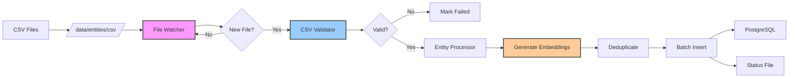

# Entity-Ingestion Service

> CSV-based entity import system with semantic embeddings and file watching

## Overview

The **Entity-Ingestion Service** monitors a directory for CSV files containing curated entity data and imports them into the platform's knowledge graph. Unlike the original README's description of API-based ingestion from external sources (ArmyGuide, Root.NK, ODIN), the **actual implementation** is a file-watching service that processes locally-placed CSV files.

!!! info "Actual vs. Planned Architecture"
    The service README describes API-based ingestion from external sources, but the implemented code is a **CSV file watcher**. This is a directory-monitoring service that:

    - Watches `/data/entities/csv/` for new CSV files
    - Validates schema and data quality
    - Generates semantic embeddings (384-dim)
    - Deduplicates against existing entities
    - Batch inserts into `curated_entities` table

**Key Characteristics:**

- **Mode**: Background daemon (300s scan interval)
- **Input**: CSV files dropped in watched directory
- **Validation**: Schema + data quality checks before processing
- **Deduplication**: Content-hash based to prevent duplicates
- **Embeddings**: Sentence-transformers (all-MiniLM-L6-v2)
- **Batch Size**: 100 entities per transaction



## Architecture

### Key Files

| File | Lines | Purpose |
|------|-------|---------|
| `main.py` | 204 | Service orchestration, file watching loop |
| `file_watcher.py` | 132 | Directory monitoring and status tracking |
| `csv_validator.py` | 156 | Schema and data validation |
| `entity_processor.py` | 223 | Database insertion with embedding generation |
| `requirements.txt` | 19 | Dependencies (pandas, sentence-transformers, PyTorch) |
| `Dockerfile` | 27 | Multi-stage build using shared PyTorch base image |

### Service Flow

The service operates in a continuous loop with these phases:

```mermaid
sequenceDiagram
    participant Loop as Main Loop
    participant Watcher as FileWatcher
    participant Validator as CSVValidator
    participant Processor as EntityProcessor
    participant DB as PostgreSQL
    participant Status as status.json

    Loop->>Watcher: scan_for_new_files()
    Watcher->>Status: Load processed files
    Watcher-->>Loop: List of new CSVs

    loop For each new file
        Loop->>Validator: validate_file()
        Validator-->>Loop: ValidationResult

        alt Validation failed
            Loop->>Status: Mark as failed
        else Validation passed
            Loop->>Processor: process_csv()
            Processor->>DB: Fetch existing hashes
            Processor->>Processor: Filter duplicates
            Processor->>Processor: Generate embeddings
            Processor->>DB: Batch insert (100/batch)
            Processor-->>Loop: ProcessingResult
            Loop->>Status: Mark as success
        end
    end

    Loop->>Loop: Sleep 300s
```

## CSV File Format

### Required Columns

The CSV validator enforces strict schema requirements:

| Column | Type | Required | Description |
|--------|------|----------|-------------|
| `entity_type` | string | Yes | One of: equipment, individual, organization, location, event, military_unit, ship, aircraft, military_vehicle, military_weapon, electronic_warfare, component |
| `name` | string | Yes | Primary entity name (cannot be null) |
| `description` | string | Yes | Entity description (can be empty) |
| `source_reference` | string | Yes | Source identifier (e.g., "armyguide", "odin_sanctions") |
| `metadata` | JSON | Yes | JSONB object with source-specific data |
| `content_hash` | string | Yes | SHA-256 hash for deduplication (name + source_reference) |

### Optional Columns

| Column | Type | Description |
|--------|------|-------------|
| `aliases` | JSON array | Alternative names/spellings |
| `latitude` | float | Geolocation latitude |
| `longitude` | float | Geolocation longitude |
| `notes` | string | Additional notes |

### Example CSV

```csv
entity_type,name,description,source_reference,metadata,content_hash,aliases,latitude,longitude
equipment,T-72B3 Main Battle Tank,Modernized version of the T-72 with improved fire control,armyguide,"{""country"":""Russia"",""weight"":""46 tons""}",a1b2c3d4e5f6...,"{""T-72B3 Obr. 2016"",""T-72B3M""}",,,
individual,Igor Konashenkov,Major General and Ministry of Defense Spokesperson,root_nk_database,"{""role"":""spokesperson"",""sanctions"":[""EU-833/2014""]}",f6e5d4c3b2a1...,"{""Игорь Конашенков""}",,,
location,Sevastopol,Major naval base in Crimea,root_nk_database,"{""country"":""Ukraine/Occupied""}",9a8b7c6d5e4f...,"{""Севастополь""}",44.6167,33.5250
```

### Validation Rules

The `CSVValidator` class performs comprehensive checks:

1. **Schema Validation**
   - All required columns present
   - Unknown columns generate warnings (but don't fail)

2. **Data Validation**
   - No null values in `name` column
   - `entity_type` must be in valid set
   - No duplicate `content_hash` within file
   - Valid JSON in `metadata` column
   - Warnings for missing descriptions

**Example validation error:**

```
❌ Validation failed:
  - Missing required columns: ['content_hash', 'metadata']
  - Invalid entity_type values (3 rows): ['tank', 'person', 'place']
  - Found 2 rows with duplicate content_hash values
  - Row 5: Invalid JSON in metadata - Expecting property name enclosed in double quotes
```

## Entity Types

The system supports 12 entity types defined in both the validator and database model:

| Type | Category | Example Use Case | Source |
|------|----------|------------------|--------|
| `equipment` | Military Hardware | General equipment category | Legacy |
| `military_vehicle` | Military Hardware | Tanks, APCs, IFVs | Fine-grained |
| `military_weapon` | Military Hardware | Missiles, artillery, small arms | Fine-grained |
| `aircraft` | Military Hardware | Fighters, helicopters, UAVs | ArmyGuide |
| `ship` | Military Hardware | Naval vessels, submarines | ArmyGuide |
| `electronic_warfare` | Military Hardware | EW systems, jammers | Fine-grained |
| `component` | Military Hardware | Parts, subsystems | Fine-grained |
| `individual` | People | Sanctioned persons, officials | Root.NK, ODIN |
| `organization` | Entities | Companies, agencies, militias | Root.NK, ODIN |
| `military_unit` | Military | Brigades, battalions, armies | Root.NK |
| `location` | Geography | Strategic locations, bases | Root.NK |
| `event` | Historical | Battles, operations, annexations | Root.NK |

!!! warning "Type Validation"
    The database has a `CheckConstraint` that only allows 8 types (original set), while the CSV validator allows 12 types. Attempting to insert fine-grained types (`military_vehicle`, `military_weapon`, `electronic_warfare`, `component`) will cause a database constraint violation.

    **Resolution**: Use `equipment` for all hardware types until the database constraint is updated.

## Database Schema

Entities are stored in the `curated_entities` table:

```sql
CREATE TABLE curated_entities (
    -- Primary key
    id SERIAL PRIMARY KEY,

    -- Entity classification
    entity_type VARCHAR(50) NOT NULL,  -- equipment, individual, organization, etc.

    -- Core fields
    name TEXT NOT NULL,
    aliases TEXT[],  -- Alternative names
    description TEXT,

    -- Geolocation (for locations)
    latitude FLOAT,
    longitude FLOAT,

    -- Source tracking
    source_reference TEXT NOT NULL,  -- 'armyguide', 'odin_sanctions', etc.
    metadata JSONB NOT NULL DEFAULT '{}'::jsonb,  -- Preserved source data
    notes TEXT,

    -- Deduplication
    content_hash VARCHAR(64) NOT NULL UNIQUE,  -- SHA-256 hash

    -- Semantic search (384-dim embeddings)
    embedding vector(384),  -- sentence-transformers output
    embedding_model VARCHAR(100),  -- Model name (e.g., 'all-MiniLM-L6-v2')

    -- Full-text search (generated column)
    search_vector TSVECTOR GENERATED ALWAYS AS (
        setweight(to_tsvector('english', name), 'A') ||
        setweight(to_tsvector('english', COALESCE(description, '')), 'B')
    ) STORED,

    -- Timestamps
    created_at TIMESTAMP NOT NULL DEFAULT NOW(),
    updated_at TIMESTAMP NOT NULL DEFAULT NOW(),

    CONSTRAINT valid_entity_type CHECK (entity_type IN (
        'equipment', 'individual', 'organization', 'location',
        'event', 'military_unit', 'ship', 'aircraft'
    ))
);

-- Indexes
CREATE INDEX idx_curated_entities_type ON curated_entities(entity_type);
CREATE INDEX idx_curated_entities_source ON curated_entities(source_reference);
CREATE INDEX idx_curated_entities_search ON curated_entities
    USING gin(search_vector);
CREATE INDEX idx_curated_entities_embedding ON curated_entities
    USING ivfflat (embedding vector_cosine_ops)
    WITH (lists = 100);
```

### Key Fields

**content_hash**: SHA-256 hash of `name + source_reference` to prevent duplicate imports from the same source. Different sources can have entities with the same name.

**embedding**: 384-dimensional vector from sentence-transformers enabling semantic search:
```sql
-- Find similar entities (cosine similarity)
SELECT name, 1 - (embedding <=> query_embedding) as similarity
FROM curated_entities
WHERE embedding IS NOT NULL
ORDER BY embedding <=> query_embedding
LIMIT 10;
```

**search_vector**: Full-text search index combining name (weight A) and description (weight B):
```sql
-- Text search
SELECT name, description
FROM curated_entities
WHERE search_vector @@ to_tsquery('english', 'tank & russian');
```

## Deduplication Strategy

The service prevents duplicate entities at three levels:

### 1. File-Level Duplicates

The CSV validator checks for duplicate `content_hash` values within a single file:

```python
duplicates = df[df.duplicated(subset=['content_hash'], keep=False)]
if len(duplicates) > 0:
    errors.append(f"Found {len(duplicates)} rows with duplicate content_hash values")
```

**Action**: Validation fails, entire file rejected.

### 2. Database-Level Duplicates

Before processing, existing content hashes are fetched:

```python
async def _get_existing_hashes(self) -> Set[str]:
    query = select(CuratedEntity.content_hash)
    result = await self.db.execute(query)
    return {row[0] for row in result.all()}

# Filter out already-imported entities
new_entities_df = df[~df['content_hash'].isin(existing_hashes)]
```

**Action**: Only new entities are inserted. Duplicates skipped and counted in result.

### 3. Unique Constraint

Database enforces uniqueness:

```sql
UNIQUE(content_hash)
```

**Action**: If content_hash collision occurs (rare), database rejects insert.

### Processing Result

The `ProcessingResult` object tracks deduplication:

```python
@dataclass
class ProcessingResult:
    total_rows: int       # Total rows in CSV
    new_rows: int         # Rows not in database
    duplicates: int       # Rows already exist
    inserted: int         # Successfully inserted
    errors: List[str]     # Any errors
```

**Example output:**

```
✅ SUCCESS: 145/200 entities inserted
   (55 duplicates skipped)
```

## Embedding Generation

Semantic embeddings enable similarity search and are generated inline during processing.

### Model Selection

Default model: **all-MiniLM-L6-v2** (sentence-transformers)

- **Dimensions**: 384
- **Performance**: ~3,800 sentences/sec on CPU
- **Size**: 80 MB download
- **Quality**: Balanced accuracy vs. speed

Configure via environment variable:

```bash
ENTITY_EMBEDDING_MODEL=all-MiniLM-L6-v2  # Default
# ENTITY_EMBEDDING_MODEL=all-mpnet-base-v2  # Higher quality, slower
# ENTITY_EMBEDDING_MODEL=paraphrase-multilingual-MiniLM-L12-v2  # Multilingual
```

### Embedding Process

1. **Text Construction**: Concatenate `name + ". " + description`
   ```python
   texts = []
   for _, row in df.iterrows():
       text = row['name']
       if pd.notna(row.get('description')):
           text += f". {row['description']}"
       texts.append(text)
   ```

2. **Batch Encoding**: Generate embeddings for all entities
   ```python
   embeddings = self.model.encode(texts, show_progress_bar=False)
   # Returns: List of 384-dim float arrays
   ```

3. **Add to DataFrame**: Store for database insertion
   ```python
   df['embedding'] = embeddings
   df['embedding_model'] = 'all-MiniLM-L6-v2'
   ```

### Disabling Embeddings

For large datasets or resource-constrained environments:

```bash
ENTITY_GENERATE_EMBEDDINGS=false
```

Entities will be inserted without embeddings. You can generate them later using the enrichment service.

### Performance Impact

Embedding generation adds ~50-100ms per entity:

| Batch Size | Processing Time | Throughput |
|------------|-----------------|------------|
| 100 entities | ~8s | 12.5 entities/s |
| 500 entities | ~35s | 14.3 entities/s |
| 1000 entities | ~70s | 14.3 entities/s |

!!! tip "Performance Tuning"
    - Larger batches improve throughput (better GPU/CPU utilization)
    - Default batch size of 100 balances memory and speed
    - Disable embeddings for initial import, generate later in bulk

## Configuration

### Environment Variables

Set in `docker-compose.yml` or `.env` file:

```bash
# Service control
ENTITY_INGESTION_ENABLED=true          # Enable/disable service

# File watching
ENTITY_CSV_DIR=/data/entities/csv/     # Directory to monitor
ENTITY_PROCESSED_FILE=/data/entities/processed/status.json  # Status tracking
ENTITY_SCAN_INTERVAL=300               # Scan interval in seconds (5 min)

# Processing
ENTITY_BATCH_SIZE=100                  # Entities per database transaction

# Embeddings
ENTITY_GENERATE_EMBEDDINGS=true        # Enable embedding generation
ENTITY_EMBEDDING_MODEL=all-MiniLM-L6-v2  # Sentence-transformers model

# Database (from shared settings)
POSTGRES_HOST=postgres
POSTGRES_PORT=5432
POSTGRES_DB=osint_platform
POSTGRES_USER=postgres
POSTGRES_PASSWORD=postgres
```

### Docker Compose

The service is in the `opensanctions` profile (disabled by default):

```yaml
entity-ingestion:
  profiles: [opensanctions]
  build:
    context: .
    dockerfile: services/entity-ingestion/Dockerfile
  container_name: osint-entity-ingestion
  restart: unless-stopped

  depends_on:
    postgres:
      condition: service_healthy

  volumes:
    - ./data/entities:/data/entities  # Read-write access
    - ./data/huggingface:/app/.cache/huggingface  # Model cache

  networks:
    - backend

  healthcheck:
    test: ["CMD", "pgrep", "-f", "python.*src.main"]
    interval: 60s
    timeout: 10s
    retries: 3
    start_period: 120s  # Allow time for model download
```

### Volume Mounts

| Host Path | Container Path | Purpose |
|-----------|---------------|---------|
| `./data/entities` | `/data/entities` | CSV input + status output |
| `./data/huggingface` | `/app/.cache/huggingface` | Shared model cache (avoids re-downloading) |

## Running the Service

### Enable and Start

The service is in a Docker Compose profile and must be explicitly enabled:

```bash
# Start with opensanctions profile
docker-compose --profile opensanctions up -d entity-ingestion

# Or start all opensanctions services
docker-compose --profile opensanctions up -d
```

### Check Status

```bash
# View logs
docker-compose logs -f entity-ingestion

# Check health
docker-compose ps entity-ingestion

# Inspect processing status
cat ./data/entities/processed/status.json | jq
```

### Stop Service

```bash
docker-compose stop entity-ingestion
```

### Run Manually (One-Time Import)

For one-time processing without the daemon:

```bash
# Run once and exit
docker-compose run --rm entity-ingestion

# Process specific file without daemon loop
docker-compose run --rm entity-ingestion python -c "
from pathlib import Path
import asyncio
from main import EntityIngestionService

async def run_once():
    service = EntityIngestionService()
    csv_file = Path('/data/entities/csv/my_entities.csv')
    if csv_file.exists():
        await service.process_file(csv_file)

asyncio.run(run_once())
"
```

## File Watching Behavior

### Status Tracking

Processed files are tracked in `status.json` to prevent re-processing:

```json
{
  "armyguide_equipment.csv": {
    "status": "success",
    "processed_at": "2025-11-28T10:30:45.123456",
    "total_rows": 723,
    "new_rows": 145,
    "duplicates": 578,
    "inserted": 145,
    "errors": []
  },
  "odin_sanctions.csv": {
    "status": "failed",
    "processed_at": "2025-11-28T10:35:12.654321",
    "total_rows": 0,
    "new_rows": 0,
    "duplicates": 0,
    "inserted": 0,
    "errors": [
      "Missing required columns: ['content_hash']"
    ]
  }
}
```

### Status Values

| Status | Meaning | Action |
|--------|---------|--------|
| `success` | File processed, entities inserted | Won't be re-processed |
| `no_new_data` | All entities already exist | Won't be re-processed |
| `failed` | Validation or processing error | Won't be re-processed (fix and rename file) |
| `error` | Unexpected exception | Won't be re-processed (check logs) |

### Re-Processing Files

To re-process a file, either:

1. **Rename the file**:
   ```bash
   mv armyguide_equipment.csv armyguide_equipment_v2.csv
   ```

2. **Delete from status.json**:
   ```bash
   # Edit ./data/entities/processed/status.json
   # Remove entry for the file
   ```

3. **Clear all status**:
   ```bash
   rm ./data/entities/processed/status.json
   # Service will re-process all CSVs on next scan
   ```

### Recursive Scanning

The file watcher uses `rglob('*.csv')` to scan recursively:

```
/data/entities/csv/
├── armyguide_equipment.csv          # Found
├── odin/
│   └── sanctions_2024.csv           # Found
└── root_nk/
    ├── individuals.csv               # Found
    └── organizations.csv             # Found
```

All `.csv` files in subdirectories are discovered.

## Example Workflow

### 1. Prepare CSV File

Create `my_entities.csv`:

```csv
entity_type,name,description,source_reference,metadata,content_hash
equipment,T-90M Proryv,Advanced Russian main battle tank,custom_import,"{""country"":""Russia"",""year"":2017}",abc123def456...
individual,Sergey Shoigu,Minister of Defense of Russia,custom_import,"{""position"":""Defense Minister"",""born"":""1955-05-21""}",def456ghi789...
```

Calculate `content_hash`:

```python
import hashlib

def calc_hash(name: str, source: str) -> str:
    return hashlib.sha256(f"{name}{source}".encode()).hexdigest()

print(calc_hash("T-90M Proryv", "custom_import"))
# Output: abc123def456...
```

### 2. Place File in Watched Directory

```bash
# Copy to watched directory
cp my_entities.csv ./data/entities/csv/

# Or create subdirectory for organization
mkdir -p ./data/entities/csv/2024-imports
cp my_entities.csv ./data/entities/csv/2024-imports/
```

### 3. Monitor Processing

```bash
# Watch service logs
docker-compose logs -f entity-ingestion
```

Expected output:

```
================================================================================
Scan iteration 12
================================================================================
Found 1 new CSV file(s)
  - my_entities.csv

────────────────────────────────────────────────────────────────────────────────
Processing: my_entities.csv
────────────────────────────────────────────────────────────────────────────────
Step 1/3: Validating CSV...
✅ Validation passed
Step 2/3: Processing entities...
Loaded 2 rows
Found 2 new entities (0 already exist)
Generating embeddings...
Generated 2 embeddings
Inserting 2 entities in batches of 100...
Inserted batch 1: 2 entities
Successfully inserted 2 entities
Step 3/3: Saving status...
✅ SUCCESS: 2/2 entities inserted

Waiting 300s until next scan...
```

### 4. Verify in Database

```sql
-- Check imported entities
SELECT id, entity_type, name, source_reference, created_at
FROM curated_entities
WHERE source_reference = 'custom_import'
ORDER BY created_at DESC;
```

Output:

```
 id  | entity_type |      name       | source_reference |       created_at
-----+-------------+-----------------+------------------+------------------------
 1426| individual  | Sergey Shoigu   | custom_import    | 2025-11-28 14:22:10
 1425| equipment   | T-90M Proryv    | custom_import    | 2025-11-28 14:22:10
```

### 5. Test Semantic Search

```sql
-- Find entities similar to "Russian tank"
-- (requires pgvector extension)
SELECT
    name,
    entity_type,
    1 - (embedding <=> (
        SELECT embedding
        FROM curated_entities
        WHERE name = 'T-90M Proryv'
    )) as similarity
FROM curated_entities
WHERE embedding IS NOT NULL
  AND name != 'T-90M Proryv'
ORDER BY similarity DESC
LIMIT 5;
```

## Troubleshooting

### Service Won't Start

**Symptom**: Service exits immediately or fails healthcheck

**Check logs**:
```bash
docker-compose logs entity-ingestion
```

**Common issues**:

1. **Service disabled**:
   ```
   Service is disabled (ENTITY_INGESTION_ENABLED=false)
   ```
   **Fix**: Set `ENTITY_INGESTION_ENABLED=true` in `.env`

2. **Database connection failure**:
   ```
   asyncpg.exceptions.InvalidPasswordError: password authentication failed
   ```
   **Fix**: Verify `POSTGRES_*` environment variables

3. **Directory doesn't exist**:
   ```
   Watch directory does not exist: /data/entities/csv/
   ```
   **Fix**: Create directory:
   ```bash
   mkdir -p ./data/entities/csv
   mkdir -p ./data/entities/processed
   ```

### Validation Failures

**Symptom**: Files marked as `failed` in status.json

**Check validation errors**:
```bash
cat ./data/entities/processed/status.json | jq '.["filename.csv"].errors'
```

**Common errors**:

1. **Missing columns**:
   ```json
   ["Missing required columns: ['content_hash', 'metadata']"]
   ```
   **Fix**: Add missing columns to CSV

2. **Invalid entity types**:
   ```json
   ["Invalid entity_type values (3 rows): ['tank', 'person']"]
   ```
   **Fix**: Use valid types from allowed set

3. **Duplicate content_hash**:
   ```json
   ["Found 2 rows with duplicate content_hash values"]
   ```
   **Fix**: Ensure each row has unique hash

4. **Invalid JSON in metadata**:
   ```json
   ["Row 5: Invalid JSON in metadata - Expecting property name"]
   ```
   **Fix**: Use proper JSON format with double quotes

### Embedding Generation Fails

**Symptom**: Entities inserted but `embedding` is NULL

**Check logs**:
```bash
docker-compose logs entity-ingestion | grep -i embedding
```

**Common issues**:

1. **Model download failure**:
   ```
   HTTPError: 503 Server Error: Service Unavailable for url: https://huggingface.co/...
   ```
   **Fix**: Check internet connection or use offline mode:
   ```bash
   # Download model locally first
   docker-compose run --rm entity-ingestion python -c "
   from sentence_transformers import SentenceTransformer
   model = SentenceTransformer('all-MiniLM-L6-v2')
   "

   # Then set offline mode
   HF_HUB_OFFLINE=1
   ```

2. **Out of memory**:
   ```
   RuntimeError: [enforce fail at alloc_cpu.cpp:114] posix_memalign(&data, gAlignment, nbytes) == 0
   ```
   **Fix**: Reduce batch size or disable embeddings:
   ```bash
   ENTITY_BATCH_SIZE=50
   # or
   ENTITY_GENERATE_EMBEDDINGS=false
   ```

### No Files Being Processed

**Symptom**: Service runs but doesn't find files

**Diagnostic steps**:

1. **Check directory mount**:
   ```bash
   docker-compose exec entity-ingestion ls -la /data/entities/csv/
   ```
   Should show your CSV files. If empty, volume mount is incorrect.

2. **Check file extension**:
   ```bash
   # Service only processes .csv files (lowercase)
   mv entities.CSV entities.csv  # Rename if needed
   ```

3. **Check status.json**:
   ```bash
   cat ./data/entities/processed/status.json
   ```
   If file is already listed, it won't be re-processed.

4. **Check scan interval**:
   ```bash
   # Wait for next scan or reduce interval
   docker-compose down
   # Edit .env: ENTITY_SCAN_INTERVAL=60
   docker-compose --profile opensanctions up -d entity-ingestion
   ```

### Duplicate Entities

**Symptom**: Entities imported multiple times

**Check for duplicates**:
```sql
SELECT content_hash, COUNT(*) as count
FROM curated_entities
GROUP BY content_hash
HAVING COUNT(*) > 1;
```

**This shouldn't happen** due to unique constraint. If it does:

1. **Check constraint status**:
   ```sql
   SELECT conname, contype, convalidated
   FROM pg_constraint
   WHERE conrelid = 'curated_entities'::regclass
     AND contype = 'u';
   ```

2. **Rebuild unique index**:
   ```sql
   DROP INDEX IF EXISTS curated_entities_content_hash_key;
   CREATE UNIQUE INDEX curated_entities_content_hash_key
       ON curated_entities(content_hash);
   ```

### Database Constraint Violations

**Symptom**: Insert fails with constraint error

**Example**:
```
CHECK constraint "valid_entity_type" violated
```

**Fix**: Ensure `entity_type` is in allowed set:
```python
# Valid types (from database constraint)
ALLOWED_TYPES = {
    'equipment', 'individual', 'organization', 'location',
    'event', 'military_unit', 'ship', 'aircraft'
}

# NOT allowed (validator accepts but database rejects)
INVALID_TYPES = {
    'military_vehicle', 'military_weapon',
    'electronic_warfare', 'component'
}
```

**Workaround**: Use `equipment` for all hardware types.

## Performance Considerations

### Processing Speed

Typical performance metrics:

| Stage | Time/Entity | Bottleneck |
|-------|-------------|------------|
| CSV parsing | ~1ms | Disk I/O |
| Validation | ~2ms | CPU |
| Hash lookup | ~10ms | Database query |
| Embedding generation | ~50ms | CPU (sentence-transformers) |
| Database insert | ~5ms | Transaction overhead |
| **Total** | **~68ms** | Embedding generation |

For 1,000 entities:
- With embeddings: ~68 seconds
- Without embeddings: ~18 seconds

### Optimization Strategies

1. **Disable embeddings for bulk import**:
   ```bash
   ENTITY_GENERATE_EMBEDDINGS=false
   ```
   Generate embeddings later in batch via enrichment service.

2. **Increase batch size**:
   ```bash
   ENTITY_BATCH_SIZE=500  # Fewer transactions
   ```
   Trade-off: Higher memory usage, but faster overall.

3. **Pre-filter duplicates**:
   ```python
   # In your CSV generation script
   import pandas as pd

   # Remove duplicates before exporting
   df = df.drop_duplicates(subset=['content_hash'])
   ```

4. **Use single large file**:
   - One 10,000-row file is faster than ten 1,000-row files
   - Avoids repeated hash lookups and status updates

### Resource Requirements

| Resource | Requirement | Notes |
|----------|-------------|-------|
| **CPU** | 1 core | Single-threaded processing |
| **Memory** | 2 GB | Includes sentence-transformers model (~500 MB) |
| **Disk** | 500 MB | HuggingFace model cache |
| **Network** | 100 MB | One-time model download |

## Integration with Other Services

### Enrichment Service

The enrichment service can generate embeddings for entities inserted without them:

```python
# In enrichment service
async def generate_entity_embeddings():
    # Find entities missing embeddings
    query = select(CuratedEntity).where(CuratedEntity.embedding.is_(None))
    entities = await db.execute(query)

    # Generate embeddings in batch
    model = SentenceTransformer('all-MiniLM-L6-v2')
    texts = [f"{e.name}. {e.description}" for e in entities]
    embeddings = model.encode(texts)

    # Update database
    for entity, embedding in zip(entities, embeddings):
        entity.embedding = embedding.tolist()
        entity.embedding_model = 'all-MiniLM-L6-v2'

    await db.commit()
```

### API Service

Entities are accessible via API:

```bash
# List entities by type
curl http://localhost:8000/api/entities?entity_type=equipment&limit=10

# Search entities
curl http://localhost:8000/api/entities/search?q=tank

# Semantic search (requires embeddings)
curl -X POST http://localhost:8000/api/entities/similar \
  -H "Content-Type: application/json" \
  -d '{"query": "Russian military vehicle", "limit": 5}'
```

### Frontend

Entities power autocomplete and entity tagging:

- **Message entity extraction**: Matches message text against entity names/aliases
- **Entity profile pages**: Display entity details and mentions
- **Knowledge graph visualization**: Shows entity relationships

## Development

### Running Tests

```bash
cd /home/rick/code/osintukraine/osint-intelligence-platform/services/entity-ingestion

# Install dev dependencies
pip install pytest pytest-asyncio aioresponses

# Run tests
pytest tests/ -v
```

### Adding New Entity Type

1. **Update CSV validator** (`src/csv_validator.py`):
   ```python
   VALID_ENTITY_TYPES = {
       'equipment', 'individual', 'organization',
       'location', 'event', 'military_unit', 'ship', 'aircraft',
       'new_type'  # Add here
   }
   ```

2. **Update database constraint** (`infrastructure/postgres/init.sql`):
   ```sql
   CONSTRAINT valid_entity_type CHECK (entity_type IN (
       'equipment', 'individual', 'organization', 'location',
       'event', 'military_unit', 'ship', 'aircraft',
       'new_type'  -- Add here
   ))
   ```

3. **Recreate database**:
   ```bash
   docker-compose down
   docker volume rm osint-intelligence-platform_postgres_data
   docker-compose up -d postgres
   ```

### Custom Embedding Models

To use a different sentence-transformers model:

```bash
# In .env or docker-compose.yml
ENTITY_EMBEDDING_MODEL=paraphrase-multilingual-MiniLM-L12-v2

# Restart service
docker-compose restart entity-ingestion
```

**Model options**:

- `all-MiniLM-L6-v2`: Fast, 384-dim (default)
- `all-mpnet-base-v2`: Slower, 768-dim, higher quality
- `paraphrase-multilingual-MiniLM-L12-v2`: Multilingual support
- `all-distilroberta-v1`: 768-dim, good for English

**Update database schema** if changing dimensions:

```sql
-- Change embedding dimension
ALTER TABLE curated_entities
    ALTER COLUMN embedding TYPE vector(768);  -- Match model dim

-- Rebuild index
DROP INDEX idx_curated_entities_embedding;
CREATE INDEX idx_curated_entities_embedding ON curated_entities
    USING ivfflat (embedding vector_cosine_ops)
    WITH (lists = 100);
```

## Related Documentation

- [Database Tables Reference](../../reference/database-tables.md) - Entity and message table schemas
- [Processor Service](processor.md) - How entities are matched against messages
- [API Service](api.md) - Entity API endpoints
- [Enrichment Service](enrichment.md) - Entity matching and enrichment tasks

## Migration from External APIs

The service README describes API-based ingestion from ArmyGuide, Root.NK, and ODIN, but this is **not implemented**. To add external API ingestion:

### 1. Create API Fetcher

```python
# src/sources/armyguide.py
import aiohttp
from typing import List, Dict

class ArmyGuideSource:
    API_URL = "https://armyguide.org/api/v1/equipment"

    async def fetch_entities(self) -> List[Dict]:
        async with aiohttp.ClientSession() as session:
            async with session.get(self.API_URL) as resp:
                data = await resp.json()
                return [self._parse_entity(item) for item in data['items']]

    def _parse_entity(self, raw: Dict) -> Dict:
        return {
            'entity_type': 'equipment',
            'name': raw['name'],
            'description': raw.get('description'),
            'source_reference': 'armyguide',
            'metadata': raw,
            'content_hash': self._calc_hash(raw['name'], 'armyguide')
        }

    @staticmethod
    def _calc_hash(name: str, source: str) -> str:
        import hashlib
        return hashlib.sha256(f"{name}{source}".encode()).hexdigest()
```

### 2. Convert to CSV

```python
# src/main.py
import pandas as pd
from sources.armyguide import ArmyGuideSource

async def fetch_and_save():
    source = ArmyGuideSource()
    entities = await source.fetch_entities()

    # Convert to DataFrame
    df = pd.DataFrame(entities)

    # Save as CSV
    csv_path = Path('/data/entities/csv/armyguide_import.csv')
    df.to_csv(csv_path, index=False)

    print(f"Saved {len(entities)} entities to {csv_path}")
```

### 3. Schedule Fetching

Add to cron or create scheduled task:

```bash
# Cron: Daily at 3 AM
0 3 * * * docker-compose run --rm entity-ingestion python src/fetch_external.py
```

This approach leverages the existing CSV pipeline while adding API fetching as a separate step.

---

**File**: `/home/rick/code/osintukraine/osint-platform-docs/docs/developer-guide/services/entity-ingestion.md`
