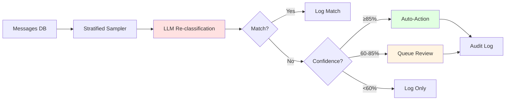
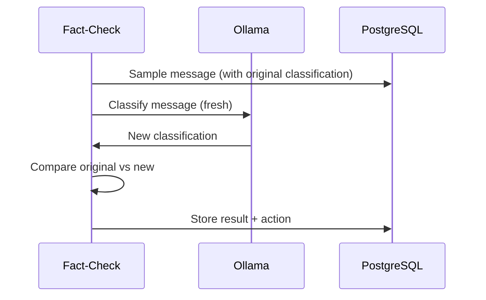
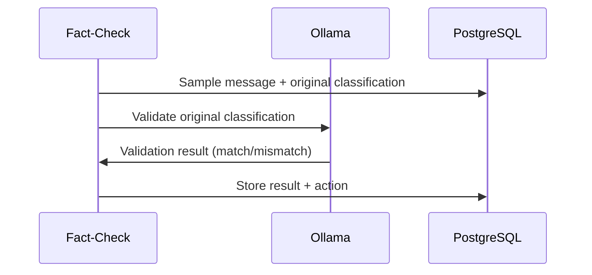
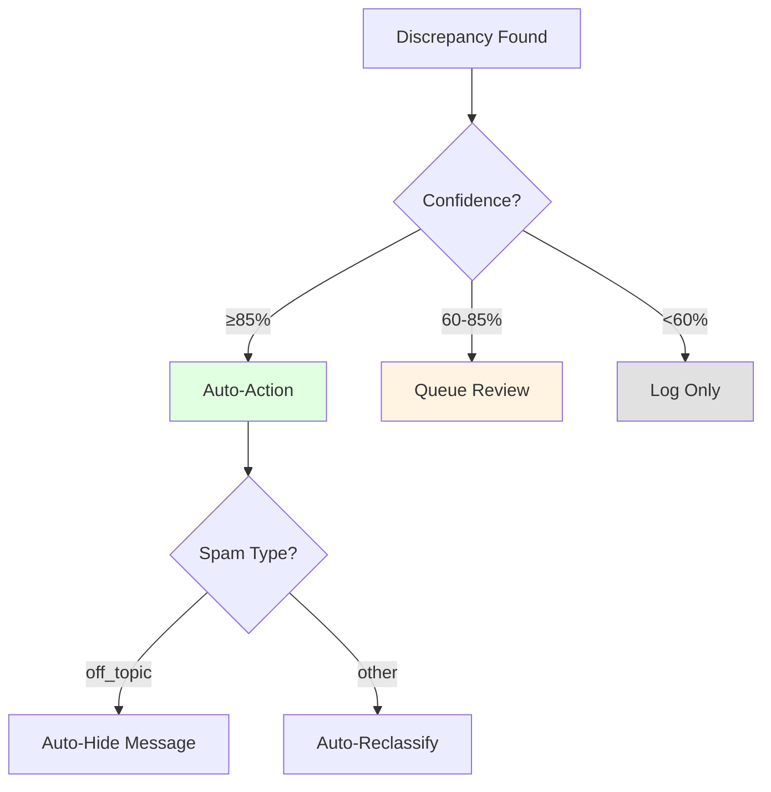
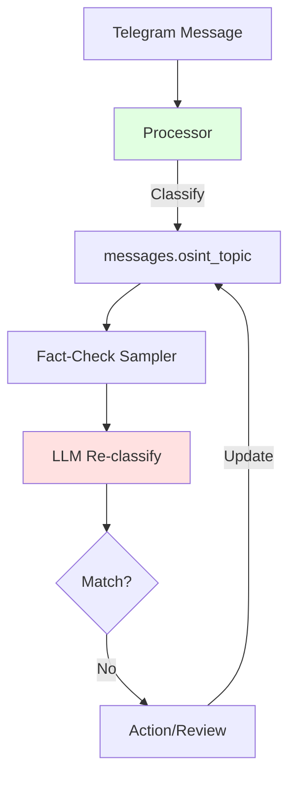

# Fact-Check Service

**Classification validation service for quality assurance of LLM classifications**

## Overview

The Fact-Check Service validates message classifications by re-analyzing previously classified messages using a separate LLM evaluation. It identifies discrepancies between original and fact-check classifications, enabling both automated corrections and human review workflows.



### Key Characteristics

| Aspect | Fact-Check Service |
|--------|-------------------|
| **Processing Mode** | Background batch sampling |
| **Speed** | Slow (LLM inference per message) |
| **Priority** | Low (25) - runs when LLM resources available |
| **Purpose** | Classification quality assurance |
| **Actions** | Auto-reclassify, auto-hide, queue for review |

!!! success "Production Stats"
    - **Sampling**: 50 messages per cycle across all topics
    - **Accuracy Target**: 95%+ classification match rate
    - **Review Queue**: Surfaces misclassifications for human review
    - **Cost**: €0/month (uses local Ollama)

## Architecture

### Component Overview

```mermaid
graph TD
    subgraph "Fact-Check Worker"
        W[FactCheckWorker] --> T[FactCheckTask]
    end

    subgraph "Data Flow"
        T -->|Sample| DB[(PostgreSQL)]
        T -->|Classify| LLM[Ollama]
        T -->|Store| FC[classification_fact_checks]
        T -->|Audit| AL[admin_audit_log]
    end

    subgraph "Admin UI"
        API[/admin/fact-check API] --> FC
        UI[Frontend] --> API
    end

    style T fill:#ffe1e1
    style LLM fill:#e1f5ff
```

### Files

| Component | Location |
|-----------|----------|
| **Worker** | `/services/enrichment/src/workers/fact_check_worker.py` |
| **Task** | `/services/enrichment/src/tasks/fact_check.py` |
| **API Router** | `/services/api/src/routers/admin/fact_check.py` |
| **Frontend** | `/services/frontend-nextjs/app/admin/fact-check/page.tsx` |

## Classifier Modes

The fact-check service supports two classification modes, configurable via `FACT_CHECK_CLASSIFIER_MODE`:

### Unified Mode (Default)

Re-classifies messages from scratch using the `message_classification` prompt, then compares with original.



**Advantages**:
- Independent classification (unbiased by original)
- Same prompt as processor (apples-to-apples comparison)
- Catches systematic prompt issues

### Modular Mode

Passes original classification to LLM for validation using `fact_check_validate` prompt.



**Advantages**:
- Faster (single-purpose prompt)
- Direct validation feedback
- LLM provides reasoning for disagreement

!!! note "Mode Selection"
    Unified mode is recommended for production as it provides unbiased re-classification. The match calculation is performed in code (not by LLM) for reliability.

## Sampling Strategy

### Stratified Topic Sampling

Messages are sampled proportionally across all topics to ensure balanced coverage:

```sql
WITH sampled AS (
    SELECT m.id, m.content, m.osint_topic,
           ROW_NUMBER() OVER (PARTITION BY m.osint_topic ORDER BY RANDOM()) as rn
    FROM messages m
    WHERE m.osint_topic IS NOT NULL
      AND m.id NOT IN (SELECT message_id FROM classification_fact_checks)
)
SELECT * FROM sampled WHERE rn <= :per_topic LIMIT :batch_size
```

**Parameters**:

| Parameter | Default | Description |
|-----------|---------|-------------|
| `FACT_CHECK_SAMPLE_SIZE` | 50 | Total messages per cycle |
| `FACT_CHECK_PER_TOPIC` | 5 | Max messages per topic |

This ensures rare topics (e.g., `disinformation`) get checked alongside common ones (e.g., `combat`).

## Confidence-Based Actions

Based on the fact-check confidence score, the service takes different actions:



### Action Thresholds

| Threshold | Action | Description |
|-----------|--------|-------------|
| ≥85% | **Auto-Action** | Automatic reclassification or hide |
| 60-85% | **Queue Review** | Sets `needs_human_review=TRUE` |
| <60% | **Log Only** | Records discrepancy for analysis |

### Auto-Hide (Off-Topic Detection)

When fact-check detects `spam_type='off_topic'` with high confidence:

```python
# Message is hidden and marked as spam
UPDATE messages SET
    is_hidden = TRUE,
    hidden_reason = 'fact_check: off_topic (confidence 0.92)',
    is_spam = TRUE,
    spam_type = 'off_topic'
WHERE id = :message_id
```

### Auto-Reclassify (Topic Mismatch)

When fact-check disagrees on topic with high confidence:

```python
# Topic is updated to fact-check result
UPDATE messages SET osint_topic = :new_topic WHERE id = :message_id
```

### Audit Trail

All automated actions are logged to `admin_audit_log`:

```python
INSERT INTO admin_audit_log (
    kratos_identity_id,  -- SYSTEM_UUID for automated actions
    action,              -- 'fact_check_auto_reclassify' or 'fact_check_auto_hide'
    resource_type,       -- 'message'
    resource_id,         -- message ID
    details              -- JSON with original/new values, confidence, reasoning
)
```

## Configuration

### Environment Variables

```bash
# Ollama Configuration
OLLAMA_HOST=http://ollama:11434      # Local Ollama (default)
OLLAMA_API_KEY=                       # Optional API key for external
OLLAMA_EXTERNAL_MODE=false            # Enable retry logic for external
OLLAMA_TIMEOUT=300                    # 5 min timeout for CPU inference
OLLAMA_MAX_RETRIES=3                  # Retries for external endpoints
OLLAMA_RETRY_DELAY=1.0                # Base retry delay (exponential)

# Classifier Mode
FACT_CHECK_CLASSIFIER_MODE=unified    # "unified" or "modular"

# Model Configuration
FACT_CHECK_MODEL=qwen2.5:3b           # LLM model to use

# Sampling Configuration
FACT_CHECK_SAMPLE_SIZE=50             # Messages per cycle
FACT_CHECK_PER_TOPIC=5                # Max per topic

# Action Thresholds
FACT_CHECK_AUTO_ACTION_THRESHOLD=0.85 # Auto-action confidence
FACT_CHECK_HUMAN_REVIEW_THRESHOLD=0.60 # Queue review confidence

# Worker Configuration
TIME_BUDGET_SECONDS=300               # Max processing time per cycle
BATCH_SIZE=10                         # Messages per batch
CYCLE_INTERVAL_SECONDS=300            # Wait between cycles (5 min)
METRICS_PORT=9197                     # Prometheus metrics port
```

### Docker Compose

```yaml
enrichment-fact-check:
  image: osint-platform-enrichment:latest
  command: python -m src.workers.fact_check_worker
  environment:
    OLLAMA_HOST: http://ollama:11434
    OLLAMA_TIMEOUT: 300
    FACT_CHECK_MODEL: qwen2.5:3b
    FACT_CHECK_CLASSIFIER_MODE: unified
    FACT_CHECK_SAMPLE_SIZE: 50
    FACT_CHECK_PER_TOPIC: 5
    TIME_BUDGET_SECONDS: 300
    CYCLE_INTERVAL_SECONDS: 300
  depends_on:
    - ollama
    - postgres
```

## Database Schema

### classification_fact_checks Table

```sql
CREATE TABLE classification_fact_checks (
    id SERIAL PRIMARY KEY,
    message_id INTEGER REFERENCES messages(id) ON DELETE CASCADE UNIQUE,

    -- Original classification (from processor)
    original_topic VARCHAR(50),
    original_is_spam BOOLEAN,
    original_spam_type VARCHAR(50),
    original_confidence FLOAT,
    original_prompt_version INTEGER,

    -- Fact-check classification
    factcheck_topic VARCHAR(50),
    factcheck_is_spam BOOLEAN,
    factcheck_spam_type VARCHAR(50),
    factcheck_confidence FLOAT,
    factcheck_prompt_version INTEGER,
    factcheck_model VARCHAR(100),
    factcheck_reasoning TEXT,

    -- Comparison results
    classification_match BOOLEAN NOT NULL,
    topic_match BOOLEAN NOT NULL,
    spam_match BOOLEAN NOT NULL,
    discrepancy_type VARCHAR(50),  -- 'topic_mismatch', 'spam_mismatch', 'both_mismatch'

    -- Review tracking
    human_reviewed BOOLEAN DEFAULT FALSE,
    human_decision VARCHAR(50),
    reviewed_by UUID,
    reviewed_at TIMESTAMP WITH TIME ZONE,

    -- Action tracking
    action_taken VARCHAR(50),  -- 'logged_only', 'auto_reclassify', 'auto_hide', 'queued_review'
    action_taken_at TIMESTAMP WITH TIME ZONE,

    -- Metrics
    processing_time_ms INTEGER,
    created_at TIMESTAMP WITH TIME ZONE DEFAULT NOW()
);

-- Index for pending review queries
CREATE INDEX idx_fact_checks_pending ON classification_fact_checks
    (created_at DESC) WHERE classification_match = FALSE AND human_reviewed = FALSE;
```

## Admin API

### Endpoints

| Method | Endpoint | Description |
|--------|----------|-------------|
| GET | `/api/admin/fact-check/stats` | Dashboard statistics |
| GET | `/api/admin/fact-check/pending` | Pending review queue |
| GET | `/api/admin/fact-check/all` | All fact-checks (paginated) |
| POST | `/api/admin/fact-check/{id}/review` | Submit human review |
| POST | `/api/admin/fact-check/bulk/approve-original` | Bulk approve originals |
| POST | `/api/admin/fact-check/bulk/approve-factcheck` | Bulk approve fact-checks |

### Stats Response

```json
{
  "total_checked": 1500,
  "pending_review": 45,
  "discrepancies_total": 78,
  "topic_mismatches": 52,
  "spam_mismatches": 26,
  "accuracy_rate": 94.8,
  "discrepancies_by_type": {
    "topic_mismatch": 52,
    "spam_mismatch": 23,
    "both_mismatch": 3,
    "match": 1422
  }
}
```

### Pending Review Response

```json
{
  "items": [
    {
      "id": 123,
      "message_id": 45678,
      "content_preview": "Breaking: Ukrainian forces...",
      "channel_name": "War Monitor",
      "original_topic": "general",
      "factcheck_topic": "combat",
      "factcheck_confidence": 0.78,
      "factcheck_reasoning": "Message describes active military engagement...",
      "discrepancy_type": "topic_mismatch",
      "created_at": "2025-12-29T10:30:00Z"
    }
  ],
  "total": 45,
  "page": 1,
  "page_size": 50
}
```

## Metrics

### Prometheus Endpoints

The fact-check worker exposes metrics on port 9197:

```bash
curl http://localhost:9197/metrics
```

### Key Metrics

```prometheus
# Messages processed
enrichment_messages_processed_total{task="fact_check"} 1500

# Discrepancies found
enrichment_fact_check_discrepancies_total{type="topic_mismatch"} 52
enrichment_fact_check_discrepancies_total{type="spam_mismatch"} 23

# Actions taken
enrichment_fact_check_actions_total{action="auto_reclassify"} 15
enrichment_fact_check_actions_total{action="auto_hide"} 8
enrichment_fact_check_actions_total{action="queued_review"} 45

# Accuracy rate
enrichment_fact_check_accuracy_rate 0.948

# Processing time
enrichment_fact_check_processing_ms{quantile="0.5"} 1200
enrichment_fact_check_processing_ms{quantile="0.95"} 3500
```

## Troubleshooting

### No Work to Do

**Symptom**: Worker logs "No more work to do" immediately

**Cause**: All classified messages have been fact-checked

**Solution**: Wait for new messages to be classified, or reset fact-check data:

```sql
-- Check unprocessed messages
SELECT COUNT(*) FROM messages
WHERE osint_topic IS NOT NULL
  AND id NOT IN (SELECT message_id FROM classification_fact_checks);

-- Reset for fresh fact-checking (careful!)
TRUNCATE classification_fact_checks;
```

### High Discrepancy Rate

**Symptom**: Accuracy rate drops below 90%

**Possible Causes**:

1. **Prompt drift**: Processor and fact-check using different prompt versions
2. **Model mismatch**: Different models have different classification tendencies
3. **Edge cases**: Certain topics/content types classify inconsistently

**Investigation**:

```sql
-- Check discrepancy distribution by topic
SELECT original_topic, factcheck_topic, COUNT(*)
FROM classification_fact_checks
WHERE classification_match = FALSE
GROUP BY original_topic, factcheck_topic
ORDER BY COUNT(*) DESC;

-- Check by confidence range
SELECT
    CASE
        WHEN factcheck_confidence >= 0.85 THEN 'high'
        WHEN factcheck_confidence >= 0.60 THEN 'medium'
        ELSE 'low'
    END as confidence_band,
    COUNT(*)
FROM classification_fact_checks
WHERE classification_match = FALSE
GROUP BY 1;
```

### LLM Timeout Errors

**Symptom**: `ReadTimeout` errors in logs

**Cause**: CPU-based LLM inference taking too long

**Solution**: Increase timeout:

```yaml
OLLAMA_TIMEOUT: 300  # 5 minutes for CPU inference
```

### Pending Review Queue Growing

**Symptom**: `pending_review` count keeps increasing

**Solution**: Review items in admin UI or adjust thresholds:

```bash
# Lower auto-action threshold to auto-resolve more
FACT_CHECK_AUTO_ACTION_THRESHOLD=0.75

# Or increase review threshold to log more instead
FACT_CHECK_HUMAN_REVIEW_THRESHOLD=0.70
```

## Integration with Processor

The fact-check service complements the [Processor Service](processor.md) by validating its classifications:



**Key Integration Points**:

1. **Same Prompt**: Unified mode uses identical `message_classification` prompt
2. **Same Model**: Uses same qwen2.5:3b model by default
3. **Feedback Loop**: Auto-reclassifications update the original classification

## See Also

- [Processor Service](processor.md) - Real-time message classification
- [Enrichment Service](enrichment.md) - Background task orchestration
- [LLM Integration](../llm-integration.md) - Prompt design and LLM usage
- [Database Tables](../../reference/database-tables.md) - Schema reference
