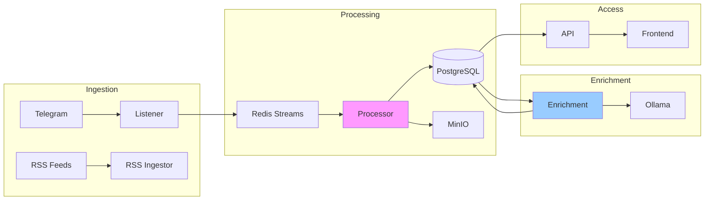

# Services Deep Dive

Detailed documentation of each microservice in the platform.

---

## Overview

The OSINT Intelligence Platform consists of **15+ application services** organized by function:

- **Core Pipeline**: Listener → Processor → Enrichment
- **Data Access**: API → Frontend
- **Supporting**: RSS Ingestor, OpenSanctions, Notifier
- **Infrastructure**: PostgreSQL, Redis, MinIO, Ollama



---

## Core Services

### [Listener Service](listener.md)

**Entry point for all Telegram data** - monitors channels, discovers from folders, pushes to Redis.

| Aspect | Details |
|--------|---------|
| **Function** | Telegram monitoring, channel discovery, backfill |
| **Tech** | Telethon, Redis Streams, asyncio |
| **Files** | `telegram_listener.py` (854 lines), `channel_discovery.py` (566 lines) |
| **Critical** | Owns Telegram session - never create clients elsewhere |

[:octicons-arrow-right-24: Full Documentation](listener.md)

---

### [Processor Service](processor.md)

**Real-time message processing** - spam filtering, LLM classification, media archival.

| Aspect | Details |
|--------|---------|
| **Function** | 9-stage pipeline: spam → routing → LLM → entities → media → DB |
| **Tech** | Redis consumer, Ollama, MinIO, PostgreSQL |
| **Target** | <1s per message latency |
| **Files** | `message_processor.py` (1278 lines), `llm_classifier.py` (1182 lines) |

[:octicons-arrow-right-24: Full Documentation](processor.md)

---

### [Enrichment Service](enrichment.md)

**Background batch processing** - AI tagging, embeddings, entity matching, validation.

| Aspect | Details |
|--------|---------|
| **Function** | 26 task types across 8 worker pools |
| **Tech** | Coordinator + Router pattern, Redis Streams, Ollama |
| **Speed** | Background - can be slow (hours OK) |
| **LLM Tasks** | Sequential execution prevents Ollama contention |

[:octicons-arrow-right-24: Full Documentation](enrichment.md)

---

### [API Service](api.md)

**REST API** - FastAPI backend for all data access.

| Aspect | Details |
|--------|---------|
| **Function** | Search, messages, entities, channels, RSS feeds |
| **Tech** | FastAPI, SQLAlchemy async, Pydantic |
| **Auth** | Optional Ory Kratos integration |
| **Files** | 15+ router modules |

[:octicons-arrow-right-24: Full Documentation](api.md)

---

### [Frontend Service](frontend.md)

**Web UI** - Next.js application for search and exploration.

| Aspect | Details |
|--------|---------|
| **Function** | Search, message view, entity explorer, admin |
| **Tech** | Next.js 14, React, Tailwind CSS |
| **Rendering** | SSR for SEO, client components for interactivity |
| **API** | Uses `lib/api.ts` centralized client |

[:octicons-arrow-right-24: Full Documentation](frontend.md)

---

## Supporting Services

### [Notifier Service](notifier.md)

Event batching and notification publishing to external channels (Slack, webhooks).

[:octicons-arrow-right-24: Full Documentation](notifier.md)

---

### [RSS Ingestor Service](rss-ingestor.md)

Polls RSS feeds, extracts articles, generates embeddings for cross-validation.

[:octicons-arrow-right-24: Full Documentation](rss-ingestor.md)

---

### [OpenSanctions Service](opensanctions.md)

Entity matching against OpenSanctions database via Yente API.

[:octicons-arrow-right-24: Full Documentation](opensanctions.md)

---

### [Analytics Service](analytics.md)

Aggregate statistics and trend analysis.

[:octicons-arrow-right-24: Full Documentation](analytics.md)

---

### [Entity Ingestion Service](entity-ingestion.md)

Custom entity import from CSV/JSON sources.

[:octicons-arrow-right-24: Full Documentation](entity-ingestion.md)

---

### [Migration Service](migration.md)

Legacy data migration from tg-archive format.

[:octicons-arrow-right-24: Full Documentation](migration.md)

---

### [Translation Backfill Service](translation-backfill.md)

Batch translation of historical messages.

[:octicons-arrow-right-24: Full Documentation](translation-backfill.md)

---

## Infrastructure Services

### PostgreSQL

Primary data store with pgvector for embeddings and full-text search.

- **Schema**: `infrastructure/postgres/init.sql` (~3000 lines)
- **Extensions**: pgvector, pg_trgm, btree_gin
- **Vector search**: HNSW index for cosine similarity

### Redis

Message queue and caching layer.

- **Streams**: `telegram:messages` for Listener→Processor
- **Streams**: `enrich:*` for Enrichment worker pools
- **Consumer groups**: Reliable delivery with acknowledgment

### MinIO

S3-compatible object storage for archived media.

- **Bucket**: `telegram-archive`
- **Paths**: Content-addressed `media/{hash[:2]}/{hash[2:4]}/{hash}.{ext}`
- **Deduplication**: SHA-256 prevents storing duplicates

### Ollama

Self-hosted LLM inference server.

- **Primary model**: `qwen2.5:3b` (superior RU/UK language support)
- **Fallback**: `llama3.2:3b`
- **Tasks**: Classification, tagging, validation, event extraction

---

## Service Communication

### Message Flow

```
Telegram → Listener → Redis Streams → Processor → PostgreSQL → Enrichment → PostgreSQL
                                          ↓
                                       MinIO
```

### Communication Patterns

| Pattern | Used By | Purpose |
|---------|---------|---------|
| **Redis Streams** | Listener→Processor, Router→Workers | Async message passing |
| **Direct DB** | Enrichment tasks | Batch read/write |
| **HTTP API** | Frontend→API | Sync data access |
| **Pub/Sub** | Notifier | Event broadcast |

---

## Service Scaling

### Horizontal Scaling

```bash
# Scale processor workers (2-8 recommended)
docker-compose up -d --scale processor-worker=4

# Scale enrichment fast pool
docker-compose --profile enrichment up -d --scale enrichment-fast-pool=2
```

### Resource Guidelines

| Service | CPU | Memory | Scaling |
|---------|-----|--------|---------|
| Listener | Low | 512MB | Single instance |
| Processor | Medium | 1GB | 2-8 workers |
| Enrichment | High | 2GB | By worker type |
| API | Low | 512MB | 1-4 instances |
| Ollama | High | 8GB+ | Single (CPU inference) |

---

## Related Documentation

- [Architecture Overview](../architecture.md) - System design
- [Adding Features](../adding-features.md) - Extension patterns
- [Database Schema](../../reference/database-tables.md) - Table reference
