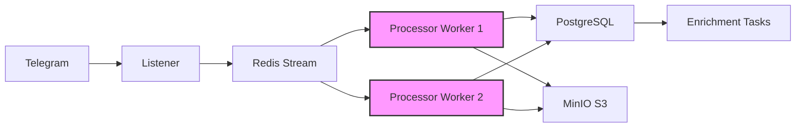
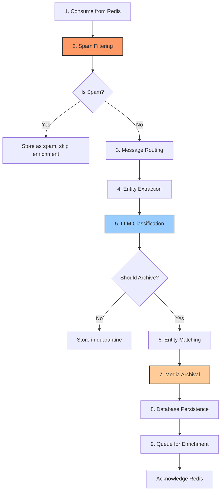

# Processor Service

> Real-time message processing on the critical path (<1s latency target)

## Overview

The **Processor Service** is the core intelligence engine of the OSINT platform. It consumes messages from Redis, applies spam filtering, performs LLM-based classification, extracts entities, archives media, and persists structured intelligence to PostgreSQL.

!!! info "Critical Path Service"
    Processor is on the **critical path** of message flow. Failures here mean messages don't reach the database. The service is designed for high reliability with automatic retries, graceful degradation, and comprehensive error handling.

**Key Characteristics:**

- **Speed**: <1s processing time per message (target)
- **Position**: Between Listener (Telegram) and Enrichment (batch processing)
- **Role**: Real-time per-message classification and archival
- **Scaling**: Horizontally scalable (default: 2 workers)



## Architecture

### Key Files

| File | Size | Purpose |
|------|------|---------|
| `main.py` | - | Worker initialization and Redis consumer loop |
| `message_processor.py` | 58 KB | Main orchestrator for 9-stage pipeline |
| `llm_classifier.py` | 49 KB | Unified LLM classification (spam + topic + importance) |
| `media_archiver.py` | - | Content-addressed storage with SHA-256 deduplication |
| `entity_matcher.py` | - | Semantic entity matching against 1,425 curated entities |
| `entity_extractor.py` | - | Regex-based extraction (hashtags, mentions, coordinates) |
| `message_router.py` | - | Channel rule lookup and routing decisions |

### Processing Pipeline

The processor executes **8 stages** for each message:



## Processing Stages

### 1. Consume from Redis

Messages arrive via Redis Streams from the Listener service. Each message contains:

- Message ID, channel ID, content
- Media metadata (type, URL, grouped_id for albums)
- Social graph data (author, replies, forwards, comments)
- Telegram timestamps and engagement metrics

### 2. Spam Filtering

!!! warning "Critical Performance Optimization"
    Spam filtering happens **before** expensive operations (LLM calls, media downloads) to save ~40% processing cost.

The LLM classifier performs unified spam detection:

- **Financial spam**: crypto, USDT, trading bots, casino
- **Promotional spam**: channel ads, merchandise, "subscribe to"
- **Off-topic spam**: memes, dating, horoscopes
- **Forwarding spam**: viral chain messages
- **Fundraising**: Donation requests (even for military equipment)

Spam messages are stored with `is_spam=true` for review/analytics but skip enrichment pipeline.

### 3. Message Routing

Determines archiving strategy based on channel folder:

| Folder Pattern | Tier | Strategy |
|----------------|------|----------|
| `Archive-*` | archive | Archive unless clearly low-value |
| `Monitor-*` | monitor | Only high OSINT value |
| `Discover-*` | discover | Very strict (probation period) |

The tier is passed to the LLM for context-aware classification.

### 4. Entity Extraction

Fast regex-based extraction (no LLM overhead):

- **Hashtags**: `#UAarmy`, `#Bakhmut`, `#HIMARS`
- **Mentions**: `@user`, `@channel`
- **Coordinates**: GPS coordinates (DD, DMS formats)
- **URLs**: External links
- **Dates**: Temporal references

Entities stored as JSONB in `messages.entities` column.

### 5. LLM Classification

!!! info "Unified Classifier"
    Replaced legacy `rule_engine.py` + `spam_filter.py` with a **single LLM call** (v2→v7 prompt evolution).

**Model**: `qwen2.5:3b` via Ollama (local, €0/month)

**Classification Output**:

```json
{
  "is_spam": false,
  "spam_type": null,
  "topic": "combat",
  "importance": "high",
  "should_archive": true,
  "is_ukraine_relevant": true,
  "reasoning": "Strike report on Novorossiysk port with confirmed damage"
}
```

**Topics** (13 categories):

- `combat`: Battles, strikes, attacks, explosions
- `equipment`: Tanks, drones, weapons deliveries
- `casualties`: KIA/WIA counts, losses
- `movements`: Troop movements, convoys
- `infrastructure`: Energy grid, bridges, civilian damage
- `humanitarian`: Evacuations, aid, refugees
- `diplomatic`: Sanctions, negotiations
- `intelligence`: OSINT analysis, reconnaissance
- `propaganda`: Russian disinformation, tabloid scandals
- `units`: Brigade/battalion updates
- `locations`: Frontline updates, city status
- `general`: Mixed content, analysis
- `uncertain`: Ambiguous content flagged for review

**Importance Levels**:

- `high`: Breaking news, significant events
- `medium`: Routine updates, unconfirmed reports
- `low`: Commentary, repetitive content

**Chain-of-Thought** (v6+):

The LLM outputs structured reasoning before JSON:

```xml
<analysis>
ENTITIES: Novorossiysk (Russian port), "прилетіло" (strike landed)
GEOGRAPHY: Crimea, Black Sea region
INDICATORS: Military slang confirms combat, damage assessment present
RELEVANCE: Direct Ukraine-Russia conflict reporting
</analysis>
{...json...}
```

This analysis is stored in `decision_log` table for audit trail.

### 6. Entity Matching

Semantic matching against **1,425 curated entities** (ArmyGuide, Root.NK, ODIN datasets):

**Methods** (priority order):

1. **Exact name match**: Full-text search (ILIKE)
2. **Alias match**: Unnest aliases array
3. **Hashtag match**: Extract #tags, match against entity names
4. **Semantic match**: pgvector cosine similarity (0.75 threshold)

Results stored in `message_entities` junction table for network graph.

### 7. Media Archival

!!! success "Content-Addressed Storage"
    SHA-256 deduplication saves **30-40% storage costs** by storing each unique file only once.

**Workflow**:

1. Download media from Telegram
2. Calculate SHA-256 hash
3. Check if hash exists in `media_files` table
4. **If exists**: Increment `reference_count`, skip upload (deduplication)
5. **If new**: Upload to MinIO, create `MediaFile` record
6. Create `MessageMedia` relationship

**Storage Path**:

```
media/{hash[:2]}/{hash[2:4]}/{hash}.{ext}
Example: media/ab/cd/abcdef123...789.jpg
```

**Album Handling**:

For grouped messages (Telegram albums), all media files are downloaded and linked to the primary message.

**Video Processing**:

Videos are processed with `ffmpeg -movflags +faststart` to enable progressive playback in browsers (moves moov atom to start).

### 8. Database Persistence

Messages are stored with **idempotent inserts** (PostgreSQL `ON CONFLICT DO NOTHING`):

```python
insert_stmt = insert(Message).values(...).on_conflict_do_nothing(
    index_elements=['channel_id', 'message_id']
).returning(Message.id)
```

**Message Authenticity Hashing**:

Each message gets two SHA-256 hashes for tamper detection:

- `content_hash`: Hash of message content
- `metadata_hash`: Hash of metadata (sender, timestamp, forward info)

**Decision Logging**:

Every LLM classification is logged to `decision_log` table:

- Full decision JSON (JSONB)
- Chain-of-thought analysis
- Model used, prompt version
- Processing time (latency_ms)
- Link to previous decision (for reprocessing)

### 9. Queue for Enrichment

After successful persistence, messages are queued for batch enrichment:

- Embedding generation
- AI tagging
- Social graph analysis
- Engagement polling (views/forwards tracking)

## Configuration

Environment variables (from `docker-compose.yml`):

### Database

```bash
POSTGRES_HOST=postgres
POSTGRES_PORT=5432
POSTGRES_DB=osint_platform
POSTGRES_USER=postgres
POSTGRES_PASSWORD=postgres
```

### Redis

```bash
REDIS_HOST=redis
REDIS_PORT=6379
REDIS_PASSWORD=""
REDIS_DB=0
REDIS_STREAM_NAME=telegram_messages
REDIS_GROUP_NAME=processor_workers
```

### MinIO (Object Storage)

```bash
MINIO_ENDPOINT=minio:9000
MINIO_ACCESS_KEY=minioadmin
MINIO_SECRET_KEY=minioadmin
MINIO_BUCKET_NAME=osint-media
MINIO_SECURE=false
```

### LLM Classification

```bash
# Ollama Configuration
OLLAMA_BASE_URL=http://ollama:11434
OLLAMA_MODEL=qwen2.5:3b
OLLAMA_NUM_PREDICT=250           # Max tokens for classification
OLLAMA_TEMPERATURE=0.1           # Low for deterministic JSON
LLM_ENABLED=true                 # Master switch

# Performance Tuning (Ollama container)
OLLAMA_NUM_PARALLEL=1            # Sequential processing
OLLAMA_MAX_LOADED_MODELS=2       # Memory limit
OLLAMA_CPU_THREADS=6             # Match CPU allocation
```

### Translation (Optional)

```bash
TRANSLATION_ENABLED=true
DEEPL_API_KEY=your-key-here      # DeepL Pro (free tier)
DEEPL_API_URL=https://api-free.deepl.com/v2/translate
```

### Scaling

```bash
PROCESSOR_REPLICAS=2             # Number of worker containers
```

## LLM Classification

### Prompt Versioning

The classifier uses database-driven prompts with version history:

| Version | Status | Date | Key Features |
|---------|--------|------|--------------|
| v2 | Legacy | - | Basic unified classifier |
| v3 | Legacy | - | Tier-based architecture |
| v4 | Legacy | - | Fixed relevance detection |
| v5 | Legacy | - | Expert persona prompting |
| v6 | Deprecated | 2025-11-29 | Chain-of-thought reasoning |
| v7 | **Active** | 2025-11-30 | Topic definitions, air raid fix |

!!! warning "Prompt Evolution History"
    Before modifying prompts, **read `/docs/architecture/LLM_PROMPTS.md`** for full context.

### 4-Tier Fallback Strategy

The classifier implements graceful degradation:

1. **Tier 1**: LLM classification with chain-of-thought (v7 prompt)
2. **Tier 2**: JSON repair for truncated responses
3. **Tier 3**: Regex extraction from partial JSON
4. **Tier 4**: Conservative fallback (archive if tier=archive, skip otherwise)

```python
# Tier 4 fallback
ClassificationResult(
    is_spam=False,
    topic="general",
    importance="medium",
    should_archive=(tier == "archive"),
    reasoning="Fallback classification (LLM unavailable)"
)
```

### Military Slang Glossary

The prompt includes a curated glossary of Ukrainian/Russian military slang stored in `military_slang` table:

**Ukrainian**:
- `прилетіло` / `приліт` = strike landed (NOT "took off")
- `бавовна` = explosion (lit. "cotton" - euphemism)
- `двохсотий` / `200` = KIA
- `трьохсотий` / `300` = WIA

**Russian**:
- `хлопок` = explosion (lit. "pop/clap")
- `задымление` = smoke event (euphemism)
- `бандерівці` = Ukrainians (derogatory)

The glossary is dynamically injected via `{{MILITARY_SLANG}}` placeholder in prompts.

### Performance

- **Latency**: 1-3s per message (acceptable for real-time)
- **Throughput**: ~20-30 messages/minute per worker (Ollama CPU-bound)
- **Cost**: €0/month (self-hosted Ollama)
- **Accuracy**: ~95% spam detection, ~90% topic classification

## Media Archival

### Content-Addressed Storage

Every media file is identified by its SHA-256 hash:

```python
def _get_s3_key(sha256: str, file_path: Path) -> str:
    ext = file_path.suffix or ".bin"
    return f"media/{sha256[:2]}/{sha256[2:4]}/{sha256}{ext}"
```

### Deduplication Logic

```python
# Check if file already exists
result = await session.execute(
    select(MediaFile).where(MediaFile.sha256 == sha256)
)
existing_file = result.scalar_one_or_none()

if existing_file:
    # Deduplicated - increment reference count
    existing_file.reference_count += 1
    bytes_saved += existing_file.file_size
else:
    # New file - upload to MinIO
    await _upload_to_minio(temp_path, s3_key, mime_type)
```

### Album Handling

Telegram albums (grouped messages with multiple media) are handled specially:

```python
media_file_ids = await media_archiver.archive_album(
    telegram_client=telegram_client,
    channel_id=channel_id,
    message_ids=album_message_ids,  # All message IDs in album
    session=session,
)
```

Each media file gets its own `MediaFile` record, all linked to the primary message via `MessageMedia` junction table.

### Video Streaming Optimization

Videos are processed with `ffmpeg` to enable progressive playback:

```bash
ffmpeg -y -i input.mp4 -c copy -movflags +faststart output.mp4
```

This moves the moov atom (metadata) to the start of the file without re-encoding.

## Entity Matching

### Matching Algorithm

**1. Semantic Similarity** (pgvector):

```sql
SELECT id, name, 1 - (embedding <=> '[...]'::vector) as similarity
FROM curated_entities
WHERE 1 - (embedding <=> '[...]'::vector) > 0.75
ORDER BY embedding <=> '[...]'::vector
LIMIT 10
```

**2. Exact Name Match**:

```sql
SELECT id, name
FROM curated_entities
WHERE LENGTH(name) >= 4
  AND :content ILIKE '%' || name || '%'
```

**3. Alias Match**:

```sql
SELECT id, name, alias
FROM curated_entities
CROSS JOIN LATERAL unnest(aliases) as alias
WHERE LENGTH(alias) >= 4
  AND :content ILIKE '%' || alias || '%'
```

**4. Hashtag Match**:

```python
hashtags = re.findall(r"#(\w+)", content.lower())
```

```sql
SELECT id, name
FROM curated_entities
WHERE LOWER(name) = ANY(:hashtags)
```

### Deduplication

When multiple methods match the same entity, priority is:

1. Exact name (1.0 confidence)
2. Alias (0.95)
3. Hashtag (0.90)
4. Semantic (varies)

## Metrics

The processor exposes Prometheus metrics at `http://localhost:8002/metrics`:

### Message Processing

```python
messages_processed_total{worker_id="...", channel_id="..."}
messages_archived_total{channel_id="...", routing_rule="..."}
messages_skipped_total{channel_id="...", skip_reason="..."}
processing_duration_seconds{stage="total"}
```

### LLM Classification

```python
llm_requests_total{model="qwen2.5:3b", status="success"}
llm_request_duration_seconds{model="..."}
osint_topics_total{topic="combat"}
```

### Media Archival

```python
media_download_duration_seconds{media_type="photo"}
media_storage_bytes_total{media_type="video"}
media_deduplication_saves_total{media_type="photo"}
media_errors_total{error_type="download_failed"}
```

### Entity Extraction

```python
entities_extracted_total{entity_type="hashtag", channel_id="..."}
entity_extraction_duration_seconds{entity_type="..."}
```

## Scaling

### Horizontal Scaling

Scale processor workers with Docker Compose:

```bash
# Default: 2 workers
docker-compose up -d --scale processor-worker=4
```

Each worker:
- Consumes from same Redis Stream (`telegram_messages`)
- Uses Redis Consumer Groups for load balancing
- Processes messages independently
- No shared state (stateless design)

### Performance Tuning

**Ollama CPU Allocation**:

```yaml
deploy:
  resources:
    limits:
      cpus: '6.0'      # Increased from 2.0 (was bottleneck)
      memory: 8G
    reservations:
      cpus: '2.0'
      memory: 4G
```

**Redis Consumer Group**:

- Group name: `processor_workers`
- Consumer ID: `worker-{hostname}`
- Auto-claim: Unclaimed messages after 60s
- Max retries: 3

**Database Connection Pool**:

```python
# AsyncSessionLocal uses asyncpg pool
pool_size=10
max_overflow=20
pool_pre_ping=True  # Verify connections before use
```

## Troubleshooting

### Common Issues

#### 1. LLM Classification Failures

**Symptom**: Messages classified as `general` with `"reasoning": "Fallback classification"`

**Causes**:
- Ollama service down
- Model not loaded (`qwen2.5:3b`)
- JSON parsing errors (truncated responses)

**Debug**:

```bash
# Check Ollama health
docker-compose logs ollama

# Test classification manually
curl http://localhost:11434/api/chat -d '{
  "model": "qwen2.5:3b",
  "messages": [{"role": "user", "content": "Test"}],
  "stream": false
}'

# View processor logs
docker-compose logs -f processor-worker
```

**Fix**:

```bash
# Restart Ollama
docker-compose restart ollama

# Pull model if missing
docker-compose exec ollama ollama pull qwen2.5:3b
```

#### 2. Media Archival Failures

**Symptom**: Warning `⚠️ MEDIA ARCHIVAL INCOMPLETE` in logs

**Causes**:
- Telegram flood wait (rate limiting)
- MinIO connection error
- Disk space full

**Debug**:

```bash
# Check MinIO
docker-compose logs minio
curl -I http://localhost:9000/minio/health/live

# Check disk space
df -h

# Verify media exists in MinIO
docker-compose exec minio mc ls local/osint-media/media/
```

**Fix**:

Run repair script:

```bash
python scripts/repair_missing_media.py --execute
```

#### 3. Redis Stream Backlog

**Symptom**: Messages delayed, `XPENDING` shows high count

**Causes**:
- Workers down/crashed
- Processing too slow (LLM bottleneck)
- Dead-letter messages (max retries exceeded)

**Debug**:

```bash
# Check stream info
docker-compose exec redis redis-cli XINFO STREAM telegram_messages

# Check pending messages
docker-compose exec redis redis-cli XPENDING telegram_messages processor_workers

# Check worker health
docker-compose ps processor-worker
```

**Fix**:

```bash
# Scale workers
docker-compose up -d --scale processor-worker=4

# Claim stuck messages
docker-compose exec redis redis-cli XAUTOCLAIM telegram_messages \
  processor_workers worker-1 60000 0-0 COUNT 100
```

#### 4. Spam False Positives

**Symptom**: Valid messages classified as spam

**Debug**:

```sql
-- Find spam classifications
SELECT id, content, spam_type, spam_reason
FROM messages
WHERE is_spam = true
  AND created_at > NOW() - INTERVAL '1 day'
ORDER BY created_at DESC
LIMIT 20;
```

**Fix**:

Update prompt in NocoDB (`llm_prompts` table) or reprocess:

```bash
python scripts/reprocess_messages.py --message-ids 123,456,789
```

### Health Checks

```bash
# Processor metrics endpoint
curl http://localhost:8002/metrics

# Check worker health
docker-compose ps processor-worker

# Check Ollama health
curl http://localhost:11434/api/tags

# Check Redis Stream
docker-compose exec redis redis-cli XLEN telegram_messages

# Check database
docker-compose exec postgres psql -U postgres -d osint_platform \
  -c "SELECT COUNT(*) FROM messages WHERE created_at > NOW() - INTERVAL '1 hour';"
```

## Related Services

- **[Listener Service](listener.md)**: Upstream - monitors Telegram channels, sends to Redis
- **[Enrichment Service](enrichment.md)**: Downstream - batch processing (embeddings, AI tagging)
- **[API Service](api.md)**: Queries processed messages
- **[Frontend](frontend.md)**: Displays processed intelligence

---

**Last Updated**: 2025-12-09
**Version**: 1.0
**Maintainer**: Platform Development Team
