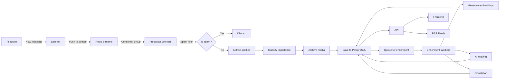

# Core Concepts

Understanding the key concepts and terminology used throughout the OSINT Intelligence Platform.

## Key Terminology

### Channel

A **Telegram channel** is a broadcast medium where administrators post messages to an unlimited number of subscribers. Channels are the primary data source for the platform.

**Channel Management**:
- Channels are organized in **Telegram folders** (Archive-*, Monitor-*, Discover-*)
- The platform auto-discovers channels from folder membership every 5 minutes
- No manual channel configuration needed

**Channel Types**:
- **Public channels**: Anyone can join (e.g., @kyivindependent)
- **Private channels**: Require invitation link (e.g., t.me/+AbCdEfG)

**Processing Rules**:
- `Archive-*` folders → Archive all messages (after spam filter)
- `Monitor-*` folders → Archive only high-importance messages
- `Discover-*` folders → Auto-created for forward chain discovery

### Message

A **message** is a single post in a Telegram channel. Messages are the core data unit in the platform.

**Message Properties**:
- **Content**: Text, media (photos, videos, documents), or both
- **Metadata**: Author, date, views, forwards, replies count
- **Enrichment**: Importance level, entities, tags, embeddings

**Message States**:
- **Raw**: Just received from Telegram
- **Filtered**: Passed spam filter
- **Processed**: Importance classified, entities extracted
- **Enriched**: Embeddings generated, AI tags added

**Storage**:
- Text stored in PostgreSQL `messages` table
- Media stored in MinIO (S3-compatible object storage)
- Content-addressed (SHA-256) to deduplicate identical media

### Entity

An **entity** is a named thing extracted from messages: person, organization, location, military unit, or equipment.

**Entity Types**:
- **Person**: Vladimir Putin, Volodymyr Zelenskyy
- **Organization**: Wagner Group, NATO
- **Location**: Bakhmut, Kherson, Mariupol
- **Military Unit**: 47th Mechanized Brigade, 3rd Assault Brigade
- **Equipment**: HIMARS, Leopard 2, F-16

**Entity Sources**:
- **Extracted**: Automatically detected from message text via regex/NER
- **Curated**: Custom CSV imports for domain-specific entities (military units, equipment, people)
- **OpenSanctions/Yente**: Matched against sanctions/PEP databases
- **Wikidata**: Automatic property enrichment for matched entities

**Entity Properties**:
- **Name** (primary and aliases)
- **Type** (person, org, location, etc.)
- **Description** (from curated database)
- **Embedding** (384-dim vector for semantic search)
- **Relationships** (connections to other entities)

### Importance Level

**Importance level** classifies how valuable a message is for intelligence analysis. Replaces legacy `osint_score` (0-100).

**Levels**:
- **High**: Critical intelligence (verified military activity, combat reports, equipment movements, war crimes evidence)
- **Medium**: Moderate value (general war updates, political statements, regional developments)
- **Low**: Background information (propaganda, opinions, routine updates)

**Classification Methods**:
1. **LLM Classification** (primary): 6 models available (Qwen, Llama, Gemma, Phi, Granite)
2. **Rule-Based** (fallback): Keyword patterns, channel credibility, metadata signals

**Usage**:
- Filter searches: `GET /api/messages?importance_level=high`
- RSS feeds: `GET /rss/search?importance_level=high`
- Message routing: Monitor-* folders only archive high importance

### Spam Filtering

**Spam filtering** removes promotional content, scams, and forwarding chains before archiving. Saves 80-90% on storage and translation costs.

**Spam Categories**:
- **Promotional**: Crypto, forex, betting advertisements
- **Forwarding**: Chain messages ("forward to 10 friends")
- **Formatting**: Excessive emoji, caps lock abuse
- **URL spam**: Shortened URLs, suspicious domains
- **Gambling**: Casino, sports betting

**Accuracy**: >95% on production data (battle-tested since 2022)

**Configuration**: Database-managed patterns in `spam_patterns` table

### Archive Modes

**Archive modes** determine which messages get permanently stored.

**archive_all**
: Store all non-spam messages from the channel. Used for comprehensive archival.
: Folder pattern: `Archive-*`

**selective_archive**
: Store only high-importance messages. Used for monitoring without full archival.
: Folder pattern: `Monitor-*`

**discovery**
: Auto-joined channels in 14-day probation. Promoted or rejected based on spam rate.
: Folder pattern: `Discover-*`

### Content-Addressed Storage

**Content-addressed storage** stores media files by their SHA-256 hash, not by filename or ID.

**Benefits**:
- **Deduplication**: Identical media stored once (30-40% storage savings)
- **Integrity**: Hash proves file hasn't been tampered with
- **Reference counting**: Track how many messages use each file

**Path Structure**:
```
media/{hash[:2]}/{hash[2:4]}/{hash}.{ext}
```

Example: `media/a7/3f/a73f82...e91.jpg`

**Storage Backend**: MinIO (S3-compatible)

## Processing Concepts

### Processor vs Enrichment

The platform separates **real-time** and **background** processing.

**Processor** (Real-Time, <1s latency):
: - Spam filtering
: - Message routing (archive_all vs selective_archive)
: - Entity extraction (regex patterns)
: - Media archival
: - Importance classification (LLM)
: - Database persistence

**Enrichment** (Background, hours OK):
: - Embedding generation (sentence-transformers)
: - AI tagging with reasoning
: - Translation backfill
: - Social graph extraction
: - Engagement polling (views, forwards, comments)

**Why Separate?**
: Live messages must be archived before they're deleted. Expensive AI operations run asynchronously to avoid blocking ingestion.

### Redis Streams

**Redis Streams** is the message queue connecting Listener and Processor.

**Flow**:
1. Listener receives message from Telegram
2. Listener pushes to Redis Stream (`telegram_messages`)
3. Processor workers consume from stream
4. Processor acknowledges (ACK) after successful processing

**Benefits**:
- **Decoupling**: Listener and Processor scale independently
- **Reliability**: Messages persist in stream until processed
- **Backpressure**: Stream buffers messages if Processor is slow

**Consumer Groups**: All Processor replicas share work via `processor_group`

### Folder-Based Channel Management

**Revolutionary approach**: Manage channels via Telegram app folders instead of admin panel.

**Workflow** (30 seconds):
1. Open Telegram app (mobile or desktop)
2. Create/use folder (right-click sidebar → Create Folder)
3. Drag channel into folder
4. Done! Platform detects within 5 minutes

**Why It's Better**:
- ✅ **No SSH required**: Manage from phone
- ✅ **Visual channel names**: Not IDs like -1001234567890
- ✅ **No duplicates**: Telegram prevents adding same channel twice
- ✅ **Zero training**: Everyone knows Telegram folders
- ✅ **Scales easily**: 10 to 1000+ channels

**Folder Patterns** (hardcoded in `services/listener/src/channel_discovery.py`):
- `Archive-*` → `archive_all` rule
- `Monitor-*` → `selective_archive` rule
- `Discover-*` → `discovery` rule

## Search Concepts

### Full-Text Search

**Full-text search** finds messages containing specific keywords using PostgreSQL's built-in search.

**Features**:
- **GIN index**: 10-100x faster than LIKE queries
- **Phrase search**: `"exact phrase"`
- **Prefix matching**: `bakhmut*`
- **Language-aware**: Stemming for English (configurable)

**Performance**: <100ms on 100K+ messages

**Example**:
```http
GET /api/messages?q=Bakhmut&limit=50
```

### Semantic Search

**Semantic search** finds messages by **meaning**, not just keywords, using vector embeddings.

**How It Works**:
1. Message text → Sentence-Transformers model → 384-dim vector
2. Store vector in PostgreSQL (pgvector extension)
3. Query: "artillery strikes" → vector → cosine similarity → results

**Use Cases**:
- Find messages about "tank losses" (matches BMP, artillery, armored vehicle)
- "Similar to this message" feature
- Cross-language search (RU/UK message → EN query)

**Performance**: <100ms on 1M+ messages (HNSW index)

**Example**:
```http
POST /api/semantic/search
{
  "query": "Russian forces near Bakhmut",
  "similarity_threshold": 0.7,
  "limit": 20
}
```

### Hybrid Search

**Hybrid search** combines full-text and semantic search for best results.

**Ranking Formula**:
```
score = 0.4 × text_rank + 0.6 × semantic_similarity
```

**Benefits**:
- Keyword precision (text search)
- Semantic recall (vector search)
- Configurable weights

**Example**:
```http
POST /api/semantic/hybrid
{
  "text_query": "Bakhmut",
  "semantic_query": "combat operations near Bakhmut",
  "importance_level": "high"
}
```

## Data Flow



## Configuration Concepts

### Database-Driven Configuration

**All filtering/routing/scoring logic** is stored in PostgreSQL tables, not code. Change rules without code deployments.

**Configurable Tables**:
- `spam_patterns`: Spam detection rules
- `importance_rules`: Importance classification modifiers
- `entity_patterns`: Entity extraction patterns
- `message_routing_rules`: Channel archive mode configuration
- `model_configuration`: LLM model selection and priority

**Example - Add Spam Pattern**:
```sql
INSERT INTO spam_patterns (category, pattern, pattern_type, weight)
VALUES ('promotional', '🎰', 'emoji', 2);
```

**Example - Switch LLM Model**:
```sql
UPDATE model_configuration
SET priority = 1
WHERE task = 'importance_classification' AND model_id = 'phi3.5:3.8b';
```

### Multi-Model AI

**6 LLM models** available for importance classification:

| Model | Quality | Speed | Context | Use Case |
|-------|---------|-------|---------|----------|
| qwen2.5:3b | 87% | 750ms | 32k | Default (best RU/UK support) |
| phi3.5:3.8b | 90% | 1200ms | 4k | Best quality |
| llama3.2:3b | 85% | 800ms | 4k | General purpose |
| granite3.0:2b | 78% | 500ms | 4k | High-throughput |
| gemma2:2b | 75% | 400ms | 8k | Fastest |

**Switch at runtime** via database (no code deploy):
```sql
SELECT * FROM model_configuration
WHERE task = 'importance_classification'
ORDER BY priority;
```

**Fallback Strategy**: If LLM fails, fall back to rule-based classification

## Next Steps

Now that you understand the core concepts, explore:

- [Channel Management](../operator-guide/channel-management.md) - Folder-based workflow details
- [Searching Messages](../user-guide/searching.md) - Full-text, semantic, and hybrid search
- [Architecture Overview](../architecture/overview.md) - Technical deep dive
- [Enrichment Pipeline](../architecture/enrichment-pipeline.md) - Background AI tasks
