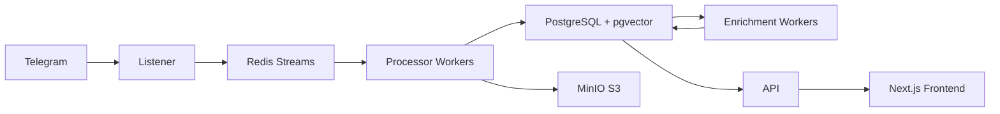

# OSINT Intelligence Platform

Welcome to the OSINT Intelligence Platform documentation. This platform is a production-ready system for archiving, enriching, and analyzing Telegram channels with multi-model AI enrichment, semantic search, and configurable intelligence rules.

## Platform Overview

**Status**: ✅ Operational | **Version**: 1.0

- **254+ Telegram channels** monitored in real-time
- **1,425 curated entities** (military/political organizations and individuals)
- **29 containerized services** for scalability and reliability
- **Self-hosted** with no cloud dependencies (~€230/month target cost)

## Quick Links by Persona

<div class="grid cards" markdown>

-   :material-rocket-launch:{ .lg .middle } __New to the Platform?__

    ---

    Get started quickly with installation and basic concepts

    [:octicons-arrow-right-24: Getting Started](getting-started/index.md)

-   :material-magnify:{ .lg .middle } __End User__

    ---

    Learn how to search messages, manage RSS feeds, and explore entities

    [:octicons-arrow-right-24: User Guide](user-guide/index.md)

-   :material-server:{ .lg .middle } __Platform Operator__

    ---

    Install, configure, monitor, and maintain the platform

    [:octicons-arrow-right-24: Operator Guide](operator-guide/index.md)

-   :material-code-braces:{ .lg .middle } __Developer__

    ---

    Understand the architecture and contribute new features

    [:octicons-arrow-right-24: Developer Guide](developer-guide/index.md)

-   :material-shield-lock:{ .lg .middle } __Security Administrator__

    ---

    Configure authentication, authorization, and security hardening

    [:octicons-arrow-right-24: Security Guide](security-guide/index.md)

-   :material-book-open-variant:{ .lg .middle } __Tutorials__

    ---

    Step-by-step guides for common tasks and workflows

    [:octicons-arrow-right-24: Tutorials](tutorials/index.md)

-   :material-file-document:{ .lg .middle } __API & Reference__

    ---

    Technical reference for APIs, environment variables, and database schema

    [:octicons-arrow-right-24: Reference](reference/index.md)

</div>

## Key Features

- **Real-time Telegram Monitoring**: Archive messages, media, and metadata from 254+ channels
- **Multi-model AI Enrichment**: Entity extraction, sentiment analysis, and AI tagging using Ollama
- **Semantic Search**: Vector-based search with pgvector for natural language queries
- **Knowledge Graph**: Track relationships between entities, channels, and messages
- **RSS Feed Management**: Create custom feeds with advanced filtering
- **Discord/Telegram Notifications**: Real-time alerts for critical intelligence
- **Spam Filtering**: Multi-layer spam detection (€1,296-2,280/year savings)
- **Content Deduplication**: SHA-256-based media deduplication
- **Self-hosted LLM**: Zero-cost AI using Ollama (qwen2.5:3b)

## Architecture Overview



The platform follows a **producer-consumer architecture** with clear separation between real-time processing (Processor) and background enrichment (Enrichment Workers).

## Quick Start

```bash
# Clone the repository
git clone https://github.com/osintukraine/osint-intelligence-platform.git
cd osint-intelligence-platform

# Start the platform
docker-compose up -d

# View logs
docker-compose logs -f

# Access the frontend
open http://localhost:3000
```

For detailed installation instructions, see the [Operator Guide](operator-guide/installation.md).

## Documentation Goals

This documentation aims to serve:

1. **End Users**: Search, explore, and consume intelligence
2. **Operators**: Install, configure, and maintain the platform
3. **Developers**: Understand architecture and contribute features
4. **Security Admins**: Configure authentication and hardening
5. **New Team Members**: Onboard quickly with comprehensive guides

## Support & Community

- **GitHub Issues**: [Report bugs and request features](https://github.com/osintukraine/osint-intelligence-platform/issues)
- **Discussions**: [Ask questions and share ideas](https://github.com/osintukraine/osint-intelligence-platform/discussions)

## License

This project is licensed under the MIT License. See the main repository for details.

---

**Ready to get started?** Choose your persona above and jump into the relevant guide.
