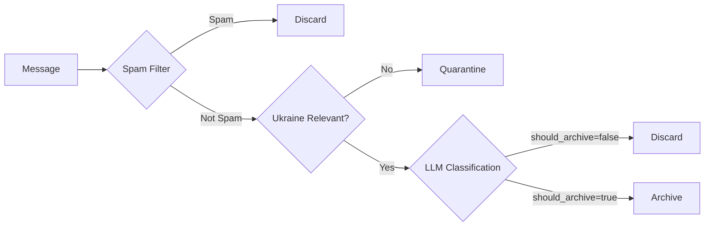

# Telegram Setup

Configure Telegram API access, session management, and channel monitoring for the OSINT Intelligence Platform.

## Overview

The platform monitors Telegram channels for intelligence collection. This guide covers obtaining API credentials, creating sessions, configuring multi-account setups, and managing channels through Telegram folders.

**Key Concepts**:

- **API Credentials**: Required from my.telegram.org for bot/user access
- **Session Files**: Persistent authentication state (avoid re-login)
- **Multi-Account**: Scale with separate Russia/Ukraine Telegram accounts
- **Folder-Based Management**: Organize channels by Telegram folders (Archive-*, Monitor-*, Discover-*)

## Prerequisites

Before starting, you need:

- [ ] A Telegram account (phone number required)
- [ ] Access to https://my.telegram.org
- [ ] Ability to receive SMS/calls for verification
- [ ] Docker Compose environment running

## Obtaining Telegram API Credentials

### Step 1: Register Application

1. **Visit Telegram API portal**:
   - Go to https://my.telegram.org
   - Click "API development tools"

2. **Log in with your phone number**:
   - Enter your phone number with country code (e.g., `+1234567890`)
   - You'll receive a verification code via SMS or call

3. **Create Application**:
   - Click "Create a new application"
   - Fill in application details:
     - **App title**: `OSINT Intelligence Platform`
     - **Short name**: `osint-platform`
     - **URL**: `https://github.com/osintukraine/osint-intelligence-platform` (or your fork)
     - **Platform**: `Desktop`
   - Submit the form

4. **Copy Credentials**:
   - **API ID**: 8-digit number (e.g., `12345678`)
   - **API Hash**: 32-character hex string (e.g., `a1b2c3d4e5f6...`)

### Step 2: Configure Environment Variables

Add credentials to `.env` file:

```bash
# Single Account Mode (Default)
TELEGRAM_API_ID=12345678
TELEGRAM_API_HASH=a1b2c3d4e5f6g7h8i9j0k1l2m3n4o5p6
TELEGRAM_PHONE=+1234567890              # Your phone number with country code
```

**CRITICAL**: Keep these credentials secret. Never commit to git.

### Security Best Practices

- **Use a dedicated account**: Don't use your personal Telegram account
- **Limit application access**: Only grant necessary permissions
- **Rotate credentials**: If compromised, delete application and create new one
- **Backup session files**: Sessions are as valuable as passwords

## Creating Telegram Sessions

### Single Account Session

#### Option 1: Interactive Session Creation (Recommended)

```bash
# Start session creation process
docker-compose run --rm listener python -c "
from telethon import TelegramClient
import os

api_id = int(os.getenv('TELEGRAM_API_ID'))
api_hash = os.getenv('TELEGRAM_API_HASH')
phone = os.getenv('TELEGRAM_PHONE')

client = TelegramClient('/app/sessions/osint_platform', api_id, api_hash)
client.start(phone=phone)
print('Session created successfully!')
client.disconnect()
"
```

**Interactive Prompts**:

1. **Phone Number**: Enter phone (with +country code)
2. **Verification Code**: Enter code from Telegram app
3. **2FA Password** (if enabled): Enter your 2FA password
4. **Success**: Session saved to `telegram_sessions/osint_platform.session`

#### Option 2: Using Telegram Auth Script (Recommended)

The `telegram_auth.py` script handles all session creation with better error handling:

```bash
# Run authentication script
python3 scripts/telegram_auth.py

# Interactive prompts:
# Enter your phone number (with country code, e.g., +1234567890):
# [System] Sending verification code to +1234567890...
# Enter the verification code you received: 12345
# Enter 2FA password (if enabled): ******

# Success output:
# Successfully logged in as: John Doe (@johndoe)
# Session files created:
#   - telegram_sessions/osint_platform.session (master)
#   - telegram_sessions/listener.session
#   - telegram_sessions/enrichment.session
```

**Check session status:**

```bash
# List existing sessions
python3 scripts/telegram_auth.py --list

# Show configuration status
python3 scripts/telegram_auth.py --status
```

### Multi-Account Sessions

For scaled deployments with separate Russia/Ukraine accounts:

#### Step 1: Configure Multi-Account Credentials

Add to `.env`:

```bash
# Russia account
TELEGRAM_API_ID_RUSSIA=11111111
TELEGRAM_API_HASH_RUSSIA=a1a1a1a1a1a1a1a1a1a1a1a1a1a1a1a1
TELEGRAM_PHONE_RUSSIA=+1234567890

# Ukraine account
TELEGRAM_API_ID_UKRAINE=22222222
TELEGRAM_API_HASH_UKRAINE=b2b2b2b2b2b2b2b2b2b2b2b2b2b2b2b2
TELEGRAM_PHONE_UKRAINE=+0987654321
```

#### Step 2: Authenticate Each Account

```bash
# Authenticate Russia account
python3 scripts/telegram_auth.py --account russia
# Enter phone: +1234567890
# Enter code: 12345

# Authenticate Ukraine account
python3 scripts/telegram_auth.py --account ukraine
# Enter phone: +0987654321
# Enter code: 54321
```

**Session Files Created**:
- `telegram_sessions/listener_russia.session`
- `telegram_sessions/listener_ukraine.session`

#### Step 3: Start Multi-Account Listeners

**Option A: Using mode switcher script (Recommended)**

```bash
# Switch to multi-account mode
./scripts/switch-telegram-mode.sh multi

# This automatically:
# - Stops the single-account listener
# - Starts listener-russia and listener-ukraine
# - Starts enrichment-russia and enrichment-ukraine

# Check current mode
./scripts/switch-telegram-mode.sh status

# Switch back to single-account mode
./scripts/switch-telegram-mode.sh single
```

**Option B: Manual docker-compose commands**

```bash
# Start both listeners
docker-compose --profile multi-account up -d listener-russia listener-ukraine

# Verify running
docker-compose ps | grep listener

# Expected output:
# osint-listener-russia    running   8011/tcp
# osint-listener-ukraine   running   8012/tcp

# (Optional) Stop default single-account listener
docker-compose stop listener
```

### Session File Structure

```bash
telegram_sessions/
├── osint_platform.session          # Single account (default)
├── listener_russia.session         # Russia account
├── listener_ukraine.session        # Ukraine account
└── enrichment.session              # Enrichment worker (separate to avoid SQLite locks)
```

**Never delete session files** - they contain authentication state. Losing them requires re-authentication and may trigger security checks.

## Session Management

### Verifying Session Health

```bash
# Check if session is valid
docker-compose exec listener python -c "
from telethon import TelegramClient
import os

client = TelegramClient('/app/sessions/osint_platform',
                       int(os.getenv('TELEGRAM_API_ID')),
                       os.getenv('TELEGRAM_API_HASH'))

async def check():
    await client.start(phone=os.getenv('TELEGRAM_PHONE'))
    me = await client.get_me()
    print(f'Session valid for: {me.first_name} (@{me.username})')
    await client.disconnect()

import asyncio
asyncio.run(check())
"
```

Expected output:
```
Session valid for: John (@johndoe)
```

### Session Expiration

Telegram sessions can expire due to:

- **Long inactivity**: Sessions may expire after ~1 year of no use
- **Security triggers**: Suspicious activity, password changes, or account compromise
- **Manual logout**: Logging out from Telegram app revokes all sessions

**Symptoms of Expired Session**:
- `AuthKeyUnregistered` error in logs
- `SessionPasswordNeeded` error
- Listener service exits immediately

**Solution**: Re-authenticate:

```bash
# Remove old session
rm telegram_sessions/osint_platform.session

# Create new session (follow prompts)
docker-compose run --rm listener python -m telethon_session_creator
```

### Session Security

**Protect session files like passwords**:

```bash
# Set strict permissions (owner read/write only)
chmod 600 telegram_sessions/*.session

# Backup sessions securely
tar -czf sessions-backup-$(date +%Y%m%d).tar.gz telegram_sessions/
gpg -c sessions-backup-$(date +%Y%m%d).tar.gz  # Encrypt with password
rm sessions-backup-$(date +%Y%m%d).tar.gz      # Remove unencrypted backup
```

### Upgrading from Previous Versions

!!! warning "Session Location Changed (December 2025)"
    If you're upgrading from a pre-December 2025 installation, session file locations have changed.

**Changes Made:**

| Setting | Old Value | New Value |
|---------|-----------|-----------|
| Session directory | `/app/data/` | `/data/sessions/` |
| Mount propagation | `:rshared` flag | Removed (incompatible with SSHFS) |

**Symptoms if not migrated:**

- "Session file not found" errors in listener logs
- Telegram prompts for re-authentication
- Listener fails to start

**Migration Steps:**

```bash
# 1. Check where your old sessions are
ls -la data/*.session 2>/dev/null
ls -la data/telegram_sessions/*.session 2>/dev/null

# 2. Create new directory
mkdir -p data/sessions

# 3. Move session files
mv data/*.session data/sessions/ 2>/dev/null
mv data/telegram_sessions/*.session data/sessions/ 2>/dev/null

# 4. Restart listener
docker-compose restart listener

# 5. Verify it's working
docker-compose logs listener | tail -20
```

**If session files are corrupted**, you'll need to re-authenticate (see [Session Creation](#creating-telegram-sessions)).

See [Production Gotchas](production-gotchas.md#session-file-location-changes) for more details.

## Folder-Based Channel Management

The platform uses Telegram app folders to organize and manage channels. No database configuration required.

### Folder Patterns

!!! warning "12-Character Folder Name Limit"
    Telegram limits folder names to **12 characters maximum**. Use short suffixes like `-UA` and `-RU` instead of full country names.

| Folder Pattern | Processing Tier | LLM Behavior |
|----------------|-----------------|--------------|
| `Archive-*` | Archive tier | Lenient - archives most Ukraine-relevant content |
| `Monitor-*` | Monitor tier | Strict - only high-value OSINT content |
| `Discover-*` | Discovery tier | Very strict + 14-day probation (from forward chains) |
| `Rec-*` | Recommendation tier | Very strict + 14-day probation (from Telegram recommendations) |

!!! important "The LLM is the Arbiter"
    The folder tier sets how strict the LLM should be, but the **AI makes the final `should_archive` decision** for every message. Even Archive-tier messages can be rejected if the LLM determines they lack OSINT value.

**Valid Examples** (≤12 characters):

- `Archive-UA` - Archive tier, Ukraine sources (10 chars) ✅
- `Archive-RU` - Archive tier, Russia sources (10 chars) ✅
- `Monitor-UA` - Monitor tier, Ukraine (10 chars) ✅
- `Discover-UA` - Discovery tier, forward chains (11 chars) ✅
- `Rec-UA` - Recommendation tier (6 chars) ✅
- `Rec-RU` - Recommendation tier (6 chars) ✅
- `Rec-?` - Needs human review (5 chars) ✅

**Invalid Examples** (too long):

- `Archive-Russia` - 14 chars ❌
- `Archive-Ukraine` - 15 chars ❌
- `Monitor-Important` - 17 chars ❌

### Creating Folders in Telegram

#### Desktop App (Telegram Desktop)

1. Open Telegram Desktop
2. Click "Settings" → "Folders"
3. Click "Create New Folder"
4. Name folder (e.g., `Archive-RU` - remember the 12-char limit!)
5. Add channels to folder:
   - Click "Add Chats"
   - Select channels to monitor
   - Click "Done"
6. Save folder

#### Mobile App (Android/iOS)

1. Open Telegram app
2. Tap "Settings" → "Folders"
3. Tap "Create New Folder"
4. Name folder (e.g., `Archive-UA` - remember the 12-char limit!)
5. Tap "Add Chats"
6. Select channels
7. Tap "Done"

### Folder Sync Process

The listener service automatically syncs folders every 5 minutes:

```bash
# Check folder sync interval (default: 300 seconds)
grep FOLDER_SYNC_INTERVAL .env
# FOLDER_SYNC_INTERVAL=300
```

**Sync Workflow**:

1. Listener reads all folders from Telegram account
2. Matches folder names against patterns (`Archive-*`, `Monitor-*`, `Discover-*`)
3. Creates/updates channels in database
4. Assigns intelligence rules based on folder pattern
5. Starts monitoring matched channels

**View sync logs**:

```bash
docker-compose logs listener | grep -i folder

# Expected output:
# INFO: Discovered folder: Archive-RU (12 channels)
# INFO: Discovered folder: Monitor-UA (3 channels)
# INFO: Assigned tier archive to 12 channels in Archive-RU
```

### Managing Channels

#### Adding Channels

**Method 1: Add to Telegram Folder**

1. Join channel in Telegram app
2. Add channel to folder (e.g., `Archive-RU`)
3. Wait for sync (max 5 minutes)
4. Verify in logs:

```bash
docker-compose logs listener | grep "Assigned rule"
```

**Method 2: Auto-Discovery (Discover-* folders)**

1. Create `Discover-New` folder
2. Platform auto-joins channels found in forward chains
3. Channels stay for 14-day probation
4. Move to `Archive-*` or `Monitor-*` to keep permanently

#### Removing Channels

**Method 1: Remove from Folder**

1. Open Telegram app
2. Remove channel from folder
3. Wait for sync (max 5 minutes)
4. Channel monitoring stops automatically

**Method 2: Database Cleanup (for stale channels)**

```bash
# View stale channels (no messages in 30+ days)
docker-compose exec postgres psql -U osint_user -d osint_platform -c "
SELECT name, last_message_at
FROM channels
WHERE last_message_at < NOW() - INTERVAL '30 days'
ORDER BY last_message_at;
"

# Disable stale channels (mark inactive, stop monitoring)
docker-compose exec postgres psql -U osint_user -d osint_platform -c "
UPDATE channels
SET is_active = false
WHERE last_message_at < NOW() - INTERVAL '30 days';
"
```

### Folder-Specific Intelligence Rules

All messages go through the same pipeline, but the **folder tier affects how strict the LLM classification is**:



#### Archive Tier (`Archive-*` folders)

**LLM behavior**: Lenient classification - archives most Ukraine-relevant content.

- **Spam filter**: YES (filters donation scams, crypto ads)
- **Ukraine relevance**: YES (non-relevant goes to quarantine)
- **LLM strictness**: LOW (most relevant messages pass)
- **Typical archive rate**: 70-90% of non-spam messages

**Use cases**:
- Critical primary sources (Ukrainian military, Russian MoD)
- High-signal channels (DeepStateUA, Rybar)
- Historical archiving (comprehensive coverage)

#### Monitor Tier (`Monitor-*` folders)

**LLM behavior**: Strict classification - only high-value OSINT content.

- **Spam filter**: YES
- **Ukraine relevance**: YES
- **LLM strictness**: HIGH (only clear OSINT value passes)
- **Typical archive rate**: 20-40% of non-spam messages

**Use cases**:
- News aggregators (too noisy for archive tier)
- Secondary sources (only significant updates)
- Discussion groups (filter out chatter)

**Storage savings**: Monitor tier typically archives 60-80% less than Archive tier.

#### Discovery Tier (`Discover-*` folders)

**LLM behavior**: Very strict classification + 14-day probation period.

- **Auto-join**: YES (from forward chains)
- **LLM strictness**: VERY HIGH (prove the channel's worth)
- **Probation period**: 14 days
- **Auto-removal**: After 14 days if inactive or spam

**Discovery Sources**:

The platform discovers new channels through two mechanisms:

| Source | Folder Pattern | Description |
|--------|----------------|-------------|
| **Forward chains** | `Discover-UA/RU/?` | Channels referenced in forwarded messages |
| **Telegram recommendations** | `Rec-UA/RU/?` | Telegram's "Similar Channels" algorithm |

!!! info "3-Round Country Detection"
    The platform uses a robust **3-round voting system** to classify channels as Ukrainian (UA), Russian (RU), or uncertain (?):

    1. **Round 1 - Keywords**: Fast deterministic check using Ukrainian/Russian keywords
    2. **Round 2 - LLM Basic**: AI analyzes channel title + description
    3. **Round 3 - LLM Deep**: AI analyzes 10 sample messages for content patterns

    **Voting Logic**:

    - All 3 rounds agree → **High confidence** → Assign country
    - 2/3 rounds agree → **Medium confidence** → Assign with review flag
    - No consensus → **Low confidence** → Put in `Discover-?` or `Rec-?` folder

**Folder Naming**:

| Folder | Source | Country |
|--------|--------|---------|
| `Discover-UA` | Forward chains | Ukrainian channels |
| `Discover-RU` | Forward chains | Russian channels |
| `Discover-?` | Forward chains | Uncertain - needs human review |
| `Rec-UA` | Recommendations | Ukrainian channels |
| `Rec-RU` | Recommendations | Russian channels |
| `Rec-?` | Recommendations | Uncertain - needs human review |

!!! warning "Recommendation Discovery is One-Time"
    When a channel is discovered via forwards, the platform fetches up to **3 recommendations** from Telegram's "Similar Channels" feature. This is a one-time expansion - recommendations don't trigger more recommendations (prevents infinite loops).

**Workflow**:

1. Platform detects new channel in forwards
2. Runs **3-round country detection** (keywords + LLM x2)
3. Auto-joins and adds to `Discover-{country}` folder
4. Fetches top 3 Telegram recommendations for that channel
5. For each recommendation: runs 3-round detection → adds to `Rec-{country}` folder
6. Monitors for 14 days with very strict filtering
7. **Decision after 14 days**:
   - **Active + valuable**: Move to `Archive-*` or `Monitor-*`
   - **Inactive or spam**: Auto-removed

**View discovery candidates**:

```bash
docker-compose exec postgres psql -U osint_user -d osint_platform -c "
SELECT name, folder, discovery_status,
       discovery_metadata->>'detected_country' as country,
       discovery_metadata->>'confidence' as confidence,
       discovery_metadata->>'discovered_via' as source
FROM channels
WHERE folder LIKE 'Discover-%' OR folder LIKE 'Rec-%'
ORDER BY created_at DESC;
"
```

**View channels needing human review**:

```bash
docker-compose exec postgres psql -U osint_user -d osint_platform -c "
SELECT name, folder, discovery_metadata->>'votes' as votes
FROM channels
WHERE discovery_metadata->>'needs_human_review' = 'true'
ORDER BY created_at DESC;
"
```

## Multi-Account Architecture

### When to Use Multi-Account

**Use multi-account if**:

- Monitoring **200+ channels** (approaching single-account rate limits)
- Need **higher throughput** (double the API quota)
- Want **risk isolation** (one account banned doesn't stop everything)
- Have **organizational split** (separate Russia/Ukraine teams)

**Stick to single-account if**:

- Monitoring **<200 channels**
- API rate limits not a problem
- Simpler operations preferred

### Account Assignment by Folder

!!! warning "12-Character Folder Limit Applies"
    Remember: Telegram folder names are limited to 12 characters. Use short suffixes like `-RU` and `-UA`.

| Account | Folders | Use Case |
|---------|---------|----------|
| **Default** | `Archive`, `Monitor`, `Discover` | Neutral channels, general OSINT |
| **Russia** | `Archive-RU`, `Monitor-RU`, `Discover-RU` | Russian military, state media |
| **Ukraine** | `Archive-UA`, `Monitor-UA`, `Discover-UA` | Ukrainian military, government |

**Example Folder Structure** (all ≤12 chars):

```
Default Account:
- Archive (international news) - 7 chars ✅
- Monitor (OSINT analysts) - 7 chars ✅

Russia Account:
- Archive-RU (Russian MoD, Wagner) - 10 chars ✅
- Monitor-RU (regional channels) - 10 chars ✅

Ukraine Account:
- Archive-UA (Armed Forces, DeepState) - 10 chars ✅
- Monitor-UA (oblast channels) - 10 chars ✅
```

### Multi-Account Performance

**Rate Limits** (per account):

- **Message fetching**: 20 requests/second per account
- **Channel joins**: 20 joins/day per account
- **Downloads**: Unlimited (but throttled by Telegram)

**With 2 accounts** (Russia + Ukraine):
- **Effective throughput**: 40 requests/second
- **Channel capacity**: 400+ channels monitored
- **Fault tolerance**: 50% capacity if one account down

## Rate Limiting & Flood Control

Telegram enforces strict API rate limits. The platform handles this automatically.

### Rate Limit Types

#### 1. Global Rate Limit

**Limit**: 20 requests/second per account

**Platform Handling**:
- Worker pool distributes requests across workers
- Per-channel rate limiting (1 request per 2 seconds)
- Redis-based distributed rate limiter

**Configuration**:

```bash
# In .env (defaults are safe)
TELEGRAM_RATE_LIMIT_PER_CHANNEL=20  # Messages per minute
```

#### 2. FloodWait Errors

**Symptom**: `FloodWaitError: Must wait 300 seconds before next request`

**Platform Handling**:
- Automatic backoff with exponential delay
- Re-queue message for later processing
- Continue processing other channels (worker pool isolates failures)

**View FloodWait in logs**:

```bash
docker-compose logs listener | grep FloodWait

# Example output:
# WARNING: Channel @example flood wait 300s, re-queuing
```

**Configuration**:

```bash
# Flood wait multiplier (backoff aggressiveness)
TELEGRAM_FLOOD_WAIT_MULTIPLIER=2  # Default: 2 (doubles wait time each retry)
```

#### 3. Channel Join Limits

**Limit**: 20 joins/day per account

**Platform Handling**:
- Discovery feature only joins high-potential channels
- Manual approval workflow for new channels
- Join queue with daily limit tracking

**View join queue**:

```bash
docker-compose exec postgres psql -U osint_user -d osint_platform -c "
SELECT name, join_attempted_at, join_status
FROM channels
WHERE join_status = 'pending'
ORDER BY join_attempted_at;
"
```

### Handling Rate Limit Errors

#### Temporary Rate Limit

**Error**: `FloodWaitError: A wait of X seconds is required`

**Action**: Wait and retry (automatic)

```bash
# Platform handles automatically, but you can monitor:
docker-compose logs listener | grep -i "wait\|flood"
```

#### Permanent Ban

**Error**: `UserDeactivatedError: The user has been deleted/deactivated`

**Action**: Account is banned, must use different account

```bash
# Check if account is valid
docker-compose exec listener python -c "
from telethon import TelegramClient
import os

async def check():
    client = TelegramClient('/app/sessions/osint_platform',
                           int(os.getenv('TELEGRAM_API_ID')),
                           os.getenv('TELEGRAM_API_HASH'))
    try:
        await client.start(phone=os.getenv('TELEGRAM_PHONE'))
        print('Account active')
    except Exception as e:
        print(f'Account error: {e}')
    await client.disconnect()

import asyncio
asyncio.run(check())
"
```

### Rate Limit Best Practices

1. **Use folder-based management** - Avoid manual channel additions (triggers rate limits)
2. **Enable worker pool** - Isolates failures, continues processing other channels
3. **Monitor FloodWait frequency** - If frequent, reduce `TELEGRAM_RATE_LIMIT_PER_CHANNEL`
4. **Use multi-account** - Doubles effective rate limit
5. **Avoid bulk operations** - Spread channel additions over days, not hours

## Historical Backfill

Fetch historical messages from channels (e.g., messages from Feb 24, 2022 to now).

### Backfill Configuration

```bash
# Enable backfill
BACKFILL_ENABLED=true

# Start date (ISO format: YYYY-MM-DD)
BACKFILL_START_DATE=2022-02-24    # Day of Russian invasion

# Backfill mode
BACKFILL_MODE=manual              # manual, on_discovery, scheduled

# Rate-limit friendly settings
BACKFILL_BATCH_SIZE=100           # Messages per batch
BACKFILL_DELAY_MS=1000            # 1 second between batches

# Media handling
BACKFILL_MEDIA_STRATEGY=download_available  # download_available, skip, download_all
```

### Backfill Modes

#### Manual Backfill (Recommended)

Start backfill via API call:

```bash
# Trigger backfill for specific channel
curl -X POST http://localhost:8000/api/admin/backfill \
  -H "Content-Type: application/json" \
  -d '{
    "channel_id": 12345,
    "start_date": "2024-01-01"
  }'
```

#### On-Discovery Backfill

Automatically backfill when channel added to folder:

```bash
BACKFILL_MODE=on_discovery
```

**Workflow**:
1. Add channel to `Archive-*` folder
2. Listener detects new channel
3. Automatically starts backfill from `BACKFILL_START_DATE`

**WARNING**: Can trigger rate limits if adding many channels at once. Use manual mode for bulk additions.

### Backfill Performance

**Example**: Backfill 1 year of messages from active channel

- **Messages**: ~10,000 messages (30 msgs/day average)
- **Batch size**: 100 messages
- **Delay**: 1 second between batches
- **Estimated time**: 100 batches × 1 second = **~2 minutes**

**With media download**:
- **+Media time**: ~5-10 seconds per batch (network dependent)
- **Total time**: **~10-15 minutes**

### Monitoring Backfill Progress

```bash
# View backfill status
docker-compose exec postgres psql -U osint_user -d osint_platform -c "
SELECT name, backfill_status, backfill_progress, backfill_started_at
FROM channels
WHERE backfill_status = 'in_progress';
"

# View backfill logs
docker-compose logs listener | grep -i backfill
```

### Backfill Errors

#### Media Not Available

**Error**: `404: Media not found (Telegram expired URLs)`

**Action**: Set `BACKFILL_MEDIA_STRATEGY=download_available`

This gracefully handles expired media:
- Try to download
- If 404, mark as `media_unavailable=true`
- Continue backfill (don't fail)

#### Rate Limit During Backfill

**Error**: `FloodWaitError: Must wait 300 seconds`

**Action**: Increase `BACKFILL_DELAY_MS`

```bash
# More conservative (slower but safer)
BACKFILL_DELAY_MS=2000  # 2 seconds between batches
```

## Troubleshooting

### Session Creation Fails

**Error**: `RuntimeError: No running event loop`

**Solution**: Use `asyncio.run()` wrapper

```bash
docker-compose run --rm listener python -c "
import asyncio
from telethon import TelegramClient
import os

async def create_session():
    client = TelegramClient('/app/sessions/osint_platform',
                           int(os.getenv('TELEGRAM_API_ID')),
                           os.getenv('TELEGRAM_API_HASH'))
    await client.start(phone=os.getenv('TELEGRAM_PHONE'))
    print('Session created!')
    await client.disconnect()

asyncio.run(create_session())
"
```

### Verification Code Not Received

**Problem**: SMS/call not arriving

**Solutions**:

1. **Check phone number format**: Must include country code (`+1234567890`)
2. **Try calling instead**: Telegram offers voice call option
3. **Wait 5 minutes**: Telegram throttles verification requests
4. **Use different account**: Try another phone number

### Channel Not Monitored

**Problem**: Channel in folder but not showing in database

**Diagnostics**:

```bash
# Check folder sync
docker-compose logs listener | grep -i "folder\|channel"

# Verify channel exists
docker-compose exec postgres psql -U osint_user -d osint_platform -c "
SELECT name, folder, is_active
FROM channels
WHERE name LIKE '%channel_name%';
"

# Force folder re-sync
docker-compose restart listener
```

### FloodWait Errors Frequent

**Problem**: `FloodWaitError` appearing multiple times per hour

**Solutions**:

1. **Reduce request rate**:

```bash
TELEGRAM_RATE_LIMIT_PER_CHANNEL=10  # Lower from 20
```

2. **Enable multi-account** (doubles capacity):

```bash
# Configure second account in .env
TELEGRAM_API_ID_UKRAINE=...
# ... follow multi-account setup
```

3. **Check for misbehaving channels**:

```bash
# View channels with highest message volume
docker-compose exec postgres psql -U osint_user -d osint_platform -c "
SELECT name, message_count, last_message_at
FROM channels
ORDER BY message_count DESC
LIMIT 10;
"

# Move high-volume channels to Monitor-* (selective archival)
```

### Session Expired

**Error**: `AuthKeyUnregistered` or `SessionPasswordNeeded`

**Solution**: Re-authenticate

```bash
# Remove old session
rm telegram_sessions/osint_platform.session

# Create new session
docker-compose run --rm listener python -c "
from telethon import TelegramClient
import os

async def auth():
    client = TelegramClient('/app/sessions/osint_platform',
                           int(os.getenv('TELEGRAM_API_ID')),
                           os.getenv('TELEGRAM_API_HASH'))
    await client.start(phone=os.getenv('TELEGRAM_PHONE'))
    print('Re-authenticated successfully')
    await client.disconnect()

import asyncio
asyncio.run(auth())
"

# Restart listener
docker-compose restart listener
```

## Next Steps

- [Configuration](configuration.md) - Environment variables and service configuration
- [Monitoring](monitoring.md) - Set up monitoring and alerts
- [Backup & Restore](backup-restore.md) - Backup Telegram sessions
- [Troubleshooting](troubleshooting.md) - Additional Telegram-related issues

## References

- Telegram API Documentation: https://core.telegram.org/api
- Telethon Library: https://docs.telethon.dev
- CLAUDE.md - Critical Rule #1 (Telegram Session Management)
- `.env.example` - Telegram configuration variables
