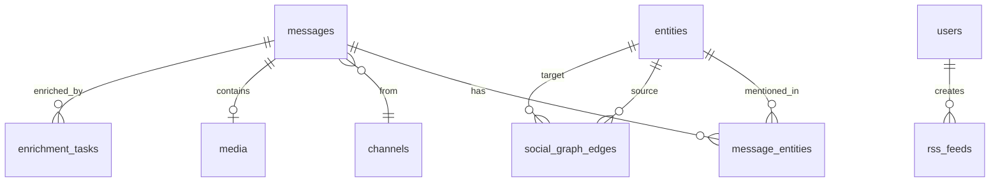

# Database Tables

Complete database schema reference for all tables and relationships.

## Overview

**TODO: Content to be generated from codebase analysis**

The database schema is defined in `/home/rick/code/osintukraine/osint-intelligence-platform/infrastructure/postgres/init.sql`.

This reference documents all tables, columns, indexes, and relationships.

## Core Tables

### messages

**TODO: Document from init.sql:**

Primary storage for all archived messages.

| Column | Type | Description | Constraints |
|--------|------|-------------|-------------|
| `id` | BIGSERIAL | Primary key | PRIMARY KEY |
| `telegram_id` | BIGINT | Telegram message ID | NOT NULL, UNIQUE per channel |
| `channel_id` | INTEGER | Foreign key to channels | FOREIGN KEY |
| `text` | TEXT | Message content | - |
| `created_at` | TIMESTAMP | Message timestamp | NOT NULL |
| `archived_at` | TIMESTAMP | When archived | DEFAULT NOW() |
| `reply_to_id` | BIGINT | Reply to message ID | - |
| `forward_from_id` | BIGINT | Forward source | - |
| `has_media` | BOOLEAN | Has media attachments | DEFAULT FALSE |
| `embedding` | VECTOR(384) | Text embedding | - |

**Indexes:**

- `idx_messages_channel_id` - Channel lookup
- `idx_messages_created_at` - Time-based queries
- `idx_messages_text_fts` - Full-text search
- `idx_messages_embedding` - Vector similarity

### channels

**TODO: Document from init.sql:**

Telegram channel metadata.

| Column | Type | Description | Constraints |
|--------|------|-------------|-------------|
| `id` | SERIAL | Primary key | PRIMARY KEY |
| `telegram_id` | BIGINT | Telegram channel ID | UNIQUE |
| `username` | VARCHAR(255) | Channel username | UNIQUE |
| `title` | VARCHAR(255) | Channel title | - |
| `folder` | VARCHAR(255) | Telegram folder name | - |
| `description` | TEXT | Channel description | - |
| `member_count` | INTEGER | Subscriber count | - |
| `intelligence_rules` | JSONB | Routing rules | - |

### entities

**TODO: Document from init.sql:**

Tracked entities (persons, organizations, locations).

| Column | Type | Description | Constraints |
|--------|------|-------------|-------------|
| `id` | SERIAL | Primary key | PRIMARY KEY |
| `name` | VARCHAR(255) | Entity name | NOT NULL |
| `type` | VARCHAR(50) | Entity type | NOT NULL |
| `source` | VARCHAR(50) | Data source | - |
| `metadata` | JSONB | Additional data | - |
| `aliases` | TEXT[] | Alternative names | - |

**Types:**

- `person`
- `organization`
- `location`
- `military_unit`

**Sources:**

- `armyguide`
- `rootnk`
- `odin`
- `wikidata`
- `opensanctions`

### message_entities

**TODO: Document from init.sql:**

Many-to-many relationship between messages and entities.

| Column | Type | Description | Constraints |
|--------|------|-------------|-------------|
| `message_id` | BIGINT | Foreign key | FOREIGN KEY |
| `entity_id` | INTEGER | Foreign key | FOREIGN KEY |
| `mention_type` | VARCHAR(50) | How mentioned | - |
| `position` | INTEGER | Position in text | - |

### media

**TODO: Document from init.sql:**

Media file metadata and storage references.

| Column | Type | Description | Constraints |
|--------|------|-------------|-------------|
| `id` | SERIAL | Primary key | PRIMARY KEY |
| `message_id` | BIGINT | Foreign key | FOREIGN KEY |
| `file_hash` | VARCHAR(64) | SHA-256 hash | UNIQUE |
| `file_type` | VARCHAR(50) | MIME type | - |
| `file_size` | BIGINT | Size in bytes | - |
| `minio_path` | VARCHAR(512) | Storage path | - |
| `width` | INTEGER | Image/video width | - |
| `height` | INTEGER | Image/video height | - |

## Enrichment Tables

### llm_prompts

**TODO: Document from init.sql:**

LLM prompt version management.

| Column | Type | Description | Constraints |
|--------|------|-------------|-------------|
| `id` | SERIAL | Primary key | PRIMARY KEY |
| `version` | VARCHAR(50) | Version identifier | UNIQUE |
| `prompt_text` | TEXT | Actual prompt | NOT NULL |
| `model` | VARCHAR(100) | Target model | - |
| `is_active` | BOOLEAN | Active status | DEFAULT FALSE |
| `created_at` | TIMESTAMP | Creation time | DEFAULT NOW() |

### enrichment_tasks

**TODO: Document from init.sql:**

Enrichment task tracking and status.

| Column | Type | Description | Constraints |
|--------|------|-------------|-------------|
| `id` | BIGSERIAL | Primary key | PRIMARY KEY |
| `task_type` | VARCHAR(100) | Task type | NOT NULL |
| `message_id` | BIGINT | Target message | FOREIGN KEY |
| `status` | VARCHAR(50) | Task status | NOT NULL |
| `error_message` | TEXT | Error details | - |
| `created_at` | TIMESTAMP | Created | DEFAULT NOW() |
| `completed_at` | TIMESTAMP | Completed | - |

**Statuses:**

- `pending`
- `processing`
- `completed`
- `failed`

## RSS & Feed Tables

### rss_feeds

**TODO: Document from init.sql:**

User-created RSS feeds.

| Column | Type | Description | Constraints |
|--------|------|-------------|-------------|
| `id` | SERIAL | Primary key | PRIMARY KEY |
| `name` | VARCHAR(255) | Feed name | NOT NULL |
| `description` | TEXT | Feed description | - |
| `user_id` | INTEGER | Owner | FOREIGN KEY |
| `filters` | JSONB | Filter configuration | - |
| `is_public` | BOOLEAN | Public visibility | DEFAULT FALSE |
| `created_at` | TIMESTAMP | Created | DEFAULT NOW() |

## User & Auth Tables

### users

**TODO: Document from init.sql:**

User accounts and authentication.

| Column | Type | Description | Constraints |
|--------|------|-------------|-------------|
| `id` | SERIAL | Primary key | PRIMARY KEY |
| `email` | VARCHAR(255) | Email address | UNIQUE, NOT NULL |
| `username` | VARCHAR(100) | Username | UNIQUE |
| `password_hash` | VARCHAR(255) | Hashed password | - |
| `is_active` | BOOLEAN | Account status | DEFAULT TRUE |
| `is_admin` | BOOLEAN | Admin flag | DEFAULT FALSE |
| `created_at` | TIMESTAMP | Created | DEFAULT NOW() |

### roles

**TODO: Document if RBAC tables exist**

## Graph & Analytics Tables

### social_graph_edges

**TODO: Document from init.sql:**

Social graph relationship edges.

| Column | Type | Description | Constraints |
|--------|------|-------------|-------------|
| `id` | BIGSERIAL | Primary key | PRIMARY KEY |
| `source_entity_id` | INTEGER | Source entity | FOREIGN KEY |
| `target_entity_id` | INTEGER | Target entity | FOREIGN KEY |
| `edge_type` | VARCHAR(50) | Relationship type | NOT NULL |
| `weight` | FLOAT | Relationship strength | DEFAULT 1.0 |
| `created_at` | TIMESTAMP | First seen | DEFAULT NOW() |
| `updated_at` | TIMESTAMP | Last updated | - |

## Indexes Summary

**TODO: Document all indexes:**

### Performance-Critical Indexes

- Message lookups by channel and time
- Full-text search on message text
- Vector similarity search
- Entity mention lookups

### Composite Indexes

**TODO: List composite indexes**

## Views

**TODO: Document database views if any exist:**

## Functions & Triggers

**TODO: Document PostgreSQL functions:**

### Automatic Timestamps

```sql
-- TODO: Add trigger function for updated_at
```

### Full-Text Search

**TODO: Document FTS configuration**

## Extensions

**TODO: Document PostgreSQL extensions:**

- `pgvector` - Vector similarity search
- `pg_trgm` - Trigram similarity
- `uuid-ossp` - UUID generation

## Schema Diagram

**TODO: Add comprehensive ER diagram:**



---

!!! warning "Schema Management"
    This database does not use Alembic migrations. Schema changes require editing init.sql and rebuilding the database.

!!! note "Documentation Status"
    This page is a placeholder. Content will be generated from /home/rick/code/osintukraine/osint-intelligence-platform/infrastructure/postgres/init.sql.
