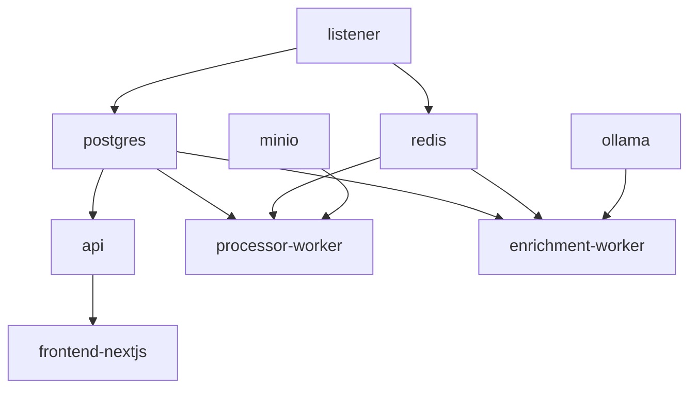

# Docker Services

Complete reference for all Docker Compose services and their configurations.

## Overview

**TODO: Content to be generated from codebase analysis**

The platform runs 29 containers across 4 categories:

- 15 Application services
- 8 Monitoring services
- 4 Infrastructure services
- 2 Authentication services

Reference: `/home/rick/code/osintukraine/osint-intelligence-platform/docker-compose.yml`

## Application Services

### listener

**TODO: Document from docker-compose.yml:**

Telegram client for monitoring channels.

```yaml
# TODO: Extract actual configuration
service: listener
image: osint-platform/listener:latest
depends_on: [postgres, redis]
volumes: [./sessions:/app/sessions]
```

**Environment Variables:**

- `TELEGRAM_API_ID`
- `TELEGRAM_API_HASH`
- `TELEGRAM_PHONE`

**Volumes:**

- Session storage

### processor-worker

**TODO: Document from docker-compose.yml:**

Real-time message processing workers.

**Scaling:** Can be scaled horizontally

```bash
docker-compose up -d --scale processor-worker=4
```

### enrichment-worker

**TODO: Document from docker-compose.yml:**

Background enrichment task workers.

**Scaling:** Can be scaled horizontally

### api

**TODO: Document from docker-compose.yml:**

FastAPI REST API service.

**Ports:** 8000:8000

### frontend-nextjs

**TODO: Document from docker-compose.yml:**

Next.js frontend application.

**Ports:** 3000:3000

### rss-ingestor

**TODO: Document from docker-compose.yml:**

RSS feed generation and serving.

### opensanctions

**TODO: Document from docker-compose.yml:**

OpenSanctions entity enrichment.

## Infrastructure Services

### postgres

**TODO: Document from docker-compose.yml:**

PostgreSQL 16 with pgvector extension.

**Ports:** 5432:5432

**Volumes:**

- `postgres_data:/var/lib/postgresql/data`
- `./infrastructure/postgres/init.sql:/docker-entrypoint-initdb.d/init.sql`

**Extensions:**

- pgvector
- pg_trgm

### redis

**TODO: Document from docker-compose.yml:**

Redis for message queues and caching.

**Ports:** 6379:6379

**Volumes:**

- `redis_data:/data`

### minio

**TODO: Document from docker-compose.yml:**

S3-compatible object storage for media.

**Ports:**

- 9000:9000 (API)
- 9001:9001 (Console)

**Volumes:**

- `minio_data:/data`

### ollama

**TODO: Document from docker-compose.yml:**

LLM inference service.

**Ports:** 11434:11434

**Volumes:**

- `ollama_models:/root/.ollama`

**Models:**

- qwen2.5:3b

## Monitoring Services

### prometheus

**TODO: Document from docker-compose.yml:**

Metrics collection and storage.

**Ports:** 9090:9090

**Volumes:**

- `prometheus_data:/prometheus`
- `./infrastructure/monitoring/prometheus.yml:/etc/prometheus/prometheus.yml`

### grafana

**TODO: Document from docker-compose.yml:**

Metrics visualization and dashboards.

**Ports:** 3001:3000

**Volumes:**

- `grafana_data:/var/lib/grafana`
- `./infrastructure/monitoring/grafana/dashboards:/etc/grafana/provisioning/dashboards`

### loki

**TODO: Document from docker-compose.yml:**

Log aggregation service.

**Ports:** 3100:3100

### promtail

**TODO: Document from docker-compose.yml:**

Log shipping agent.

**Volumes:**

- `/var/log:/var/log:ro`
- `/var/lib/docker/containers:/var/lib/docker/containers:ro`

### node-exporter

**TODO: Document from docker-compose.yml:**

System metrics exporter.

**Ports:** 9100:9100

### cadvisor

**TODO: Document from docker-compose.yml:**

Container metrics exporter.

**Ports:** 8080:8080

### alertmanager

**TODO: Document from docker-compose.yml:**

Alert routing and management.

**Ports:** 9093:9093

### uptime-kuma

**TODO: Document from docker-compose.yml:**

Uptime monitoring.

**Ports:** 3002:3001

## Network Configuration

**TODO: Document Docker networks:**

```yaml
networks:
  osint-network:
    driver: bridge
  monitoring-network:
    driver: bridge
```

## Volume Management

**TODO: Document named volumes:**

```yaml
volumes:
  postgres_data:
  redis_data:
  minio_data:
  ollama_models:
  grafana_data:
  prometheus_data:
```

## Resource Limits

**TODO: Document resource constraints from docker-compose.yml:**

### Memory Limits

| Service | Memory Limit | Memory Reservation |
|---------|--------------|-------------------|
| postgres | 4GB | 2GB |
| ollama | 8GB | 4GB |
| processor-worker | 2GB | 1GB |

### CPU Limits

**TODO: Document CPU constraints**

## Health Checks

**TODO: Document health check configurations:**

```yaml
healthcheck:
  test: ["CMD", "pg_isready", "-U", "osint_user"]
  interval: 10s
  timeout: 5s
  retries: 5
```

## Dependency Graph

**TODO: Create service dependency diagram:**



## Service Startup Order

**TODO: Document recommended startup sequence:**

1. Infrastructure (postgres, redis, minio)
2. Core services (listener, ollama)
3. Workers (processor-worker, enrichment-worker)
4. API and frontend
5. Monitoring stack

## Scaling Guidelines

**TODO: Document scaling recommendations:**

### Horizontal Scaling

Services that can be scaled:

- processor-worker (recommended: 2-8)
- enrichment-worker (recommended: 1-4)

### Vertical Scaling

Services that benefit from more resources:

- postgres (more memory for caching)
- ollama (more memory for models)
- minio (more disk for media)

## Port Reference

**TODO: Complete port mapping table:**

| Service | Internal Port | External Port | Description |
|---------|--------------|---------------|-------------|
| postgres | 5432 | 5432 | PostgreSQL |
| redis | 6379 | 6379 | Redis |
| minio | 9000 | 9000 | MinIO API |
| minio | 9001 | 9001 | MinIO Console |
| api | 8000 | 8000 | FastAPI |
| frontend | 3000 | 3000 | Next.js |
| grafana | 3000 | 3001 | Grafana |
| prometheus | 9090 | 9090 | Prometheus |

## Environment File Templates

**TODO: Provide service-specific .env templates:**

---

!!! tip "Resource Planning"
    For production, allocate at least 16GB RAM and 500GB disk space. Scale worker counts based on message volume.

!!! note "Documentation Status"
    This page is a placeholder. Content will be generated from /home/rick/code/osintukraine/osint-intelligence-platform/docker-compose.yml.
