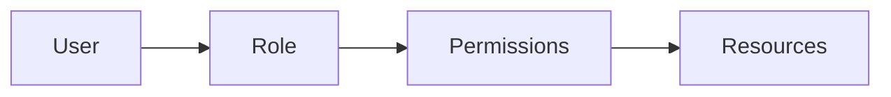

# Authorization

Role-based access control and permissions management.

## Overview

**TODO: Content to be generated from codebase analysis**

This page will cover:

- RBAC model
- Built-in roles
- Custom roles
- Permissions system
- Resource-level access control
- API authorization
- Admin privileges

## RBAC Model

**TODO: Document role-based access control model:**

- Users
- Roles
- Permissions
- Resources

### Permission Model



## Built-in Roles

**TODO: Document default roles:**

### Admin

- Full system access
- User management
- Configuration changes
- All API access

### Analyst

- Read access to all messages
- Entity exploration
- Search functionality
- RSS feed creation

### Viewer

- Read-only access
- Limited search
- No administrative functions

## Custom Roles

**TODO: Document how to create custom roles:**

- Role creation process
- Permission assignment
- Role hierarchy
- Role inheritance

## Permissions System

**TODO: Document available permissions:**

- `messages:read`
- `messages:write`
- `entities:read`
- `entities:write`
- `channels:admin`
- `rss:create`
- `users:admin`
- `system:admin`

## Resource-Level Access Control

**TODO: Document resource-level permissions:**

- Channel-level access
- Message-level access
- Entity-level access
- Feed-level access

## API Authorization

**TODO: Document API authorization:**

### Endpoint Protection

```python
# TODO: Add example API authorization code
from fastapi import Depends
from auth import require_permission

@router.get("/admin/users")
async def get_users(user = Depends(require_permission("users:admin"))):
    return users
```

### Permission Checks

**TODO: Document permission checking patterns**

## Admin Privileges

**TODO: Document admin capabilities:**

- User management
- Channel configuration
- System settings
- Access logs
- Audit trails

## Managing Permissions

**TODO: Document permission management UI/API:**

- Viewing user permissions
- Assigning roles
- Revoking permissions
- Permission auditing

## Security Best Practices

**TODO: Document authorization best practices:**

- Principle of least privilege
- Regular permission audits
- Separation of duties
- Time-limited elevated access

---

!!! tip "Security Tip"
    Follow the principle of least privilege - grant users only the minimum permissions required for their role.

!!! note "Documentation Status"
    This page is a placeholder. Content will be generated from authorization code and RBAC implementation.
