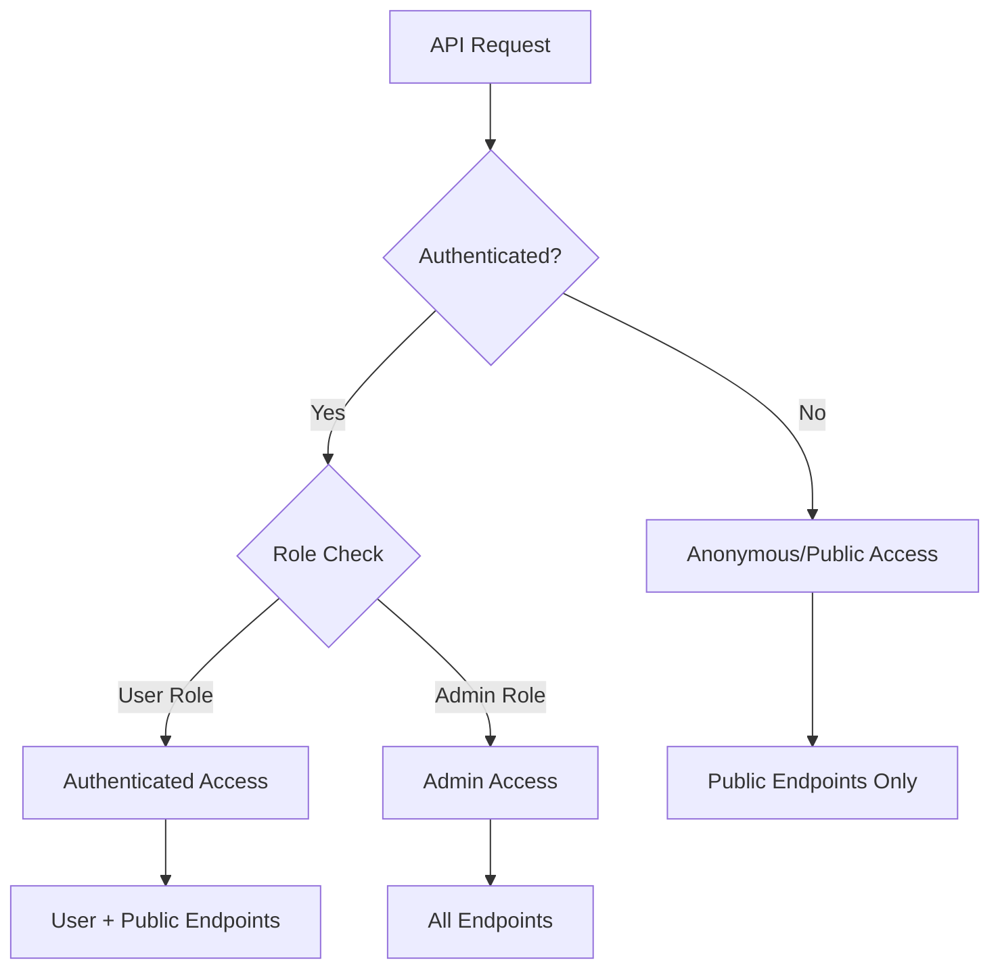

# Authorization

Role-based access control and permissions management for the OSINT Intelligence Platform.

## Overview

The platform implements a **three-tier access model** based on user roles and authentication status. Authorization is enforced at the API level using FastAPI dependency injection to protect endpoints based on required permissions.

## Access Control Model

### Three-Tier Access



### Access Tiers

| Tier | Authentication | Role | Access Level |
|------|---------------|------|--------------|
| **PUBLIC** | Not required | None | Search, RSS feeds, analytics |
| **AUTHENTICATED** | Required | User | Bookmarks, preferences, feed tokens |
| **ADMIN** | Required | Admin | Spam review, user management, system config |

## Built-in Roles

### Anonymous (Public)

**No authentication required** - Read-only access to OSINT data.

**Permissions:**

- Search messages (`GET /api/messages`)
- View channel details (`GET /api/channels`)
- Access RSS feeds (`GET /api/rss/*`)
- View analytics (`GET /api/analytics/*`)
- Semantic search (`GET /api/semantic/search`)
- Timeline views (`GET /api/timeline/*`)
- Knowledge graph (`GET /api/network/*`)

**Philosophy:**

Public access to OSINT data maximizes accessibility for researchers, journalists, and analysts. No registration friction enables immediate research.

### User (Authenticated)

**Authentication required** - Personal features and preferences.

**Additional Permissions:**

- Manage bookmarks (`GET/POST/DELETE /api/bookmarks`)
- Update preferences (`GET/PUT /api/user/preferences`)
- Generate feed tokens (`POST /api/feed-tokens`)
- View user profile (`GET /api/user/me`)

**Use Cases:**

- Researchers saving important messages
- Analysts customizing search preferences
- RSS subscribers generating personal feed URLs

### Admin

**Authentication + admin role required** - System management and moderation.

**Additional Permissions:**

- Review spam decisions (`POST /api/spam/messages/{id}/mark-not-spam`)
- Manage users (future: `GET/PUT/DELETE /api/admin/users`)
- Configure channels (future: `POST/PUT/DELETE /api/channels`)
- Access system settings (`GET /api/admin/config`)
- Export data (`GET /api/admin/export`)
- Manage LLM prompts (`GET/POST /api/admin/prompts`)

**Responsibilities:**

- Reviewing spam filter false positives
- Managing user accounts and roles
- Configuring platform settings
- Monitoring system health
- Investigating security incidents

## Permission Model

### FastAPI Dependency Injection

Authorization is enforced using FastAPI dependencies that validate user authentication and roles:

```python
from src.dependencies.auth import get_current_user, get_current_admin

# Public endpoint (no authentication)
@router.get("/api/messages")
async def search_messages():
    # Anyone can search messages
    return results

# Authenticated endpoint (login required)
@router.get("/api/bookmarks")
async def list_bookmarks(user: AuthenticatedUser = Depends(get_current_user)):
    # Only logged-in users can access their bookmarks
    # user.user_id, user.email, user.role are available
    return bookmarks

# Admin endpoint (admin role required)
@router.post("/api/spam/messages/{id}/mark-not-spam")
async def mark_not_spam(id: int, user: AdminUser = Depends(get_current_admin)):
    # Only admins can manage spam review
    # Raises 403 Forbidden if user.role != "admin"
    return result
```

### Dependency Functions

**`get_current_user()`** - Requires authentication, returns user object:

- Used for endpoints requiring login
- Returns `AuthenticatedUser` object
- Raises `401 Unauthorized` if not authenticated

**`get_current_user_optional()`** - Optional authentication:

- Used for endpoints that work both ways
- Returns `Optional[AuthenticatedUser]`
- Never raises error (returns None if not authenticated)

**`get_current_admin()`** - Requires admin role:

- Used for admin-only endpoints
- Returns `AdminUser` object
- Raises `401 Unauthorized` if not authenticated
- Raises `403 Forbidden` if authenticated but not admin

## API Endpoint Protection

### Public Endpoints (No Auth Required)

All **GET** operations on OSINT data are public to maximize accessibility:

```
GET /api/messages              # Search messages
GET /api/messages/{id}         # Message details
GET /api/channels              # List channels
GET /api/channels/{id}         # Channel details
GET /api/rss/*                 # All RSS feeds
GET /api/analytics/*           # Analytics dashboards
GET /api/semantic/search       # Semantic search
GET /api/network/*             # Knowledge graph
GET /api/timeline/*            # Timeline views
GET /api/health                # Health check
GET /docs                      # API documentation
```

### Authenticated Endpoints (Login Required)

User-specific features require authentication:

```
GET  /api/bookmarks            # List user's bookmarks
POST /api/bookmarks/{msg_id}   # Add bookmark
DELETE /api/bookmarks/{msg_id} # Remove bookmark

GET  /api/user/me              # Current user info
GET  /api/user/preferences     # User preferences
PUT  /api/user/preferences     # Update preferences

GET  /api/feed-tokens          # List feed tokens
POST /api/feed-tokens          # Generate token
DELETE /api/feed-tokens/{id}   # Revoke token
```

### Admin Endpoints (Admin Role Required)

System management requires admin role:

```
POST /api/spam/messages/{id}/mark-not-spam    # Review spam
POST /api/spam/messages/{id}/confirm-spam     # Confirm spam

GET  /api/admin/config         # System configuration
PUT  /api/admin/config         # Update config

GET  /api/admin/prompts        # LLM prompt management
POST /api/admin/prompts        # Create/update prompts

GET  /api/admin/export         # Data export
```

### Feed Token Authorization

Feed tokens have their own authorization system for RSS subscriptions:

**Feed Token Scopes:**

- `read:feeds` - Access RSS/Atom/JSON feeds (default)
- `read:search` - Access dynamic search feeds
- `read:channel` - Access per-channel feeds

**Enforcement:**

```bash
# Feed URL includes token + HMAC signature
GET /api/rss/search?q=ukraine&token=<id>&sig=<hmac>

# API validates:
# 1. Token exists and is active
# 2. HMAC signature is valid
# 3. Token has required scope
```

## Error Responses

### 401 Unauthorized

Returned when authentication is **required** but user is not logged in.

```json
{
  "detail": "Authentication required"
}
```

**Common Causes:**

- No `Authorization` header
- Invalid JWT token
- Expired JWT token
- Missing session cookie (Ory Kratos)

**Frontend Action:**

Redirect user to login page.

### 403 Forbidden

Returned when user is **authenticated** but lacks required permissions.

```json
{
  "detail": "Admin role required"
}
```

**Common Causes:**

- Authenticated user accessing admin endpoint
- User role is not "admin"
- Feed token lacks required scope

**Frontend Action:**

Display "Access Denied" message.

## User Role Management

### Assigning Admin Role

**During User Creation (JWT mode):**

```bash
# Create admin user via API
curl -X POST http://localhost:8000/api/auth/register \
  -H "Content-Type: application/json" \
  -d '{
    "email": "admin@localhost",
    "password": "strong-password",
    "role": "admin"
  }'
```

**Database Update (Ory Kratos mode):**

```sql
-- Connect to database
docker-compose exec postgres psql -U osint_user -d osint_platform

-- Update user role to admin
UPDATE users SET role = 'admin' WHERE email = 'user@example.com';
```

**Future Admin UI:**

Admin users will be able to promote/demote users via web interface:

```
GET  /api/admin/users              # List all users
PUT  /api/admin/users/{id}/role    # Update user role
```

### Checking User Role

**Via API:**

```bash
# Get current user info (includes role)
curl http://localhost:8000/api/user/me \
  -H "Authorization: Bearer $TOKEN"
```

**Response:**

```json
{
  "user_id": 1,
  "email": "user@example.com",
  "role": "admin",
  "created_at": "2025-01-01T00:00:00Z"
}
```

## Feed Token Permissions

### Token Scopes

Feed tokens support scoped permissions for fine-grained access control:

**Available Scopes:**

- `read:feeds` - Read RSS/Atom/JSON feeds (default)
- `read:search` - Dynamic search feeds
- `read:channel` - Per-channel feeds
- `read:analytics` - Analytics data feeds (future)

**Scope Enforcement:**

```python
# API validates token has required scope
@router.get("/api/rss/search")
async def search_feed(auth: FeedAuthResult = Depends(verify_feed_token)):
    if not auth.token.has_scope("read:search"):
        raise HTTPException(403, "Token lacks 'read:search' scope")
    return feed_data
```

### Token Management

**Create Token with Scopes:**

```bash
curl -X POST http://localhost:8000/api/feed-tokens \
  -H "Authorization: Bearer $TOKEN" \
  -d '{
    "name": "RSS Reader",
    "description": "Personal subscription",
    "scopes": ["read:feeds", "read:search"]
  }'
```

**List User's Tokens:**

```bash
curl http://localhost:8000/api/feed-tokens \
  -H "Authorization: Bearer $TOKEN"
```

**Revoke Token:**

```bash
curl -X DELETE http://localhost:8000/api/feed-tokens/<token-id> \
  -H "Authorization: Bearer $TOKEN"
```

## Resource-Level Access Control

### Future: Row-Level Security (RLS)

PostgreSQL Row-Level Security will enable fine-grained data access:

**Planned Features:**

- **Channel-level access** - Users can only see channels they have access to
- **Message-level access** - Filter messages by user permissions
- **Entity-level access** - Restrict sensitive entity data
- **Feed-level access** - Private feeds visible only to creator

**Example RLS Policy:**

```sql
-- Future: Restrict bookmarks to owner
CREATE POLICY bookmarks_owner_policy ON bookmarks
  FOR ALL
  USING (user_id = current_setting('app.user_id')::integer);
```

### Future: Ory Keto Integration

[Ory Keto](https://www.ory.sh/docs/keto/) will provide relationship-based access control:

**Use Cases:**

- **Organization memberships** - Users belong to organizations
- **Team permissions** - Teams have access to specific channels
- **Hierarchical permissions** - Admins inherit all user permissions
- **Delegation** - Users can delegate access to others

**Example Keto Relation:**

```
user:alice is member of team:analysts
team:analysts has access to channel:ukraine-osint
→ user:alice has access to channel:ukraine-osint
```

## Audit Logging

### Authorization Events

All authorization decisions are logged for security monitoring:

**Logged Events:**

- Failed authorization attempts (403 Forbidden)
- Admin action performed
- Role changes (user promoted/demoted)
- Feed token created/revoked
- Scope violations

**View Authorization Logs:**

```bash
# View all authorization events
docker-compose logs -f api | grep authorization

# View failed authorization attempts
docker-compose logs -f api | grep "403 Forbidden"

# View admin actions
docker-compose logs -f api | grep admin
```

**Log Format:**

```json
{
  "timestamp": "2025-01-01T12:00:00Z",
  "event": "authorization_failure",
  "user_id": 123,
  "email": "user@example.com",
  "role": "user",
  "endpoint": "/api/admin/config",
  "required_role": "admin",
  "ip_address": "192.168.1.100"
}
```

## Security Best Practices

### Principle of Least Privilege

!!! tip "Best Practice"
    Grant users only the minimum permissions required for their role. Most users should have "user" role, not "admin".

**Guidelines:**

- Default new users to "user" role
- Promote to admin only when necessary
- Regularly review admin user list
- Revoke admin when no longer needed

### Regular Permission Audits

**Monthly Security Review:**

```sql
-- List all admin users
SELECT email, created_at, last_login_at
FROM users
WHERE role = 'admin'
ORDER BY last_login_at DESC;

-- Find inactive admins (>90 days)
SELECT email, last_login_at
FROM users
WHERE role = 'admin'
  AND last_login_at < NOW() - INTERVAL '90 days';
```

### Separation of Duties

**Recommendation:**

- **Analysts** - User role (search, bookmarks, feeds)
- **Moderators** - Admin role (spam review only)
- **System Admins** - Admin role (full access)

**Future:**

Additional roles for fine-grained separation:

- `moderator` - Spam review only
- `analyst` - Enhanced search and exports
- `readonly_admin` - View admin panels, no changes

### Time-Limited Elevated Access

**For temporary admin tasks:**

```sql
-- Grant temporary admin access (manual)
UPDATE users SET role = 'admin' WHERE email = 'analyst@example.com';

-- Perform admin task
-- ...

-- Revoke admin access
UPDATE users SET role = 'user' WHERE email = 'analyst@example.com';
```

**Future:**

Time-limited role escalation:

```python
# Grant admin for 1 hour
POST /api/admin/users/123/escalate
{
  "role": "admin",
  "duration_seconds": 3600,
  "reason": "Emergency spam review"
}
```

## Testing Authorization

### Test Public Access

```bash
# Should work without authentication
curl http://localhost:8000/api/messages
curl http://localhost:8000/api/channels
```

### Test User Access

```bash
# Login as user
USER_TOKEN=$(curl -X POST http://localhost:8000/api/auth/login \
  -d '{"email":"user@example.com","password":"password"}' \
  | jq -r '.access_token')

# User endpoints should work
curl http://localhost:8000/api/bookmarks \
  -H "Authorization: Bearer $USER_TOKEN"

# Admin endpoints should fail (403 Forbidden)
curl -X POST http://localhost:8000/api/spam/messages/123/mark-not-spam \
  -H "Authorization: Bearer $USER_TOKEN"
# Expected: {"detail":"Admin role required"}
```

### Test Admin Access

```bash
# Login as admin
ADMIN_TOKEN=$(curl -X POST http://localhost:8000/api/auth/login \
  -d '{"email":"admin@example.com","password":"admin_password"}' \
  | jq -r '.access_token')

# Admin endpoints should work
curl -X POST http://localhost:8000/api/spam/messages/123/mark-not-spam \
  -H "Authorization: Bearer $ADMIN_TOKEN"
```

## Troubleshooting

### User Can't Access Authenticated Endpoint

**Check authentication:**

```bash
# Verify token is valid
curl http://localhost:8000/api/user/me \
  -H "Authorization: Bearer $TOKEN"
```

**If 401 Unauthorized:**

- Token is invalid or expired
- Refresh token and try again

### Authenticated User Gets 403 Forbidden

**Check user role:**

```bash
# Get user info
curl http://localhost:8000/api/user/me \
  -H "Authorization: Bearer $TOKEN"
```

**If role is "user" but endpoint requires "admin":**

- Contact admin to promote user
- Or use admin account

### Feed Token Access Denied

**Check token status:**

```bash
# List user's tokens
curl http://localhost:8000/api/feed-tokens \
  -H "Authorization: Bearer $TOKEN"
```

**Common Issues:**

- Token was revoked
- Token lacks required scope
- HMAC signature invalid (regenerate URL)

## Future Enhancements

### Advanced RBAC (Planned)

**Additional Roles:**

- `moderator` - Spam review only
- `analyst` - Enhanced search, bulk export
- `channel_admin` - Manage specific channels
- `readonly_admin` - View-only admin access

**Role Hierarchies:**

```
admin > moderator > analyst > user > anonymous
```

**Permission Inheritance:**

Admin inherits all permissions from lower roles.

### API Scopes (OAuth2)

**Fine-grained API permissions:**

- `read:messages` - Search messages
- `read:channels` - View channels
- `write:bookmarks` - Manage bookmarks
- `admin:config` - Modify system settings

**Example:**

```bash
# OAuth2 token with limited scopes
Authorization: Bearer <token-with-read:messages-scope>
```

### Ory Keto Integration

**Relationship-based access control:**

```
user:alice is member of team:analysts
team:analysts has access to channel:ukraine-osint
→ user:alice can read channel:ukraine-osint
```

## Related Documentation

- [Authentication Guide](authentication.md) - User authentication setup
- [API Endpoint Protection](https://github.com/osintukraine/osint-intelligence-platform/blob/master/services/api/ENDPOINT_PROTECTION.md) - Complete endpoint catalog
- [Security Hardening](hardening.md) - Production security practices

---

!!! info "Public OSINT Philosophy"
    The platform prioritizes public access to OSINT data for maximum research impact. Authorization protects user data and administrative functions, not intelligence data itself.
