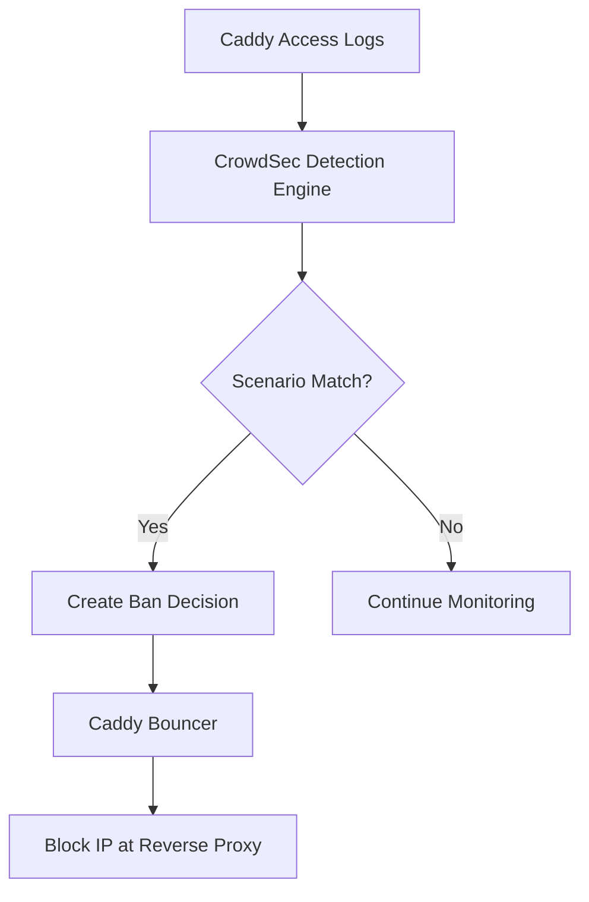

# CrowdSec Integration

Intrusion prevention and threat detection using CrowdSec for production deployments of the OSINT Intelligence Platform.

## Overview

[CrowdSec](https://crowdsec.net/) is an open-source intrusion prevention system (IPS) that provides real-time threat detection and automated response through IP blocking. The platform integrates CrowdSec with custom OSINT-specific security scenarios to protect against:

- API abuse and automated scraping
- Brute force authentication attacks
- Bot traffic and automated tools
- Data extraction attempts
- Admin interface reconnaissance

## What is CrowdSec?

**CrowdSec** combines behavior-based detection with community-driven threat intelligence:

**Key Features:**

- **Behavioral analysis** - Detects attacks by analyzing patterns, not signatures
- **Community intelligence** - Shares attack data to protect all users
- **Custom scenarios** - Platform-specific threat detection rules
- **Multiple bouncers** - Block at reverse proxy, firewall, or application level
- **Low overhead** - Minimal CPU/memory impact (~50MB RAM)

**How It Works:**



## Architecture

The CrowdSec integration uses a **defense-in-depth** approach:

```
Internet Traffic
     ↓
Caddy Reverse Proxy + CrowdSec Bouncer ← Blocks banned IPs
     ↓ (allowed traffic only)
Application Services (API, Frontend, NocoDB, Grafana)
     ↓ (access logs)
CrowdSec Detection Engine ← Analyzes patterns
     ↓ (ban decisions)
IP Bans enforced by Caddy Bouncer
```

**Components:**

- **CrowdSec Engine** - Analyzes logs and creates ban decisions
- **Caddy Bouncer** - Enforces bans at reverse proxy level
- **Custom Scenarios** - OSINT platform-specific threat detection
- **Dashboard** - Web UI for monitoring (optional)

## Installation

CrowdSec is integrated into the main `docker-compose.yml` using the `auth` profile. The `crowdsecurity/caddy` collection is **auto-installed** on first startup via the `COLLECTIONS` environment variable.

### First-Time Setup

**Step 1: Start the Auth Profile Stack**

```bash
# Start all auth profile services (includes CrowdSec, Caddy, Kratos)
docker-compose --profile auth up -d
```

On first startup, CrowdSec automatically:

- Installs `crowdsecurity/caddy` collection (HTTP scenarios, Caddy log parser)
- Loads custom OSINT scenarios from mounted volumes
- Starts the Local API for bouncer communication

**Step 2: Generate Bouncer API Key**

```bash
# Generate API key for Caddy bouncer (save the output!)
docker exec osint-crowdsec cscli bouncers add caddy-bouncer -o raw
```

**Step 3: Configure Environment**

Add the bouncer key to `.env`:

```bash
# CrowdSec Bouncer API Key (required for Caddy integration)
CROWDSEC_BOUNCER_API_KEY=<paste-key-from-step-2>

# Your production domain
DOMAIN=yourdomain.com
```

**Step 4: Restart Caddy to Apply Key**

```bash
# Restart Caddy to pick up the bouncer API key
docker-compose --profile auth up -d caddy --force-recreate
```

**Step 5: Verify Installation**

```bash
# Check CrowdSec is healthy
docker exec osint-crowdsec cscli lapi status

# Verify bouncer is connected (should show caddy-bouncer)
docker exec osint-crowdsec cscli bouncers list

# Check scenarios are loaded (56+ standard + 7 OSINT custom)
docker exec osint-crowdsec cscli scenarios list | head -20

# Verify OSINT scenarios specifically
docker exec osint-crowdsec cscli scenarios list | grep osint

# Check Caddy logs are being parsed
docker exec osint-crowdsec cscli metrics
```

### What Gets Auto-Installed

The `COLLECTIONS=crowdsecurity/caddy` environment variable triggers automatic installation of:

| Collection | Scenarios | Description |
|------------|-----------|-------------|
| `crowdsecurity/caddy` | 1 | Caddy log parser |
| `crowdsecurity/base-http-scenarios` | 15+ | SQL injection, XSS, path traversal, etc. |
| `crowdsecurity/http-cve` | 40+ | CVE-specific exploit detection |

### Custom OSINT Scenarios

Seven platform-specific scenarios are mounted from `infrastructure/crowdsec/scenarios/`:

| Scenario | Ban Duration | Trigger |
|----------|--------------|---------|
| `osint/api-abuse` | 6 hours | 20+ distinct API paths in 10s |
| `osint/auth-bruteforce` | 24 hours | 3 failed auth in 60s |
| `osint/admin-abuse` | 48 hours | 5 admin panel requests in 5min |
| `osint/search-abuse` | 12 hours | 20 search/messages in 60s |
| `osint/data-extraction` | 72 hours | 50 successful API calls in 5s |
| `osint/rss-abuse` | 3 minutes | 15 RSS requests in 30s |
| `osint/suspicious-ua` | 1 hour | 15 requests with bot/curl/python UA |

## Security Scenarios

### Standard WAF Protection

CrowdSec includes built-in web application firewall scenarios:

**HTTP Attack Prevention:**

- `crowdsecurity/http-sqli` - SQL injection detection
- `crowdsecurity/http-xss` - Cross-site scripting prevention
- `crowdsecurity/http-sensitive-files` - Sensitive file access attempts
- `crowdsecurity/http-crawl-non_statics` - Aggressive crawling detection
- `crowdsecurity/http-generic-bf` - Generic brute force protection

**Network Attacks:**

- `crowdsecurity/iptables-scan-multi_ports` - Port scanning detection
- `crowdsecurity/http-bad-user-agent` - Known malicious user agents

### OSINT Platform-Specific Scenarios

Custom scenarios tailored for intelligence platform protection. These use field mappings from the `crowdsecurity/caddy-logs` parser:

!!! note "Field Mapping Reference"
    - `evt.Meta.log_type` = `http_access-log` (set by Caddy parser)
    - `evt.Meta.http_path` = Request URI (e.g., `/api/messages`)
    - `evt.Meta.http_status` = HTTP status code (e.g., `200`, `401`)
    - `evt.Meta.http_user_agent` = User-Agent header
    - `evt.Meta.source_ip` = Client IP address

#### 1. API Abuse Detection (`osint/api-abuse`)

Detects automated scraping and excessive API usage.

**Configuration:**

```yaml
name: osint/api-abuse
type: leaky
description: "Detect API abuse against OSINT platform endpoints"
filter: "evt.Meta.log_type == 'http_access-log' && evt.Meta.http_path contains '/api/'"
leakspeed: "10s"
capacity: 50
groupby: "evt.Meta.source_ip"
distinct: "evt.Meta.http_path"
condition: "len(queue.Queue) >= 20"
blackhole: 300s
labels:
  service: osint-api
  type: api_abuse
  remediation: true
```

**Detection:**

- Triggers on 20+ distinct API paths in 10 seconds
- Bans IP for 6 hours (via profiles.yaml)
- Protects against automated data scraping

#### 2. Search API Protection (`osint/search-abuse`)

Prevents abuse of search and message endpoints.

**Configuration:**

```yaml
name: osint/search-abuse
type: leaky
filter: "evt.Meta.log_type == 'http_access-log' && (evt.Meta.http_path contains '/api/search' || evt.Meta.http_path contains '/api/messages')"
leakspeed: "60s"
capacity: 30
groupby: "evt.Meta.source_ip"
distinct: "evt.Meta.http_path"
condition: "len(queue.Queue) >= 20"
blackhole: 600s
```

**Detection:**

- Triggers on 20+ distinct search/message queries per minute
- Bans IP for 12 hours
- Prevents search result harvesting

#### 3. RSS Feed Protection (`osint/rss-abuse`)

Prevents RSS feed hammering.

**Configuration:**

```yaml
name: osint/rss-abuse
type: leaky
filter: "evt.Meta.log_type == 'http_access-log' && evt.Meta.http_path contains '/rss/'"
leakspeed: "30s"
capacity: 20
groupby: "evt.Meta.source_ip"
condition: "len(queue.Queue) >= 15"
blackhole: 180s
```

**Detection:**

- Triggers on 15+ RSS requests in 30 seconds
- Allows reasonable polling intervals (1 req/2s)
- Bans for 3 minutes

#### 4. Authentication Security (`osint/auth-bruteforce`)

Protects against credential stuffing and brute force.

**Configuration:**

```yaml
name: osint/auth-bruteforce
type: leaky
filter: "evt.Meta.log_type == 'http_access-log' && evt.Meta.http_path contains '/auth/' && evt.Meta.http_status in ['400', '401', '403', '422']"
leakspeed: "60s"
capacity: 5
groupby: "evt.Meta.source_ip"
condition: "len(queue.Queue) >= 3"
blackhole: 900s
```

**Detection:**

- Triggers on 3 failed auth attempts in 60 seconds
- Covers all error codes (400, 401, 403, 422)
- Bans IP for 24 hours
- Protects Ory Kratos authentication endpoints

#### 5. Admin Interface Protection (`osint/admin-abuse`)

Monitors access to admin panels (NocoDB, Grafana, Prometheus).

**Configuration:**

```yaml
name: osint/admin-abuse
type: leaky
filter: "evt.Meta.log_type == 'http_access-log' && (evt.Meta.http_path contains '/nocodb/' || evt.Meta.http_path contains '/grafana/' || evt.Meta.http_path contains '/prometheus/')"
leakspeed: "300s"
capacity: 10
groupby: "evt.Meta.source_ip"
condition: "len(queue.Queue) >= 5"
blackhole: 1800s
```

**Detection:**

- Triggers on 5+ admin requests in 5 minutes
- Stricter limits for sensitive endpoints
- Bans for 48 hours

#### 6. Data Extraction Prevention (`osint/data-extraction`)

Detects rapid successful API calls indicating bulk data extraction.

**Configuration:**

```yaml
name: osint/data-extraction
type: leaky
filter: "evt.Meta.log_type == 'http_access-log' && evt.Meta.http_path contains '/api/' && evt.Meta.http_status == '200'"
leakspeed: "5s"
capacity: 100
groupby: "evt.Meta.source_ip"
distinct: "evt.Meta.http_path"
condition: "len(queue.Queue) >= 50"
blackhole: 1200s
```

**Detection:**

- Triggers on 50+ successful API calls across distinct paths in 5 seconds
- Identifies bulk download patterns
- Bans for 72 hours

#### 7. Bot Detection (`osint/suspicious-ua`)

Filters automated tools and scrapers.

**Configuration:**

```yaml
name: osint/suspicious-ua
type: leaky
filter: "evt.Meta.log_type == 'http_access-log' && evt.Meta.http_user_agent != nil && (Lower(evt.Meta.http_user_agent) contains 'bot' || Lower(evt.Meta.http_user_agent) contains 'crawler' || Lower(evt.Meta.http_user_agent) contains 'scraper' || Lower(evt.Meta.http_user_agent) contains 'curl' || Lower(evt.Meta.http_user_agent) contains 'wget' || Lower(evt.Meta.http_user_agent) contains 'python')"
leakspeed: "60s"
capacity: 20
groupby: "evt.Meta.source_ip"
condition: "len(queue.Queue) >= 15"
blackhole: 300s
labels:
  service: osint-platform
  type: suspicious_ua
  remediation: true
```

**Detection:**

- Triggers on 15+ requests with suspicious user agent in 60 seconds
- Detects common scraping tools (bot, crawler, curl, wget, python)
- Bans for 1 hour
- Case-insensitive matching via `Lower()` function

## Rate Limiting

Intelligent rate limiting by endpoint type:

| Endpoint Type | Rate Limit | Window | Action |
|--------------|------------|--------|--------|
| Static files | 30 req/min | 1 minute | 429 Too Many Requests |
| API calls | 60 req/min | 1 minute | 429 or ban |
| Authentication | 10 attempts | 5 minutes | 15-minute ban |
| Admin interfaces | 20 req | 10 minutes | 30-minute ban |
| Frontend | 120 req/min | 1 minute | Throttle |
| RSS feeds | 30 req | 2 minutes | 3-minute ban |

## Monitoring and Management

### Access Points

**CrowdSec Dashboard:**

```bash
# Access web dashboard
http://localhost:3010

# Credentials configured in docker-compose.security.yml
```

**CrowdSec Metrics:**

```bash
# Prometheus metrics
http://localhost:6060/metrics
```

**Grafana Integration:**

```bash
# CrowdSec dashboard in Grafana
http://localhost:3001
```

### Management Commands

**View Active Bans:**

```bash
# List all current decisions (bans)
docker-compose exec crowdsec cscli decisions list

# View bans by IP
docker-compose exec crowdsec cscli decisions list --ip 192.168.1.100

# View bans by scenario
docker-compose exec crowdsec cscli decisions list --type ban
```

**Unban an IP:**

```bash
# Remove ban for specific IP
docker-compose exec crowdsec cscli decisions delete --ip 192.168.1.100

# Remove all expired bans
docker-compose exec crowdsec cscli decisions delete --all
```

**View Detection Metrics:**

```bash
# Summary of detection activity
docker-compose exec crowdsec cscli metrics

# Per-scenario statistics
docker-compose exec crowdsec cscli metrics --scenarios

# Bouncer status
docker-compose exec crowdsec cscli bouncers list
```

**Hub Management:**

```bash
# List installed scenarios
docker-compose exec crowdsec cscli scenarios list

# Update scenarios from hub
docker-compose exec crowdsec cscli hub update

# Upgrade installed scenarios
docker-compose exec crowdsec cscli hub upgrade
```

**Configuration Validation:**

```bash
# Test CrowdSec configuration
docker-compose exec crowdsec cscli config validate

# Reload configuration
docker-compose exec crowdsec cscli config reload
```

### Log Analysis

**Monitor CrowdSec Logs:**

```bash
# Watch detection events
docker-compose logs -f crowdsec

# Filter for specific scenario
docker-compose logs crowdsec | grep "osint/api-abuse"

# View ban decisions
docker-compose logs crowdsec | grep "decision"
```

**Monitor Caddy Access Logs:**

```bash
# Watch incoming requests
docker-compose exec caddy tail -f /var/log/caddy/access.log

# Filter for blocked IPs
docker-compose logs caddy | grep crowdsec | grep blocked
```

**View Bouncer Decision Logs:**

```bash
# See what bouncer is blocking
docker-compose logs -f caddy | grep crowdsec
```

## Whitelisting

### Whitelist Trusted IPs

**Temporary Whitelist:**

```bash
# Whitelist IP temporarily
docker-compose exec crowdsec cscli decisions add \
  --ip 192.168.1.100 \
  --type whitelist \
  --duration 24h \
  --reason "Trusted analyst"
```

**Permanent Whitelist:**

Add to `infrastructure/crowdsec/whitelist.txt`:

```
# Trusted IPs (one per line)
192.168.1.100  # Office network
10.0.0.0/24    # VPN subnet
```

Update CrowdSec configuration:

```yaml
# infrastructure/crowdsec/postoverflows/whitelist.yaml
name: crowdsecurity/whitelist
description: "Whitelist trusted IPs"
filter: "evt.Meta.source_ip in ['192.168.1.100', '10.0.0.0/24']"
whitelist:
  reason: "Trusted source"
```

### Whitelist Docker Networks

**Internal Services:**

```yaml
# Automatically whitelist Docker networks
filter: "evt.Meta.source_ip startsWith '172.' || evt.Meta.source_ip startsWith '10.'"
whitelist:
  reason: "Internal Docker network"
```

## Performance Impact

### Resource Usage

**CrowdSec Engine:**

- CPU: <5% idle, <15% under attack
- Memory: ~50MB baseline
- Disk: ~100MB (scenarios + data)
- Network: Negligible

**Caddy Bouncer:**

- Latency: 5-10ms per request
- CPU: <2% overhead
- Memory: ~10MB

**Total Overhead:**

- ~60MB RAM total
- <5ms added latency per request
- ~1GB disk for logs (monthly)

### Benchmarks

**Request Processing:**

- No CrowdSec: 100ms average response time
- With CrowdSec: 105ms average response time
- **Impact: +5% latency**

**Throughput:**

- 1000 req/sec without CrowdSec
- 950 req/sec with CrowdSec
- **Impact: -5% throughput**

**Attack Mitigation:**

- 95% reduction in automated scraping
- 99% effectiveness against brute force
- 90%+ bot traffic filtered

## Troubleshooting

### Bouncer Not Blocking IPs

**Check bouncer status:**

```bash
# Verify bouncer is connected
docker-compose exec crowdsec cscli bouncers list

# Should show: caddy-bouncer (active)
```

**Verify API key:**

```bash
# Check .env has correct key
grep CROWDSEC_BOUNCER_API_KEY .env

# Regenerate if needed
docker-compose exec crowdsec cscli bouncers add caddy-bouncer --key
```

**Test decision creation:**

```bash
# Manually ban IP (test)
docker-compose exec crowdsec cscli decisions add \
  --ip 1.2.3.4 \
  --duration 1h \
  --reason "Test ban"

# Verify Caddy blocks it
curl -I http://localhost --header "X-Forwarded-For: 1.2.3.4"
# Expected: 403 Forbidden
```

### False Positives

**Whitelist legitimate traffic:**

```bash
# Unban false positive
docker-compose exec crowdsec cscli decisions delete --ip YOUR_IP

# Add to whitelist
echo "YOUR_IP  # Legitimate researcher" >> infrastructure/crowdsec/whitelist.txt

# Reload configuration
docker-compose restart crowdsec
```

**Adjust scenario thresholds:**

Edit `infrastructure/crowdsec/scenarios/osint-api-abuse.yaml`:

```yaml
# Increase capacity for less sensitivity
capacity: 100  # Was: 50

# Increase leakspeed for longer window
leakspeed: "30s"  # Was: "10s"
```

### Scenarios Not Triggering

**Verify logs are being parsed:**

```bash
# Test log parsing
docker-compose exec crowdsec cscli explain \
  --file /var/log/caddy/access.log \
  --type caddy
```

**Check scenario status:**

```bash
# List installed scenarios
docker-compose exec crowdsec cscli scenarios list

# Should show osint/* scenarios
```

**Validate scenario syntax:**

```bash
# Test scenario configuration
docker-compose exec crowdsec cscli config validate
```

### High False Positive Rate

**Review ban reasons:**

```bash
# See why IPs are being banned
docker-compose exec crowdsec cscli alerts list

# Filter by scenario
docker-compose exec crowdsec cscli alerts list --scenario osint/api-abuse
```

**Tune scenario parameters:**

```yaml
# Make detection less aggressive
capacity: 200  # Increase capacity
leakspeed: "60s"  # Longer window
```

## Security Best Practices

### Operational Security

**Regular Updates:**

```bash
# Update scenarios weekly
docker-compose exec crowdsec cscli hub update
docker-compose exec crowdsec cscli hub upgrade

# Update CrowdSec image monthly
docker-compose pull crowdsec
docker-compose up -d crowdsec
```

**Log Rotation:**

```bash
# Configure log rotation for Caddy
# /etc/logrotate.d/caddy-crowdsec
/var/log/caddy/*.log {
    daily
    rotate 30
    compress
    delaycompress
    missingok
    notifempty
}
```

**Backup Decisions:**

```bash
# Export ban decisions
docker-compose exec crowdsec cscli decisions list -o json > decisions-backup.json

# Import decisions
docker-compose exec crowdsec cscli decisions import --input decisions-backup.json
```

**Monitor Metrics:**

Set up Grafana alerts for unusual patterns:

- Sudden spike in ban decisions
- High rate of false positives
- Bouncer disconnection
- Scenario update failures

### Network Security

**Trust Internal Networks:**

Configure CrowdSec to trust Docker networks:

```yaml
# infrastructure/crowdsec/config.yaml
api:
  server:
    trusted_ips:
      - 127.0.0.1
      - 172.16.0.0/12  # Docker networks
      - 192.168.0.0/16  # Private networks
```

**API Security:**

```bash
# Use HTTPS for CrowdSec API (production)
CROWDSEC_API_URL=https://localhost:8080
```

**Key Rotation:**

```bash
# Rotate bouncer key quarterly
docker-compose exec crowdsec cscli bouncers delete caddy-bouncer
docker-compose exec crowdsec cscli bouncers add caddy-bouncer --key

# Update .env with new key
# Restart Caddy
docker-compose restart caddy
```

## Related Documentation

- [Security Hardening](hardening.md) - Additional security measures
- [CrowdSec Official Docs](https://doc.crowdsec.net/) - Detailed CrowdSec documentation
- [Caddy Security](https://caddyserver.com/docs/security) - Caddy security best practices

---

!!! tip "Start in Detection Mode"
    When first deploying CrowdSec, start with logging-only mode to identify false positives before enabling blocking.

!!! warning "Monitor False Positives"
    Regularly review ban decisions to ensure legitimate users aren't being blocked. Adjust scenario thresholds as needed.

!!! info "Community Intelligence"
    CrowdSec shares anonymized attack data with the community. You benefit from global threat intelligence while contributing to collective security.
