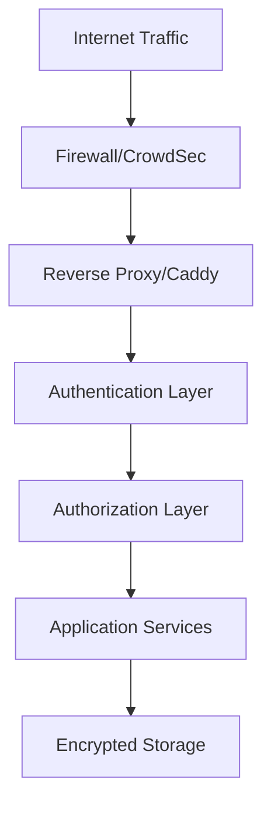

# Security Guide

Comprehensive security documentation for protecting the OSINT Intelligence Platform against reconnaissance, abuse, and unauthorized access.

## Overview

The OSINT Intelligence Platform implements a multi-layered security architecture designed for self-hosted deployments that handle sensitive intelligence data. This guide covers all aspects of securing the platform from authentication to network hardening.

## Security Architecture

The platform uses a defense-in-depth approach with multiple security layers:

## Security Principles

The platform follows these core security principles:

**Defense in Depth**
Multiple layers of security controls ensure that if one layer fails, others continue to protect the system.

**Least Privilege**
Users and services operate with the minimum permissions required for their function.

**Secure by Default**
Default configurations prioritize security over convenience. Optional features must be explicitly enabled.

**Zero Trust**
All requests are authenticated and authorized, even from internal services.

**Audit Everything**
All authentication events, authorization failures, and admin actions are logged for forensic analysis.

## What You'll Learn

This guide is organized into four main sections:

### [Authentication](authentication.md)
User authentication and identity management using Ory Kratos or JWT.

- 4 authentication modes (None, JWT, Cloudron, Ory)
- Session management with Redis
- OAuth2 integration (Google, GitHub)
- Feed token authentication for RSS
- Password policies and MFA

### [Authorization](authorization.md)
Role-based access control and permissions management.

- Admin vs user roles
- API endpoint protection
- Feed token scopes
- Future: Ory Keto integration

### [CrowdSec Integration](crowdsec.md)
Intrusion prevention and threat detection for production deployments.

- Real-time threat detection
- Custom OSINT platform scenarios
- Caddy bouncer for IP blocking
- API abuse protection
- Monitoring and management

### [Security Hardening](hardening.md)
Production security best practices and deployment checklist.

- Network security and firewall rules
- Docker container security
- TLS/SSL configuration
- Secrets management
- Backup encryption
- Security monitoring
- **NEW**: Media storage security (MinIO pre-signed URLs)

### [Security Changelog](security-changelog.md)
Track security improvements and vulnerability fixes.

- Latest: 2025-12-27 Comprehensive Security Hardening
- Role-filtered OpenAPI documentation
- ILIKE injection prevention
- Dependency CVE fixes (httpx, aiohttp, fastapi)
- Pre-signed URL support for media
- Configuration hardening

## Who This Is For

This guide is designed for:

- **Security Administrators** - Implementing authentication and access controls
- **DevSecOps Engineers** - Deploying secure production environments
- **Platform Operators** - Managing security monitoring and incident response
- **Compliance Officers** - Understanding data protection measures

## Quick Start Security Checklist

Use this checklist to verify your deployment meets minimum security requirements:

### Pre-Production Security Checklist

- [ ] **Authentication configured** - Choose and enable auth provider
- [ ] **Strong secrets** - Generate random 256-bit keys for JWT/Kratos
- [ ] **HTTPS enabled** - Configure TLS certificates (Let's Encrypt)
- [ ] **Firewall rules** - Block direct database/Redis access from internet
- [ ] **CrowdSec deployed** - Enable intrusion prevention (production)
- [ ] **Password policies** - Enforce strong passwords (12+ chars, bcrypt)
- [ ] **Secrets not in git** - Verify `.env` is gitignored
- [ ] **Backup encryption** - Encrypt database backups
- [ ] **Audit logging** - Enable authentication event logging
- [ ] **Network segmentation** - Use Docker networks to isolate services

### Production Security Checklist

- [ ] **AUTH_PROVIDER=ory** or **jwt** (never "none")
- [ ] **AUTH_REQUIRED=true** - Enforce authentication
- [ ] **POSTGRES_PASSWORD** - Strong random password
- [ ] **REDIS_PASSWORD** - Strong random password
- [ ] **JWT_SECRET_KEY** - Random 256-bit key
- [ ] **KRATOS_SECRET_COOKIE** - Random base64 secret
- [ ] **KRATOS_SECRET_CIPHER** - Exactly 32 characters
- [ ] **MINIO_ACCESS_KEY** - Strong credentials
- [ ] **MINIO_SECRET_KEY** - Minimum 32 characters
- [ ] **CrowdSec API keys** - Generated and configured
- [ ] **Regular security updates** - Container image updates enabled

## Security Features by Deployment Mode

### Development Mode (Local)

- **Authentication**: Optional (AUTH_PROVIDER=none)
- **HTTPS**: Not required (HTTP is acceptable)
- **Firewall**: Host firewall only
- **Secrets**: Simple passwords acceptable
- **Monitoring**: Optional

!!! warning "Development Only"
    Never use development mode settings in production. All endpoints become publicly accessible.

### Production Mode

- **Authentication**: Required (Ory Kratos or JWT)
- **HTTPS**: Required (Caddy with Let's Encrypt)
- **Firewall**: Host firewall + CrowdSec
- **Secrets**: Strong random keys (256-bit minimum)
- **Monitoring**: Mandatory (Prometheus + Grafana)

## Threat Model

The OSINT Intelligence Platform is designed to protect against:

**External Threats:**

- **Reconnaissance attacks** - Automated scanning and enumeration
- **Brute force attacks** - Credential guessing against login endpoints
- **API abuse** - Automated scraping of intelligence data
- **DDoS attacks** - Application-layer attacks on search/API endpoints
- **Bot traffic** - Automated tools attempting to harvest data
- **Data extraction** - Bulk download attempts

**Internal Threats:**

- **Privilege escalation** - Unauthorized access to admin functions
- **Data exfiltration** - Unauthorized bulk export of intelligence
- **Configuration tampering** - Unauthorized changes to system settings
- **Credential theft** - Session hijacking or token theft

## Security Components

### Authentication Layer

- **Ory Kratos** - Production-grade identity management
- **JWT tokens** - Lightweight authentication for small deployments
- **Session cookies** - Redis-backed session storage
- **Feed tokens** - HMAC-signed URLs for RSS subscriptions

### Authorization Layer

- **Role-based access** - Admin vs authenticated vs anonymous
- **Endpoint protection** - FastAPI dependency injection
- **Feed token scopes** - Per-token permissions for RSS feeds

### Network Security

- **CrowdSec** - Intrusion prevention system
- **Caddy reverse proxy** - TLS termination and security headers
- **Docker networks** - Service isolation (frontend/backend)
- **Firewall rules** - UFW/iptables for host protection

### Data Security

- **PostgreSQL** - Row-level security (future)
- **MinIO** - Encrypted object storage
- **Redis** - Password-protected sessions
- **Backups** - GPG-encrypted database dumps

## Getting Help

**Security Questions:**

- Review relevant sections of this guide
- Check [Troubleshooting Guide](../operator-guide/troubleshooting.md)
- Review [Security Hardening](hardening.md) best practices

**Security Issues:**

If you discover a security vulnerability, please report it responsibly:

1. **Do NOT** open a public GitHub issue
2. Email security concerns to project maintainers
3. Include detailed reproduction steps
4. Allow 90 days for patch development

## Additional Resources

**Official Documentation:**

- [Ory Kratos Documentation](https://www.ory.sh/docs/kratos/)
- [CrowdSec Documentation](https://doc.crowdsec.net/)
- [Caddy Security](https://caddyserver.com/docs/security)

**Platform Documentation:**

- [Installation Guide](../operator-guide/installation.md)
- [Configuration Reference](../operator-guide/configuration.md)
- [Monitoring Guide](../operator-guide/monitoring.md)

---

!!! tip "Security is a Process"
    Security is not a one-time configuration - it requires ongoing monitoring, updates, and adaptation to new threats. Review this guide regularly and keep all components updated.

!!! info "Self-Hosted Philosophy"
    This platform prioritizes self-hosted deployments with no cloud dependencies. All security components can run on a single server or VPS without external services.
