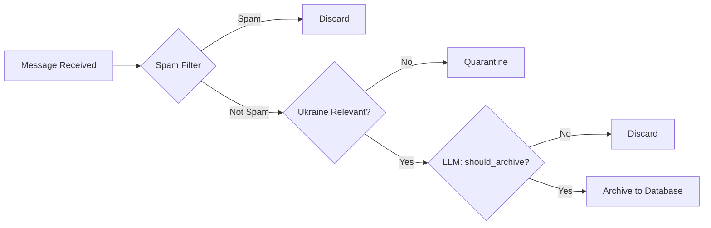

# Add a Telegram Channel

**Time: ~5 minutes**

In this tutorial, you'll learn the folder-based channel management system that makes adding Telegram channels to the OSINT platform incredibly simple. Unlike traditional admin panels, the platform uses Telegram's native folder feature for channel discovery - no configuration needed.

---

## What You'll Learn

After this tutorial, you will be able to:

1. Create monitoring folders in the Telegram app (mobile or desktop)
2. Add channels to folders for monitoring
3. Understand how the two folder types (Archive and Monitor) control message handling
4. Verify that your channels are being actively monitored
5. Remove channels from monitoring when needed

---

## Prerequisites

Before starting, make sure you have:

- A Telegram account (mobile app, desktop app, or both)
- The OSINT Intelligence Platform running locally (`docker-compose up -d`)
- At least one Telegram channel you want to monitor (public or private)
- Basic familiarity with Telegram's folder feature

**Time Check:** This tutorial takes about 5 minutes of active work.

---

## The Folder-Based System: How It Works

The OSINT platform uses an innovative approach to channel management:

Instead of building a complex admin panel, it reads your Telegram folders directly. You manage channels the same way you'd organize any other Telegram folder - in your native Telegram app.

### Folder Naming Convention

The platform recognizes specific folder name patterns:

| Folder Pattern | Processing Tier | LLM Strictness | Use Case |
|---|---|---|---|
| `Archive-*` | Archive tier | Lenient (most messages pass) | Primary sources, official channels |
| `Monitor-*` | Monitor tier | Strict (only high-value passes) | News aggregators, noisy sources |
| `Discover-*` | Discovery tier | Very strict + 14-day probation | Auto-discovered channels |

!!! important "The LLM is the Arbiter"
    Unlike simple rule-based systems, the OSINT platform uses an **AI classifier** to decide what gets archived. The folder tier sets how strict the LLM should be, but the **LLM makes the final `should_archive` decision** for every message.

!!! warning "12-Character Folder Name Limit"
    Telegram limits folder names to **12 characters**. This is why we use short suffixes like `-UA` and `-RU` instead of full country names.

### Key Examples

**Valid folder names** (≤12 characters):

- `Archive` - Archive tier (8 chars) ✅
- `Archive-UA` - Archive tier, Ukraine sources (10 chars) ✅
- `Archive-RU` - Archive tier, Russia sources (10 chars) ✅
- `Monitor` - Monitor tier (7 chars) ✅
- `Monitor-UA` - Monitor tier, Ukraine (10 chars) ✅
- `Discover-UA` - Discovery tier (11 chars) ✅

**Invalid folder names**:

- `Archive-Ukraine` - Too long (15 chars) ❌
- `Monitor-Russia` - Too long (14 chars) ❌
- `Personal` - Ignored (doesn't match pattern) ❌
- `News-Archive` - Ignored (pattern must match prefix) ❌

---

## Step 1: Create a Monitoring Folder

### On Telegram Mobile App

1. Open the Telegram app
2. Swipe left to see the chat list sidebar
3. Tap the **folder icon** (looks like a folder with lines)
4. Tap **Create Folder** or the **plus (+)** button
5. Name the folder `Archive` (or `Archive-UA` for Ukraine sources)
6. Select **Create**

**Expected Result:** You see your new folder appear in the Telegram sidebar.

### On Telegram Desktop App

1. Open Telegram Desktop
2. On the left sidebar, look for the **Folder** section
3. Right-click or click the **plus (+)** button next to "Folders"
4. Click **Create New Folder**
5. Name it `Archive` (or `Archive-UA` for Ukraine sources)
6. Click **Create**

**Expected Result:** Your new folder appears in the sidebar with zero chats.

!!! tip "Which folder tier to choose?"
    - Use `Archive-*` for **primary sources** where the LLM should be lenient (military channels, official sources)
    - Use `Monitor-*` for **noisy channels** where the LLM should be strict (news aggregators, discussion groups)
    - Remember the **12-character limit**: `Archive-UA` works, `Archive-Ukraine` doesn't!

---

## Step 2: Add Channels to Your Folder

### Method 1: From the Chat List (Recommended)

1. In the Telegram chat list, find a channel you want to monitor
2. Long-press (or right-click) on the channel name
3. Select **Add to Folder** from the menu
4. Choose the folder you created (`Archive` or `Monitor`)
5. Tap **Add**

The channel is now moved into the folder.

### Method 2: From Folder Settings

1. Open the folder you created
2. Tap the **plus (+)** button or **Edit** button
3. Select channels to add from the "Available" list
4. Tap **Add** or **Done**

**Expected Result:** The channel now appears in your monitoring folder.

---

## Step 3: Verify Channel Discovery

Now that you've added a channel to a folder, the platform needs to discover it. The listener service automatically syncs your Telegram folders every 5 minutes.

### Check the Logs

1. Open a terminal
2. Run the following command to watch the listener service:

```bash
docker-compose logs -f listener | grep -i "discover"
```

**Expected Output:**

```
INFO - Discovery cycle starting (checking 2 folders)
INFO - Found "Archive" folder with 1 channels
INFO - Syncing channel to database: example_channel
INFO - Discovery complete: 1 new channels discovered
```

Wait up to 5 minutes for the discovery cycle to run automatically. Or force an immediate check by restarting:

```bash
docker-compose restart listener
```

### Or: Check the Database Directly

To see channels immediately (without waiting for logs):

```bash
docker-compose exec -T postgres psql -U osint_user -d osint_platform -c \
  "SELECT id, name, username, folder, rule, active FROM channels ORDER BY id DESC LIMIT 5;"
```

**Expected Output:**

```
 id |      name       |   username    |      folder      |     rule     | active
----+-----------------+---------------+------------------+--------------+--------
  3 | Example Channel | example_chann | Archive          | archive_all  | t
  2 | Test Channel    | test_channel  | Monitor          | selective... | t
```

Look for:
- ✅ Your channel name in the `name` column
- ✅ The correct folder in the `folder` column
- ✅ `archive_all` or `selective_archive` in the `rule` column
- ✅ `t` (true) in the `active` column

---

## Step 4: Monitor a Message

Let's verify the system is actually capturing messages by sending a test message to your monitored channel.

### Option A: You Own the Channel

1. Go to the monitored channel
2. Send a test message: "Test message from OSINT platform tutorial"
3. Wait 10-30 seconds for the message to be processed

### Option B: Channel is Public

1. Find a public channel that's in your monitoring folder
2. Wait for a message to be posted (or check recent messages)
3. Observe the platform processing

### Check if Message Was Received

```bash
docker-compose logs -f processor | grep -i "processing\|received" | head -20
```

**Expected Output:**

```
INFO - Processing message 123456: "Test message from OSINT..."
INFO - Message passed spam filter
INFO - Message importance: high
INFO - Message archived successfully
```

Or query the database:

```bash
docker-compose exec -T postgres psql -U osint_user -d osint_platform -c \
  "SELECT id, channel_id, content, created_at FROM messages ORDER BY created_at DESC LIMIT 3;"
```

**Expected Output:**

```
   id   | channel_id |          content          |         created_at
--------+------------+---------------------------+---------------------
 123456 |          3 | Test message from OSINT...| 2025-12-09 14:32:15
```

---

## Step 5: Understand the Processing Rules

Now that your channel is monitored, it's important to understand how messages are handled.

### The LLM Classification Pipeline

**Every message** goes through this pipeline:



1. **Spam filter** - Fast rule-based filter removes obvious spam (donation scams, crypto ads)
2. **Ukraine relevance check** - Is this message relevant to the Ukraine conflict?
3. **LLM classification** - The AI decides: `should_archive = true/false`

### How Folder Tiers Affect the LLM

The folder tier tells the LLM **how strict to be**:

| Tier | LLM Behavior | Typical Archive Rate |
|------|--------------|---------------------|
| **Archive tier** (`Archive-*`) | Lenient - archive most relevant content | 70-90% of non-spam |
| **Monitor tier** (`Monitor-*`) | Strict - only high-value OSINT content | 20-40% of non-spam |
| **Discover tier** (`Discover-*`) | Very strict - prove the channel's worth | 10-20% of non-spam |

!!! important "The LLM Makes the Final Decision"
    Even in `Archive-*` folders, the LLM can reject low-value messages. The tier sets the threshold, but the **AI evaluates every message individually** based on OSINT relevance, importance, and content quality.

### Archive Tier (`Archive-*` folders)

**Use for:** Primary sources where you want comprehensive coverage.

**LLM behavior:** Lenient classification. Archives most Ukraine-relevant content, only rejecting clear noise.

**Examples:**
- Official military channels (DeepStateUA, Ukrainian Armed Forces)
- Government announcements
- Key OSINT analysts

### Monitor Tier (`Monitor-*` folders)

**Use for:** Noisy channels where you only want high-value content.

**LLM behavior:** Strict classification. Only archives messages with clear OSINT value (troop movements, equipment losses, official statements).

**Examples:**
- News aggregators with mixed content
- Discussion groups
- Regional channels with local chatter

**Storage Savings:**
Monitor tier typically archives 60-80% less than Archive tier while capturing critical intelligence.

!!! warning "Spam filtering saves the most"
    The spam filter runs first on ALL tiers. This removes 80-90% of junk before the LLM even sees it, saving processing costs regardless of tier.

---

## Step 6: Add a Second Channel (Practice)

To cement your understanding, let's add another channel:

1. Find another Telegram channel to monitor
2. Create a folder named `Monitor` or `Monitor-UA` (for selective archiving)
3. Add the channel to the `Monitor` folder
4. Wait 5 minutes for discovery
5. Verify it appears in your database query

```bash
docker-compose exec -T postgres psql -U osint_user -d osint_platform -c \
  "SELECT id, name, folder, rule FROM channels WHERE folder LIKE 'Monitor%' ORDER BY id;"
```

You should see your new channel listed with `rule = 'selective_archive'`.

---

## Common Scenarios

### "I want to monitor a private channel"

Private channels work exactly the same way - add them to your folder and the platform will monitor them. The platform uses your Telegram account's access, so you must be a member of the private channel first.

### "I want to monitor multiple channels at once"

You can add as many channels as you want to a folder:

1. Open the folder
2. Tap the plus (+) button
3. Select multiple channels
4. Tap "Add" or "Done"

The platform can monitor 100+ channels simultaneously.

### "What if I want to change monitoring rules?"

Just move the channel to a different folder:

1. Long-press the channel
2. Select "Change Folder"
3. Choose your new folder
4. Wait 5 minutes for the platform to sync

The processing rule will automatically update.

### "How do I remove a channel from monitoring?"

1. Long-press the channel in your folder
2. Select "Remove from Folder" or "Delete"
3. Wait 5 minutes for sync

The channel will no longer appear in the `channels` table and new messages won't be archived.

---

## Troubleshooting

### "No channels are being discovered"

**Problem:** You created a folder, added channels, but the platform isn't discovering them.

**Solutions:**

1. **Check folder naming:** Folder name must start with `Archive`, `Monitor`, or `Discover`
   - ✅ `Archive` works (8 chars)
   - ✅ `Archive-UA` works (10 chars)
   - ✅ `Monitor-RU` works (10 chars)
   - ❌ `Archive-Ukraine` doesn't work (15 chars - exceeds 12 char limit!)
   - ❌ `UA-Archive` doesn't work (prefix must be `Archive`, `Monitor`, or `Discover`)
   - ❌ `My Channels` doesn't work (doesn't match any pattern)

2. **Wait for sync:** The platform checks folders every 5 minutes. It might not be immediate:
   ```bash
   # Force check the current time in logs
   docker-compose logs listener | tail -20
   ```

3. **Verify the listener is running:**
   ```bash
   docker-compose ps listener
   ```
   Should show `Up` status. If not:
   ```bash
   docker-compose up -d listener
   ```

4. **Check folder actually has channels:**
   - Open Telegram app
   - Tap your folder
   - Make sure at least one channel is visible in the folder

5. **View all discovery attempts:**
   ```bash
   docker-compose logs listener | grep -i discovery
   ```

### "Channels show as inactive"

**Problem:** Channel appears in database but `active = f`

**Solutions:**

1. **Channel was removed from folder:** If you removed the channel from the folder, it becomes inactive
   - Re-add the channel to the folder
   - Wait 5 minutes for sync

2. **Folder pattern changed:** If you renamed the folder to something without `Archive`/`Monitor`, it becomes inactive
   - Rename folder to match pattern
   - Wait 5 minutes

### "Messages aren't being archived"

**Problem:** Messages are coming to the channel, but not appearing in the platform.

**Solutions:**

1. **Check the spam filter:** Your message might be flagged as spam
   ```bash
   docker-compose logs processor | grep "is_spam"
   ```

2. **Check Ukraine relevance:** Messages not relevant to Ukraine go to quarantine
   ```bash
   docker-compose logs processor | grep "ukraine_relevant"
   ```

3. **Check LLM decision:** The LLM may have decided `should_archive = false`
   ```bash
   docker-compose logs processor | grep "should_archive"
   ```

   This happens more often in `Monitor-*` folders (strict mode) than `Archive-*` folders (lenient mode).

4. **Check processor is running:**
   ```bash
   docker-compose ps processor
   ```
   Should show "Up". If not:
   ```bash
   docker-compose up -d processor
   ```

5. **Wait for processing:** Messages take 5-30 seconds to appear. Check logs:
   ```bash
   docker-compose logs -f processor
   ```

---

## What You Learned

Congratulations! You now understand:

1. **Folder naming patterns** - How the platform discovers channels from folder names
2. **Archive vs. Monitor rules** - The difference and when to use each
3. **Message processing flow** - How messages move from Telegram to the database
4. **Verification methods** - How to check that channels are being monitored
5. **Common issues** - What can go wrong and how to fix it

---

## Next Steps

Now that you have channels being monitored, you can:

1. **Create RSS Feeds** - [Tutorial: Create Custom RSS Feeds](create-custom-rss-feed.md)
   - Subscribe to filtered searches in any RSS reader
   - Share feeds with your team

2. **Set Up Alerts** - [Tutorial: Setup Discord Alerts](setup-discord-alerts.md)
   - Get real-time notifications for important messages
   - Route different content to different Discord channels

3. **Explore the Search UI** - [Platform Guide](../platform-guide/index.md)
   - Search messages by keyword, date, importance
   - Use semantic search to find related content

4. **Monitor Channel Health** - [Operator Guide](../operator-guide/monitoring.md)
   - Check spam rates per channel
   - View message volume trends
   - Identify channels to archive or remove

---

## Key Takeaways

| Concept | Key Point |
|---------|-----------|
| **Folder Management** | Use native Telegram folders - no admin panel needed |
| **12-Char Limit** | Folder names max 12 characters: `Archive-UA` not `Archive-Ukraine` |
| **LLM is Arbiter** | AI decides what to archive; folder tier sets strictness level |
| **Three Tiers** | `Archive-*` (lenient), `Monitor-*` (strict), `Discover-*` (very strict) |
| **Auto-Discovery** | Platform checks every 5 minutes - wait for sync |
| **Flexible Rules** | Change rules by moving channels between folders |

---

**Ready to create custom feeds? Check out the next tutorial: [Create Custom RSS Feeds](create-custom-rss-feed.md)**
